The financial services industry continues to attract startups that aim to transform how people and businesses spend, save, borrow, and invest money. Take a look at the 2020 [CB Insights](https://www.cbinsights.com/research/report/fintech-250-startups-most-promising/) list of top 250 Fintech companies, and you’ll see that they raised $49.2 billion in aggregate funding across almost 900 deals made since 2015!

From digital banking and insurance to lending and wealth management, Fintech companies and budding startups are growing fast today. And, California is the origin of many successful ventures that have earned global fame.

Read on to find out more about the most impressive California-based Fintech companies.

## What is Fintech?

Fintech is the name given to the cluster of Fintech companies that deliver innovative products and services, which compete with traditional means of delivering financial services.
This emerging industry uses technology to improve these services and make them more accessible. The best example of Fintech is the use of smartphones for mobile banking, investing, and lending services.

## When was Fintech first used?

The word “Fintech” appeared for the first time in the 1980s when Peter Knight  - the editor of the Sunday Times business newsletter - used it to describe a bot that had changed his mailbox.

But how did Fintech as we know it emerge?

The Global Financial Crisis in 2008 increased public distrust of traditional financial institutions. This, in turn, led to a shift in mindset and opened the doors to a brand-new industry that we call Fintech today.

The release of Bitcoin v0.1 in 2009 and the boom of different cryptocurrencies impacted the financial world as well.

Another critical factor that led to the emergence of Fintech was the mass-market penetration of smartphones that brought internet access to millions of people across the world. These consumers were open to using mobile payments and mobile applications for carrying out financial operations, powering the rise of Fintech.

## 8 Fintech fun facts that will enrich your small talk

Most business meetings start with small talk, breaking the ice and building a deeper connection between the participants. If you’re planning a Fintech-related meeting, it’s worth having a few brilliant curiosities up your sleeves that will attract and surprise the room.

Check out my top 8 rich and tasty starters... Bon appetit!

1.  In the first half of 2020, Fintech investment reached 1221 deals representing $26.5 billion globally! (KPMG, 2020)

2.  Even 28% of banking and payment services are at risk of disruption because of the new business models introduced by Fintech. (PwC, 2020)

3.  Companies that use Robotic Process Automation (RPA) for banking-related tasks see an ROI of 100% within 3 to 8 months. (Medium, 2020)

4.  Stripe is the largest Fintech company in the United States, worth $22.5 billion. (Forbes, 2019)

5.  AI is one of the leading technologies in the Fintech scene, boasting a market share of 38.25% in 2019. (Research and Markets, 2020)

6.  PayPal is probably the biggest financial company in history - as well as one of the world's first Fintech companies.

7.  The largest Fintech market in Central and Eastern Europe is Poland.

8.  Fintech companies in Africa raised more capital than ever - the amount of funding grew to $1.35 billion last year from $1 billion in 2019. (Bloomberg)

Ok, now that we’re done with small talk, let’s get into the core part about Fintech companies.

We picked these 10 startups and tech companies based in San Francisco, Los Angeles, Palo Alto, and other locations in California because of their incredible success, high valuation, market share, and drive to innovate.

## 10 top Fintech companies based in California you should know

## 1. Stripe
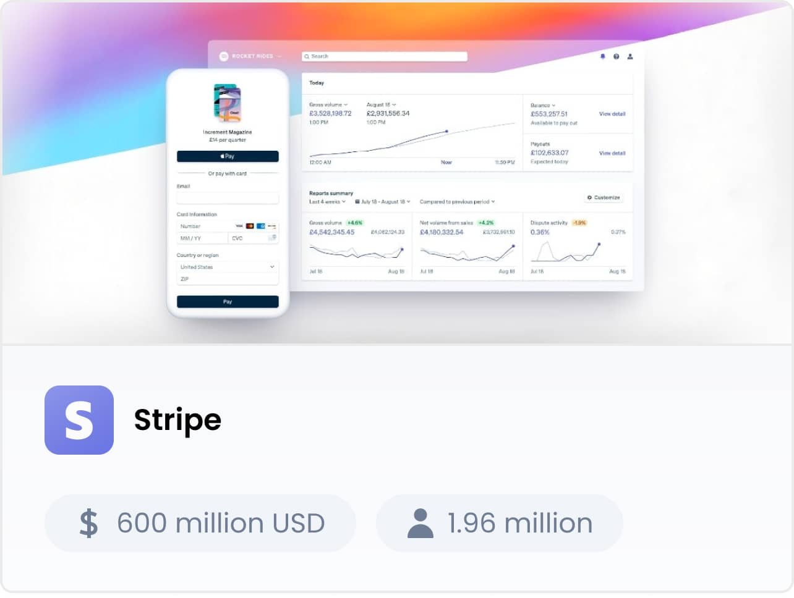

Funding: US$ 600 million

Users: 1.96 million

What they do: A king among Fintech companies, [Stripe](https://stripe.com/) offers payment solutions for web-based marketplaces, subscription services, e-commerce businesses, and crowdfunding platforms. Millions of online businesses - from Pinterest and Kickstarter to Instacart and Squarespace - use it to structure their online billing processes.

One key fact to remember: The British Government [uses Stripe](https://www.payments.service.gov.uk/getstarted/) to process payments for many of its departments.

## 2. Riskalyze
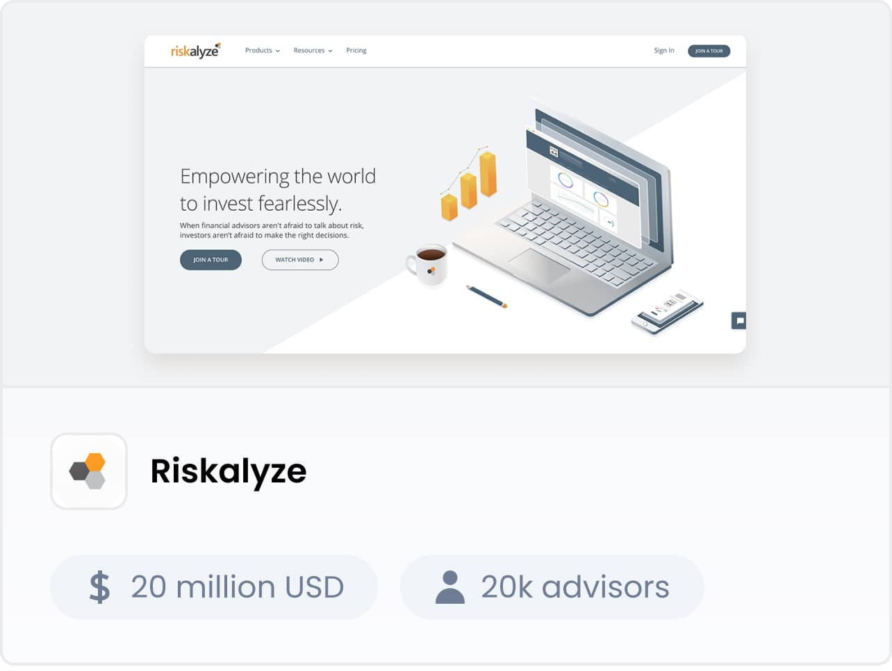

Funding: $20 million

Users: 20k advisors representing hundreds of billions in assets under management (as of August 2017)

What they do: [Riskalyze](https://www.riskalyze.com/) delivers software as a service to financial advisors in the United States - among others, tools for analyzing investment risk, delivering 401(k) plans, and building investment portfolios.

One key fact to remember: Riskalyze was recognized by Fast Company as one of The World’s Top 10 Most Innovative Companies in Finance 2013 and The World’s Top 10 Most Innovative Companies in Personal Finance 2015.

Psst
We've been working with Riskalyze since 2019. So, if you’re looking for a partner with whom you will build your next Fintech project - well, nice to meet you and let’s talk!

## 3. Sofi
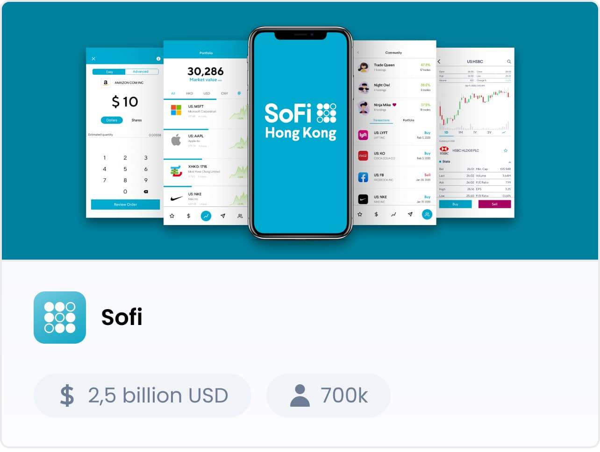

Funding: $2.5 Billion

Users: 700k members and 7.5+ million registered users

What they do: [SoFi](https://www.sofi.com/) offers services such as refinancing, loans, and wealth management. They developed an algorithm for assessing a user's rates and the likelihood of loan repayment considering factors beyond income and credit history - like education, career, and estimated cash flow.

One key fact to remember: SoFi offers really cool benefits that most banks charge for or require large balances - for example, career services, unemployment protection, and financial advising.

## 4. Chime
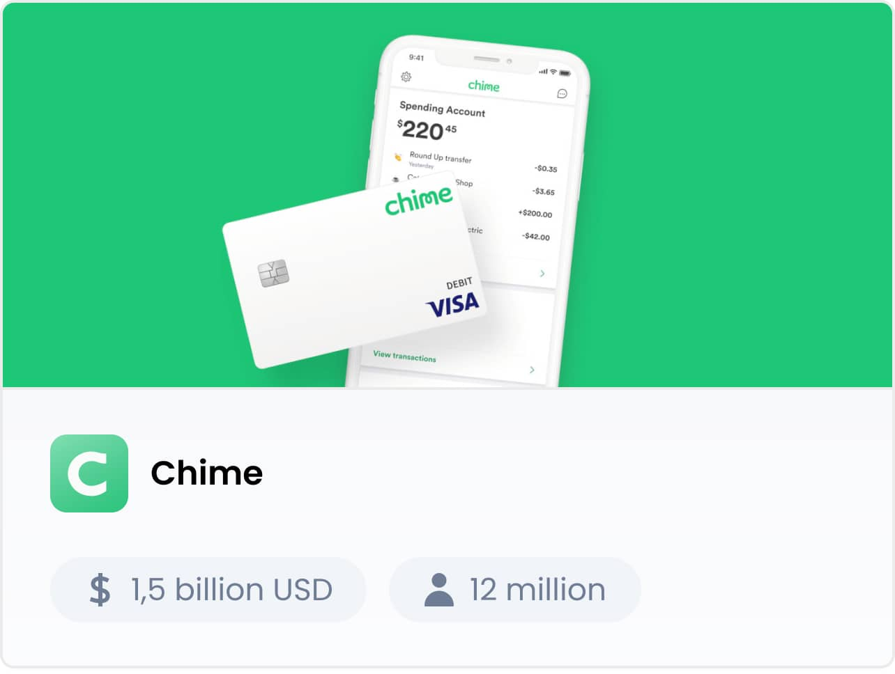

Funding: $1.5 Billion

Users: 12 million

What they do: [Chime](https://www.chime.com/) is a digital bank that promises excellent financial services without overdraft or maintenance bank fees. It offers a range of spending, savings, credit-building accounts, smart mobile banking, and digital payment solutions for individual users.

One key fact to remember: It’s hard to believe, but Chime doesn’t charge service fees. Instead, it relies on interchange transaction fees to merchants.

## 5. Robinhood
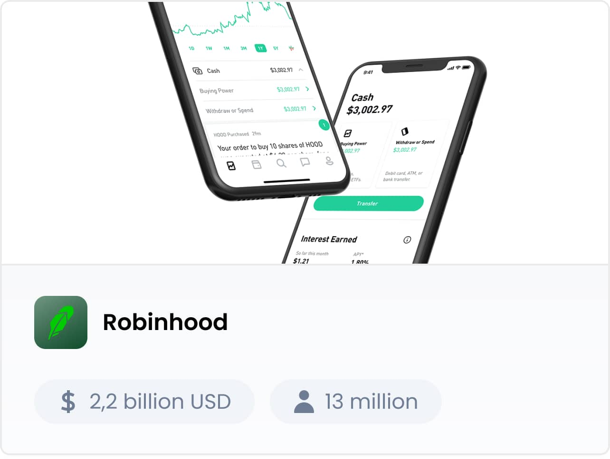

Funding: $2.2 billion

Users: 13 million

What they do: [Robinhood](https://robinhood.com/) is a world-famous stock brokering company that opens the doors to commission-free investing for individual users. The company’s web and mobile applications allow people to buy and sell stocks, ETFs, options, and cryptocurrencies without having to pay any fee.

One key fact to remember: Since it doesn’t charge any fees, the company’s revenue is based on the interest earned from balances and margin lending.

## 6. Figure
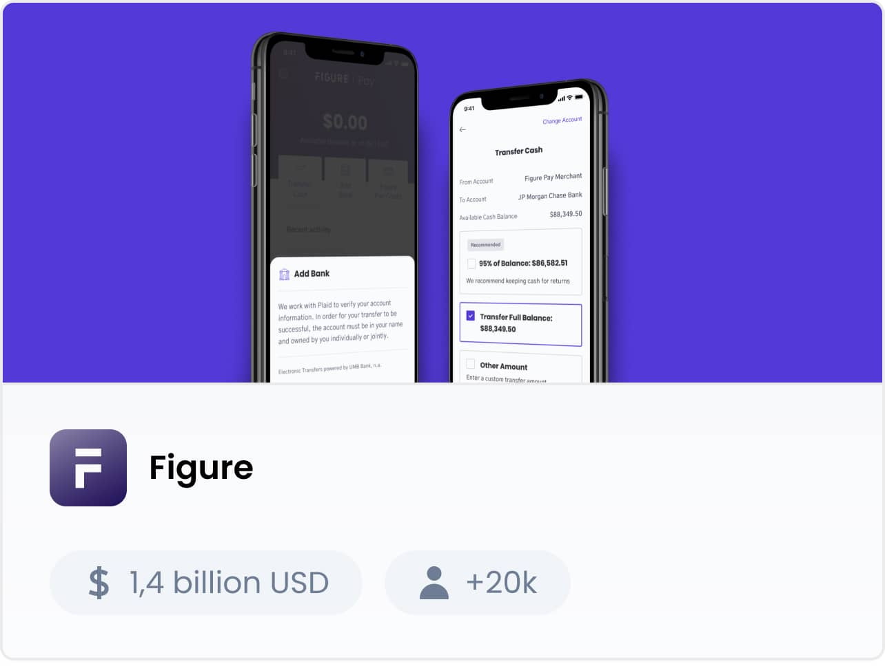

Funding: $1.4 billion

Users: 20+ thousand

What they do: [Figure](https://www.figure.com/) delivers a range of financial solutions dedicated to homeowners - from home equity lines and mortgage refinancing to investment opportunities. It’s power lies in low interest rates, product customization, and intuitive online applications.

1 key fact to remember: Figure uses blockchain technology.

## 7. Brex
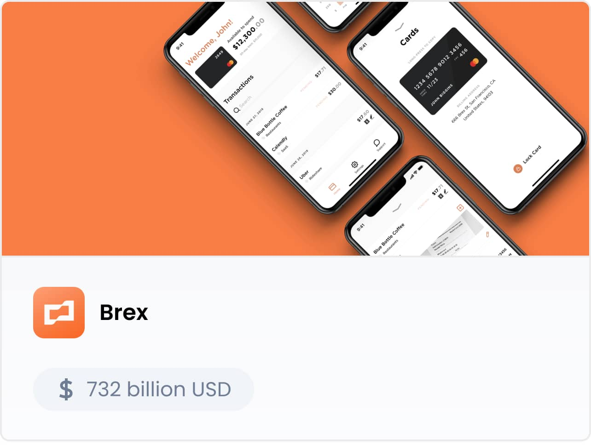

Funding: $732 million

Users: Y Combinator, Airbnb, Bounce, Carta

What they do: [Brex](https://www.brex.com/) is a well-funded Fintech startup that provides business credit cards and cash management accounts specifically to tech companies. The Brex financial platform allows these companies to manage their finances as they launch, scale, and grow.

One key fact to remember: The smart thing about Brex? It dissociates a startup’s finances from the founders’ personal assets and credit scores.

## 8. Tradeshift
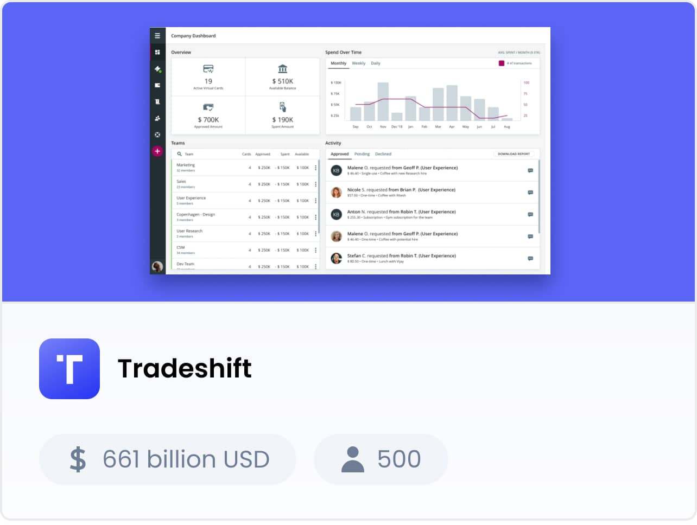

Total funding: $661 million

Users: 500 global customers

What they do: [Tradeshift](https://tradeshift.com/) developed a B2B platform for handling supply chain management and payments. Companies of all sizes can easily connect with their suppliers, send electronic invoices, manage payments, and get products faster. Suppliers, on the other hand, can manage their orders, invoices, and cash flows better.

One key fact to remember: The company acquired the unicorn status after a round of funding in 2018 led by Goldman Sachs (raising $250 million at a valuation of $1.1 billion).

## 9. Next Insurance
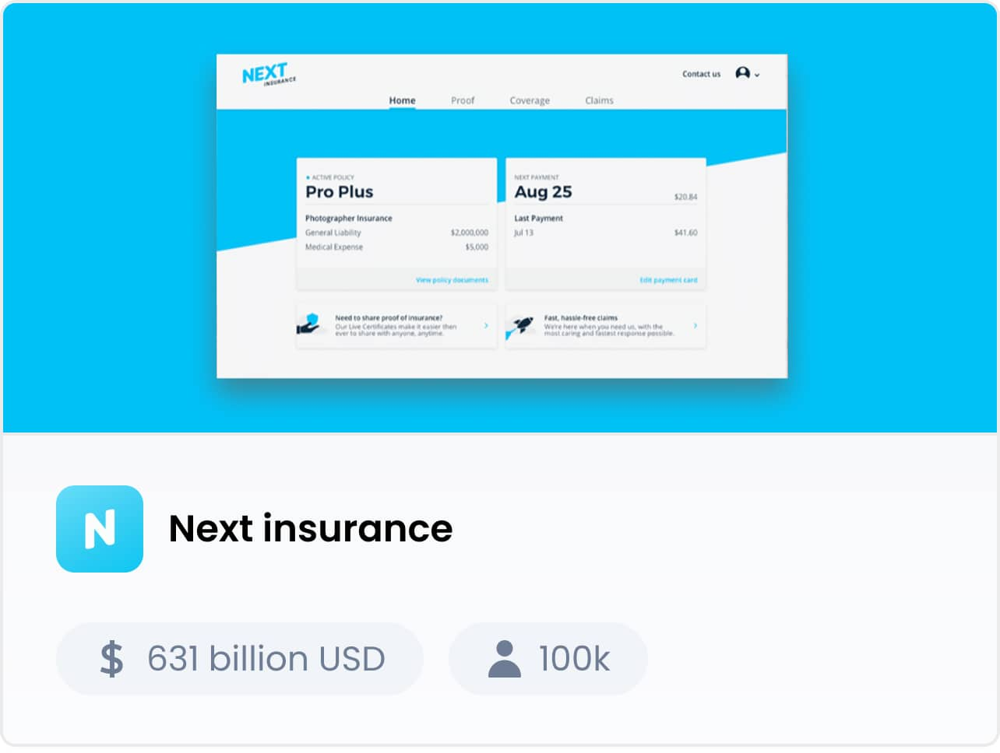

Funding: $631 million

Users: 100k

What they do: [Next Insurance](https://www.nextinsurance.com/) is an insurance provider for small businesses and entrepreneurs. Their technology allows this Fintech startup to eliminate agents or extras and offers accelerated claims management.

One key fact to remember: The company delivers tailored policies for thousands of professions, from fitness and dance instructors to child care and DJing.

## 10. Carta
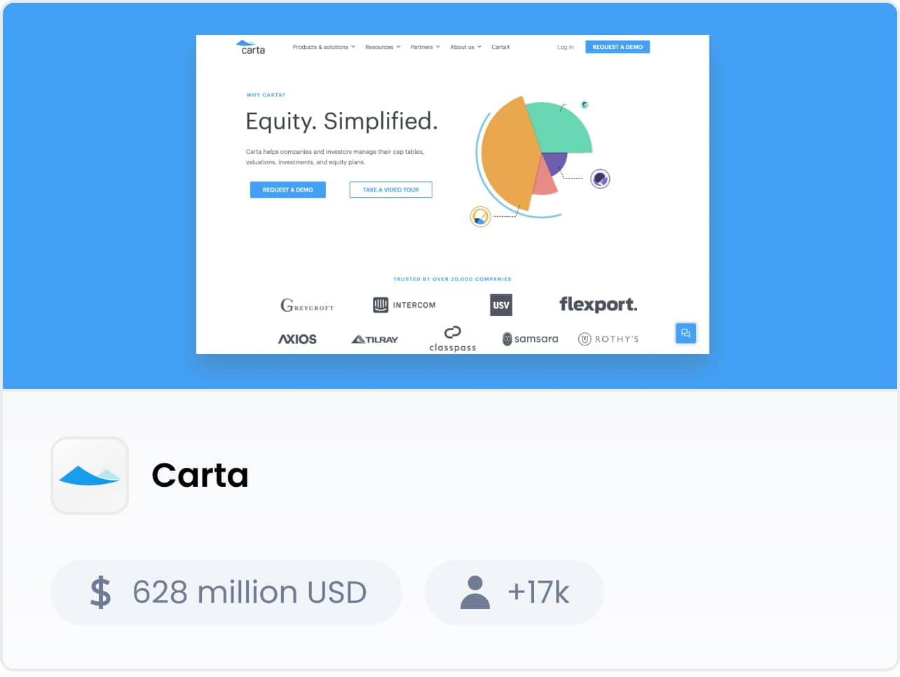

Funding: $628 million

Users: 17k+ companies

What they do:

[Carta](https://carta.com/) specializes in capitalization table management and valuation software, especially for seed-stage to pre-IPO startups. The platform allows founders, employees, and investors to easily manage equity - stocks, stock options, warrants, and derivatives in one place.

One key fact to remember: Users can see who owns what in the company in real time.

## Bonus: 10 best-funded Fintech companies of 2020

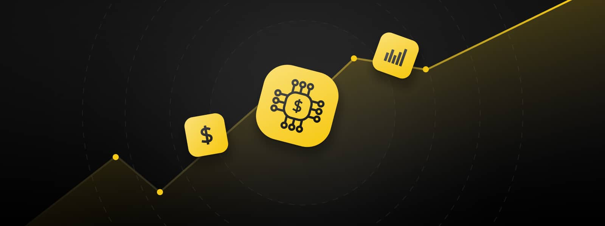

According to worldbank.org - the Fintech market has reported rapid growth during COVID-19 with a predicted annual growth rate of 25% until 2022.

So now, as a small bonus - take a look at the list of the highest-funded startups of 2020. Fintech is the fastest-growing area dedicated to creating disruptive businesses and the below amounts of $ speaks for themselves:

### 1. Kabbage

Total funding: $2.5 billion

[Kabbage](https://www.kabbage.com/) provides small businesses with access to working capital by aggregating their data and calculating the required line of credit.

### 2. Avant

Total funding: $1.6 billion

[Avant](https://www.avant.com/) specializes in personal loans and uses Big Data and machine learning algorithms to provide a customized approach to credit.

### 3. Klarna

Total funding: $2.1 billion

Based in Stockholm, [Klarna](https://klarna.com/) provides e-commerce payment solutions to merchants and shoppers like direct payments, pay after delivery options, and installment plans.

### 4. Judo Bank

Total funding: $1.5 billion

The Australian [Judo Bank](https://judo.bank/) focuses on small and medium-sized companies to deliver tailor-made financial solutions.

### 5. Nubank

Total funding: $1.4 billion

The Brazilian [Nubank](https://nubank.com.br/en/) provides a wide range of payment solutions, free-of-charge credit cards, and equity investment.

### 6. Prodigy Finance

Total funding: $1.3 billion

[Prodigy Finance](https://prodigyfinance.com/) is a digital platform that specializes in providing loans to international postgraduate students and refinancing in the UK.

### 7. Wise (formerly TransferWise)

Total funding: $1.1 billion

[Wise](https://wise.com/us) is a well-known international money transfer service that offers a great alternative to traditional (and costly) international money transfers.

### 8. Revolut

Total funding: $917 million

[Revolut](https://www.revolut.com/) is a digital bank that offers several financial services through its comprehensive digital platform - from prepaid debit cards and currency exchange to peer-to-peer payments.

### 8. Toast

Total funding: $902 million

[Toast](https://pos.toasttab.com/) specializes in point-of-sale as well as cloud-based restaurant management.

### 9. N26

Total funding: $783 million

[N26](https://n26.com/) is a mobile banking platform that offers current accounts, fixed accounts, and other financial services to customers in the EU.

### 10. Jiedaibao

Total funding: $700 million

[Jiedaibao](https://www.jiedaibao.com/) is a Chinese marketplace for peer-to-peer lending.

## Summary

We’ve had the pleasure to work with Riskalyze, mentioned above, for several years. That’s why our experts know how to create Fintech products from the inside out.

If you’re looking for developers who will build your MVP on the cheap, then... we can’t help you. But if you’re looking for an experienced partner that can advise you holistically - in the field of business, VC, product design, and software development - we’re here for you.
