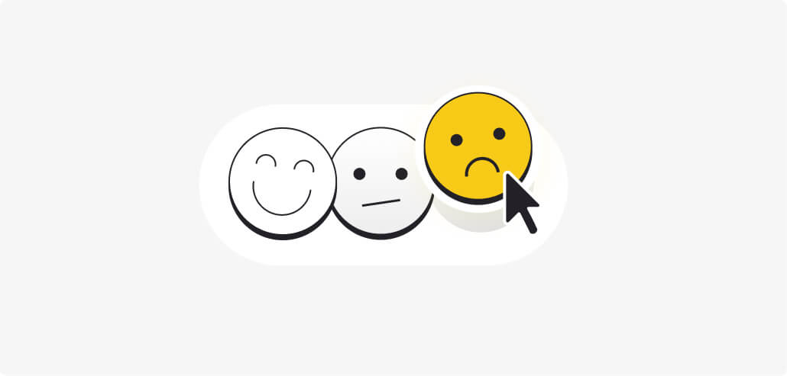
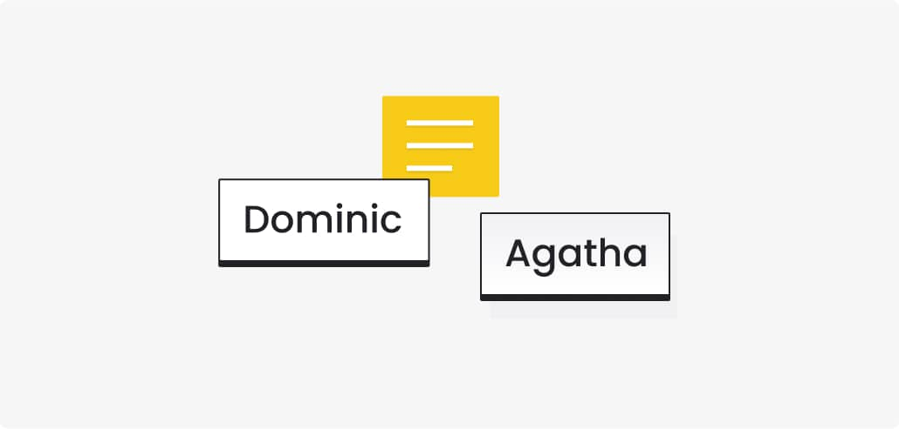

In the previous article, I showed you what a Retro meeting is all about, what purpose it serves, and how to conduct it with the help of some handy Retrospective tools.

But being effective at carrying out this meeting is just one side of the coin. The other is about building commitment and making the team genuinely fond of this meeting. This calls for agile and Fun Retrospective tools!

## Fun Retro Tools Will Make Your Agile Meetings More Engaging

Fun Retrospective tools help to diversify your basic Retrospective meetings by adding some entertaining and light elements to them. This not only improves the overall meeting atmosphere but also helps to achieve the meeting’s goal more efficiently.

To diversify your Retro meetings, you can choose from many free online Retrospective tools that were designed for both stationary meetings and remote or hybrid work setups.

Thanks to these tools, you get to foster team member collaboration, create a space for interaction, and evoke emotions that build deep commitment.

## How to Make Your Retrospectives Fun and Exciting?

First of all, instead of combining different solutions, it’s worth choosing the simplest and cleverest tool that will complete a large part of the work for you.

In this article, we share our favorite Fun Retrospective tools. These tools will not only diversify your Retrospective meetings but also allow you to break the ice between new teammates, improve the atmosphere and strengthen relationships between team members. That last part is extremely important, especially when working remotely and in dispersed agile teams.

Let's have some fun, shall we?

## 10 Exciting Retro Tools that Will Spice Up Your Team Meetings!

## Energizers

### 1. Rock-Paper-Scissors

[Human Rock-Paper-Scissors](https://www.funretrospectives.com/human-rock-paper-scissors/) is a perfect Retrospective tool to get you started. Our job is based on working at a desk in front of a computer. This type of activity allows you to relax your body and mind, all the while having a great time.

## Retrospective Meeting Check-in

### 2. Draw your feelings

This is a great exercise to start a Retrospective. [Draw your feelings](https://www.funretrospectives.com/draw-your-feelings/) relaxes the meeting atmosphere and stimulates creativity and thinking "out of the box." During remote meetings, you can use drawing boards or even better - pictures, gifs, or memes… and who doesn’t like memes, right?

### 3. ESVP - Explorer, Shopper, Vacationer, Prisoner

How do you check the team's approach to your Retrospective meeting? [ESVP](https://www.funretrospectives.com/esvp-explorer-shopper-vacationer-prisoner/)  is a popular and effective tool. It helps Scrum Masters lead the meeting and identify ambiguities.

If some members say that they consider themselves "Vacationers" or worse, "Prisoners," Scrum Masters can explain in more detail what the purpose of the meetings is, give examples of improvements that were implemented thanks to the Retrospective, and how it influenced the work of your agile teams.

At MasterBorn, Clarity is one of our four Core Values and it’s really important for us. That is why we strive to ensure that our communication is transparent and honest. We want everyone to be aware of their expectations, which is a great help for ESVP.

### 4. Happiness Radar

Teams sometimes discuss emotional topics during sprint Retrospectives. It's important to know the approach of each team member to these specific areas.

Another measure of happiness we use at MasterBorn is the [Happiness radar](https://www.funretrospectives.com/happiness-radar/). At the end of each Retrospective, we ask the team about their satisfaction with the previous sprint on the scale of 1 to 10. We then take an average and map it on a chart.

Thanks to this simple activity, we can compare the quantity and quality of the delivered value in a sprint to the team's happiness/level of well-being. This allows us to conclude whether the data points correlate with each other. In the event of a drop in the index, we can react quickly and help the team identify problems and solve them together.

## Retrospective Meeting Check-out

### 5. Fun photo - check-out

Commemorating shared moments is a great practice. At MasterBorn, we have a special wall dedicated to our photos and we regularly add new ones!

Such an initiative builds belonging to the company and allows us to remember the coolest moments from the history of the company. We encourage you to take a [Fun Photo](https://www.funretrospectives.com/fun-photo/) at the earliest possible opportunity!

### 6. One word before leaving - check-out

Words can offer valuable information to the Scrum Master about the feelings of the team. It’s definitely a good idea to introduce the ESVP exercise at the beginning of the meeting. It helps to check the team's approach to the Retrospective. In the end, we can check what has changed in the approach of the team members using [One word before leaving](https://www.funretrospectives.com/one-word-before-leaving/).

## Teambuilding

### 7. Fun Fact

This is a great exercise that allows everyone to break the ice, learning something new about the team, and creates a relaxed atmosphere where team members feel more comfortable. [Fun fact](https://www.funretrospectives.com/fun-fact/) is a Retrospective tool that helps team members discover shared interests, which often leads to spending time together outside of work hours.

We unveiled so many amazing stories from our team members at MasterBorn. For example, one of our top developers used to be a sawmill worker. Another team member traveled to a wild jungle forest and got attacked by wild monkeys. Yet another person told us an amazing story of hitchhiking from Poland to Calabria (Southern Italy).

### 8. The roles we play

[The roles we play](https://www.funretrospectives.com/the-roles-we-play/) helps to integrate team members because they can get to know each other in a broader context that extends beyond work. At MasterBorn, we like to meet at a common table during coffee or lunch breaks. This is an ideal time to expand topics we got from this exercise. Getting to know each other like this improves communication, breaks the ice, and also makes us friends outside of work.

### 9. 360 degrees appreciation

Constructive feedback is an attitude we take really seriously at our company. We try to appreciate our input and show mutual gratitude for the work performed on a regular basis. However, sometimes it’s easy to forget about it during the whirlwind of work. [360 degrees appreciation](https://www.funretrospectives.com/360-degrees-appreciation/) is a great Retrospective tool that strengthens relationships and builds trust.

### 10. Punctual Paulo

We start a new project, put together a team, and it just so happens that nobody knows each other. How can we start getting to know team members? Probably by having everyone introduce themselves. But how do you quickly remember all the names? [Punctual Paulo](https://www.funretrospectives.com/punctual-paulo/) streamlines this process and helps teams make the first step to free communication.

## Retrospective Tools - Summary

We recommend testing both regular Retro tools and Fun Retro tools, keeping in mind that there are no perfect tools out there. There is no one-size-fits-all solution.

We recommended quite a few options in this and [previous article](./10-retrospective-tools-for-scrum-masters), but each team is different - so it's important to customize these tools to your needs.

Have fun in your own search for agile Retrospective tools!
