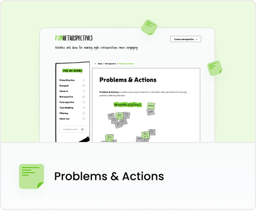
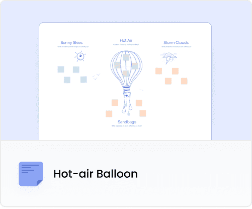
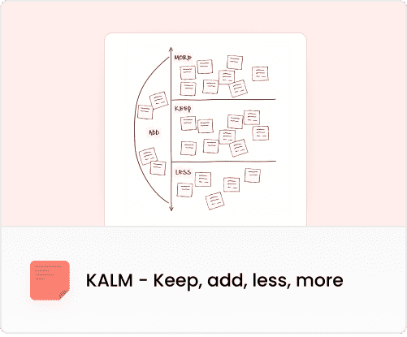
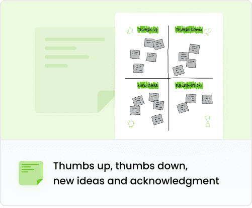
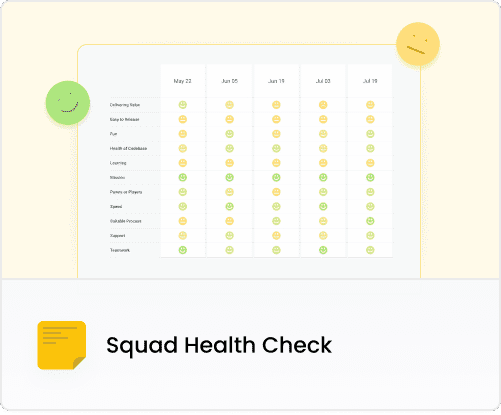
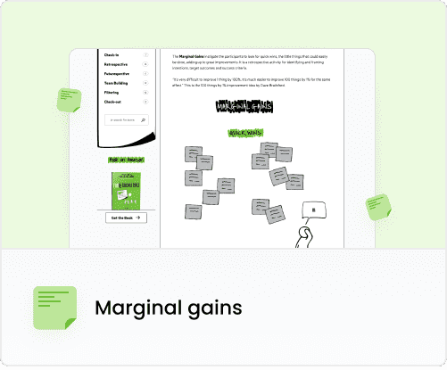
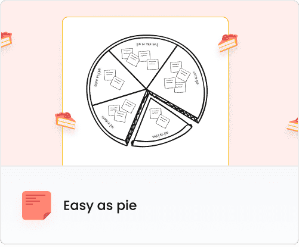
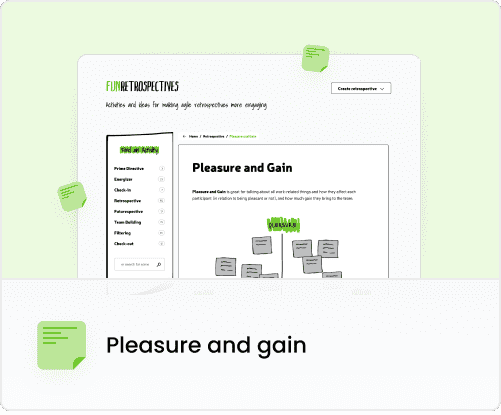
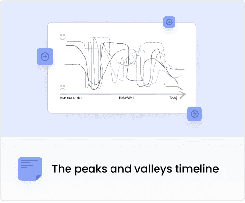
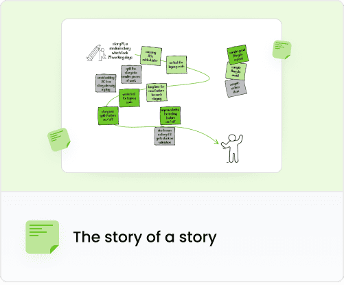

A Sprint Retrospective is a cyclical meeting of a project team that perfectly embodies the three pillars of Scrum: transparency, inspection, and adaptation.

As the Scrum Guide says:

"The Sprint Retrospective is an opportunity for the Scrum Team to inspect its activities and develop an improvement plan that will be implemented in the next Sprint."

There are a lot of articles on the web like "1001 ideas for effective Retro,” so we will approach the topic differently and be more specific about it. Read on to discover 10 proven tools that help to carry out a Retro meeting efficiently. Let’s start with a little intro.

## What is a Retrospective meeting?

Retrospective (Latin: retrospectare - looking back) - colloquially called "Retro", a Retrospective is a regular meeting during which a team analyzes their past activities, i.e. events and work on a product. The goal of a Retrospective is to draw conclusions and lessons learned from this experience.

## How to run a Retro Meeting?

The first stage of a Retrospective is gathering knowledge and facts, since none of the members has the complete picture of the project. Everyone knows only their own and highly selective fragments of what happened. Bringing all of these fragments together is what gives us a full picture of the activities carried out. This forms a basis for drawing conclusions, considering possible changes, and adjusting future activities accordingly.

It’s worth remembering that at the beginning of the meeting, you should take a moment to summarize what has been achieved since the previous Retrospective.

At MasterBorn, we stick to the following steps:

A brief overview of what happened in the previous Retrospective and what conclusions we came up with.

We review our Action Points and verify whether they have been implemented (and what is their status).

The transition to the new Retrospective.

## What is the purpose of a Retrospective meeting?

A Retrospective allows you to optimize the team’s work as the collected conclusions and opinions of each team member contribute to better results.

At MasterBorn, Retrospectives are carried out by Scrum Masters who act as facilitators. They offer the team various tools that help them gather their thoughts and learn from their insights.

A Scrum Master observes the process but isn’t actively involved in implementing these solutions. Their role is to help teams develop practical results that will form the foundation for success in the long run.

## Retrospectives: How Not to Hate Them

Sometimes teams may be reluctant to participate in a Retrospective meeting. Usually, that’s because the meeting isn’t run properly.

It’s extremely important to show the purpose of the meeting, its significance, and its potential benefits. This allows the skeptics to see and understand WHY we do it. And by understanding the true value of a Retro (for the project and each participant), their reluctance is bound to decrease.

Another important element is encouraging team members to be open and creating a safe space for such openness characterized by respect, empathy, and an openness to other viewpoints.

Even if a topic is uncomfortable for team members, you should talk about it. The Retrospective meeting is a perfect time for the team to share what has been on their minds.

At MasterBorn, we focus not on only technical but also soft skills. Emotional intelligence is extremely important in teamwork - and it comes in handy during the Retrospective.

Carrying out a Retrospective properly might be difficult. That’s why we decided to share our experiences in using various tools and techniques that - when applied properly - help to improve a Retrospective a lot.

## 10 Retrospective tools for Scrum Masters and Agile Teams

## 1. Problems & Actions

[Problems & Actions](https://www.funretrospectives.com/problems-actions/) is one of the easiest Retrospective tools around. But it brings a lot of value and allows you to identify problems and find solutions in the blink of an eye. It works great when we want to openly talk about the current problems happening in relationships between team members. A simple method, but it’s so effective!

## 2. Hot-air Balloon

We use the free Retrospective tool [Hot-air Balloon](https://www.funretrospectives.com/hot-air-balloon/) at MasterBorn because images and metaphors are great for stimulating creativity, opening our eyes to new ideas, and generally spicing up meetings. Our teams definitely prefer to use boards like this instead of simple columns where you paste cards with ideas.

We use the [Metro Retro](https://metroretro.io/) platform that comes with a ready-made board template that includes Hot-air Balloon and many other techniques such as The Sailboat, The Speed ​​Car, The Starfish, or The Superhero.

Here’s how Hot-air Balloon works:

-   Hot Air - What are the things pushing us forward?

-   Sandbags - What is slowing us down or holding us back?

-   Sunny Skies - What positive things have we seen coming up?

-   Storm Clouds - What problems or obstacles are coming up?

At MasterBorn, we use this tool when we want to focus on problems related mainly to the product we are developing. It helps us a lot in defining the areas that slow down our development.

## 3. KALM - Keep, add, less, more

[KALM - Keep, add, less, more](https://www.funretrospectives.com/kalm-keep-add-more-less/) is one of the simplest Retrospective tools. We use it at MasterBorn to identify the practices that are valuable to the team. It’s the team that determines which of them are going to be continued, which aren’t working, and which ones team members would like to add or intensify.

-   Keep - something the team is doing well and its value is recognized

-   Less - something already being done, but what you’d rather do less

-   More - something already being done which will bring more value if done even more

-   Add - a new idea or something you have seen working before that you’d like to bring to the table

## 4.Thumbs up, thumbs down, new ideas and acknowledgment

Here’s another witty & free Retrospective tool [Thumbs up, thumbs down, new ideas and acknowledgment](https://www.funretrospectives.com/thumbs-up-thumbs-down-new-ideas-and-recognition/). We use it at MasterBorn, because apart from identifying all the things the team likes and dislikes, this tool works great for generating new ideas. It also provides a space for praising each other's work, which has a significant impact on building a positive atmosphere in the team and strengthening team bonds.

We introduced this tool in one of our teams and the “recognition” section ended up with barely enough space for more cards! Since then, we offer the team space to thank each other and appreciate the work done even more often.

## 5. Squad Health Check

An interesting example among Retrospective tools is this one created by Spotify. Squad Health Check allows you to visualize the status of individual areas, such as easy to release, suitable process, tech quality (codebase health), value, or learning.

Every team member evaluates the condition of each area using colors: Green (Good), Yellow (Some problems), Red (Bad). This tool differs from the methods I mentioned before because we don’t start with brainstorming and writing our thoughts down. Instead, we advise the team on what areas they should focus. After the assessment, we discuss each of the areas, find solutions to the problems, and choose Action Points to be implemented in the next Sprint.

At MasterBorn, we tested [Squad Health Check](https://engineering.atspotify.com/2014/09/16/squad-health-check-model/) and it worked really well. It allowed us to look at the challenges that arise during projects from a different perspective.

It’s worth it to use this tool more or less once a quarter. Using it more often could get boring and the data doesn’t change quickly enough to notice a change.

How do we implement this tool in a remote Retrospective? So far, we haven't found anything better than a simple Excel spreadsheet. We encourage you to [use our template](https://docs.google.com/spreadsheets/d/1_Y9e7bnltoKqA4yL5WOa9Pi2c-W8_R49Ik-34XKPTfM/edit?usp=sharing).

## 6. Marginal gains

It’s much easier to start with smaller tasks that bring you closer to achieving the goal. [Marginal gains](https://www.funretrospectives.com/marginal-gains/) is a free Retrospective tool that prioritizes finding "quick wins." This tool will come in handy when your team members are facing a lot of problems that might overwhelm them. By achieving small goals, they’ll become more motivated to face bigger challenges.

## 7. Easy as pie

A Retro can’t become boring with [Easy as pie](https://www.funretrospectives.com/easy-as-pie/) - which is brilliant and… easy-peasy!

It’s worth using this technique when you notice the need to identify chances for continuous improvement in a team and foster mutual appreciation among team members.

## 8. Pleasure and gain

This free Retrospective tool helps you to recognize the effect of certain things on team members. During Retrospectives, it’s worth introducing tools that allow you to look at the team's work from different perspectives. [Pleasure and gain](https://www.funretrospectives.com/pleasure-and-gain/) is a great diversion too!

## 9. The peaks and valleys timeline

The output of this exercise gives you a picture of the "ups and downs" of each team during the product realization.

[The peaks and valleys timeline](https://www.funretrospectives.com/the-peaks-and-valleys-timeline/) is an interesting tool that offers a different perspective on a team's work and the overall product development process.

## 10. The story of a story

People love stories! [The story of a story](https://www.funretrospectives.com/the-story-of-a-story/) is a tool that allows you to see the path your team has been following. But that’s not everything. During a Retrospective, you can write a history of a project, product, or User Story.
You can use this tool in many different ways.

## Best Retrospective Tools to conduct a great meeting

To make the most of every online and offline Retrospective tool I mentioned above, it’s worth choosing the appropriate platform to carry out your Retrospective. If you have the opportunity to meet the entire team on-site, you can simply use a board and cards. But since more and more teams work remotely today, you can choose from many digital platforms dedicated to conducting Retrospectives.

We use [MetroRetro](https://metroretro.io/) as it offers all the important functionalities for carrying out effective Retro meetings. In addition to the basic functions for a Retro - such as creating boards, adding sticky notes, or voting - it also has fun features such as emojis or fireworks! These functionalities help to create a relaxed atmosphere during a meeting, resulting in greater openness between team members. This is something you should aim for in Retrospectives.

We also use [Easy Retro](https://easyretro.io/) from time to time, which is also great for KALM, for example. We encourage you to check out other online Retrospective tools dedicated to retrospectives such as [Reetro](https://reetro.io/) or [TeamRetro](https://www.teamretro.com/).

## Summary

The choice of online Retrospective tools on the market is really massive, so follow the news and test new solutions on a regular basis. In the end, these tools are here to serve us - not the other way around.

If a solution no longer serves its purpose, don’t hesitate to look for a new Retrospective tool. Be agile and flexible. After all, agile isn’t just a method - it is a state of mind.

And if you’re looking for some more suggestions, I’m going to share some more fun Retro tools in the next article on this topic. Stay tuned!
