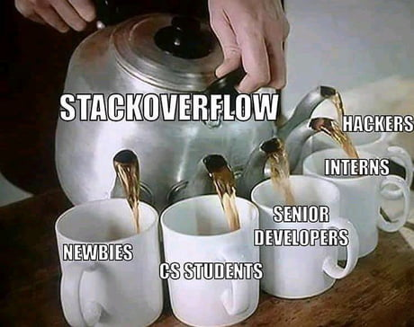
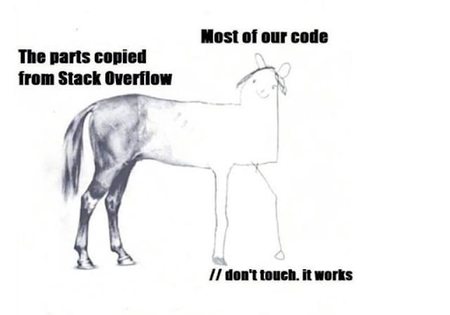
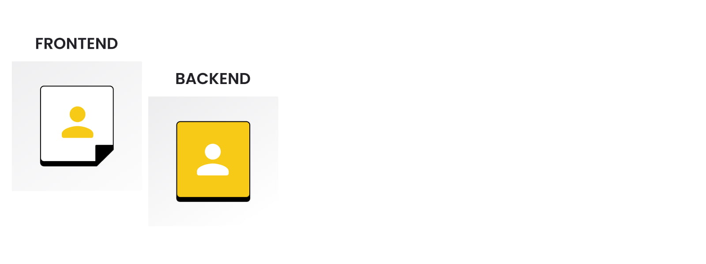
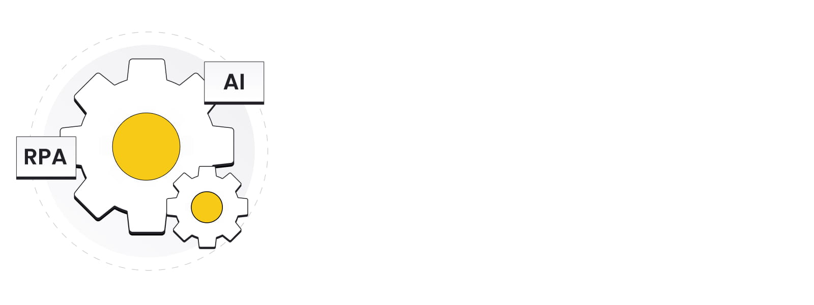

# 38 Tech Terms You Need to Know as a Start-up Founder

Technology is an ocean, and you need to know which wave to catch…

But which waves are great to ride, and which will send you straight to the bottom? As a non-technical founder, entrepreneur or CEO you won’t always be a tech mastermind, but it’s essential for you to know at least some terms and concepts to catch up with your engineers.

At MasterBorn, we’ve worked and spoken with countless founders and completed many projects, resulting in a list of important concepts our clients should be familiar with.

Below you will find a helpful glossary we compiled. Spoiler alert: you won't become an expert after reading this article (and you don't have to!) but you'll expand your lexicon.

Brought to you by your favorite CTO, me.

## General Development Terms

These general terms are often used in a context of software development and as a founder or CEO, you may encounter them while talking with a Software House or a CTO. They are often used by engineers, testers and architects.

### 1. API

#### What is an API?

API or Application Programming Interface is used to connect multiple applications. They allow different pieces of software to exchange data making the apps more flexible, easier to maintain and scale. Simply put: whenever applications want to ask somebody about some data, or your browser shows you some data, it’s provided mostly by API.

In 2020 APIs adoption was expected to [grow by two thirds](https://www.idevnews.com/stories/7335/API-Adoption-To-Increase-in-2020-REST-Serverless-and-GraphQL-Most-Popular-Survey-Says#:~:text=Tags%3A%20APIs%2C%20developers%20FaaS%2C,in%202020%20compared%20to%202019.) globally, which proves that they are a great tool for building modern applications.

### 2. Stack / Tech Stack

#### What is a tech stack?

Tech stack is the totality of technologies used in an application. It can consist of programming languages, frameworks, databases, tools and cloud solutions.

According to StackOverflow, the [top 3 languages used worldwide](https://insights.stackoverflow.com/survey/2020#most-popular-technologies) are JavaScript, HTML/CSS and SQL - but be careful and choose your stack based on your needs, not on hype.

### 3. Framework

#### What is a framework?

A framework is a predesigned, abstract platform that helps developers build applications faster and easier compared to a raw programming language. Specific frameworks are available for individual languages, for example, React and Angular for frontend JavaScript applications or Express.js and Fastify for backend.

As a founder or CEO, be sure that your team uses a mainstream framework - niche ones are notoriously difficult to scale and maintain.

### 4. Library

#### What is a library?

A library in software development is a set of precoded functionalities, data templates or components. A developer almost never develops very complex parts of the app themselves. They usually use libraries.

For example, if your app needs complex charts, a developer would most likely implement an already available chart library and just tweak it to fit your product. Likey, you can use D3.js then. Many libraries are free but some are restricted by licenses.

### 5. CRUD

#### What is CRUD?

CRUD stands for Create, Read, Update, and Delete. It is defined as a core element of persistent storage applications, and the functions it covers. It’s simple to understand as a set of basic operations that allow you to store, maintain and retrieve data in a database via some kind of an interface.

Many developers value CRUD because of its performance as usually it doesn’t relate to any business logic whatsoever.

Fun Fact: CRUD operations are often used in applications that are based on the manipulation of simple entities/records like CMS

### 6. Open Source

#### What is Open Source?

Open Source is a piece of software that is created and made available to the public by a 3rd party for free. It can be something as small as a library for developing forms in JavaScript, or something as complex as a graphic design tool which is an alternative to Photoshop.

The advantage of incorporating Open Source into your project is that you don’t have to pay license fees for its components. The downside is that you never know what could happen to the open code, how it will be maintained, by whom and need to consider it’s license limitations.

### 7. GIT

#### What is GIT?

GIT is a version control system that does the magic of keeping the code ordered. It helps maintain code, its versions, releases etc. Without it, it would be extremely difficult for developers to cooperate without instantly causing a mess.

Great news - GIT is free and open source, which means it’s not an additional cost within your project.

### 8. JSON

#### What is JSON?

JSON is a notation format that applications may utilise while talking with each other. Because it provides standards of communication, developers may be sure that if both parties use JSON, it will be easy for them to exchange or store data.

### 9. GitHub

#### What is GitHub?

GitHub is the most popular development platform in the world. It is based on the GIT system and allows you to store the entire codebase of your project in the cloud. It dramatically improves cooperation between developers.

According to GitHub it is [used by over 65 million developers and over 3 million organizations](https://github.com/). Most likely, your team is using it too (or some of its competitors like BitBucket or GitLab).

### 10. StackOverflow

#### What is StackOverflow?

StackOverflow is a community for developers where they learn, exchange knowledge and solutions to common problems. It’s powerful knowledge database is a source of many jokes with some developers claiming you don’t need to write any code any more and can simply copy it chunk by chunk from StackOverflow.

But jokes aside, StackOverflow is deeply embedded in the software development community with [14 million users and 21 million code related questions](https://en.wikipedia.org/wiki/Stack_Overflow). Without it, your product team would have to continuously reinvent the wheel and solve problems that have already been solved.

### 11. Event Storming

#### What is Event Storming?

Event Storming is a part of the software development process. It is a workshop format that often uses a whiteboard and a set of post-it notes for exploring business domains. As the name suggests, the procedure focuses on domain events which occur in a business application or process.

As a start-up founder or CEO, you can use Event Storming to explore the viability of a new business model or to design new services or functionalities in a way that maximises the chances of positive outcomes. Later on, you should be able to translate them almost in 1:1 relationship into the code.

## Roles in a Project

The best teams consist of various roles and different people. Each of the roles has specific responsibilities and together they work towards achieving a common goal - your application’s success.

### 12. Frontend Developer

#### Who is a Frontend Developer?

A frontend developer is someone who builds the visual part of an app interface. He or she puts together the designs, makes sure that the scrolling is smooth, that pushing a button triggers a specific action. They also adapt the application to different devices and screen sizes.

As a founder or CEO you should make sure that your frontend developers are precise and are able to recreate designs in a pixel-perfect way.

### 13. Backend Developer

#### Who is a Backend Developer?

A backend developer deals with everything that is hidden under the hood. He or she builds and maintains the technology that utilises servers, databases, APIs, etc. They usually don’t deal with the user interface layer of the app, leaving it to frontend developers, but they develop API interfaces for them.

Skills you should look for in a backend developer include attention to the optimization of data exchange, focus on performance and scalability.

### 14. Fullstack Developer

#### Who is a Fullstack Developer?

A fullstack developer is someone who deals with both backend and frontend. These are people who can almost single handedly build and maintain an entire app, so it’s worth having such a person in a development team.

[Around 55%](https://insights.stackoverflow.com/survey/2020#developer-roles) of all developers consider themselves to be fullstack developers. Some believe, however, that it is hard to be really good if you don’t specialize in either frontend or backend (and trust me, it is so don’t go that way).

### 15. DevOps

#### Who is a DevOps?

DevOps is a very specific and crucial role in a team, especially a larger one. DevOps engineers deal with server setups, cloud environments, and application monitoring. They are often responsible for realising the software built by developers.

DevOps engineers are relatively rare and their salaries are often higher than those of developers. Don’t be surprised if your DevOps costs are not in line with the rest of the team.

### 16. QA Engineer

#### Who is a QA Engineer?

A QA engineer is often referred to as a tester. This is a person who makes sure that the application behaves according to plan. He or she looks for bugs, errors and inconsistencies. There are two types of quality assurance engineers: manual testers who click through the app and look for problems, and automation testers who write programs which test applications with minimal human intervention. They tend to be precise and detailed and verify the code to fit the businesses needs.

Make sure to have a tester in your team - otherwise you may end up with a product whose quality is doubtful.

### 17. Software Architect

#### Who is a Software Architect?

A software architect is usually a very experienced developer who is capable of planning and designing the entire structure of an application, it’s multiple components and layers. They may write code by themselves too, or leave it to others.

This is a very important role, and contrary to popular belief, it’s NOT restricted for enterprises and advanced systems. If you're in the early stages of a start-up you might need an architect too, trust me. I would highly recommend having an Architect (at least partially) to have a general understanding and tech-overview for all teams.

### 18. SRE - Site Reliability Engineer

#### Who is a Site Reliability Engineer?

A site reliability engineer is a role that is close to DevOps. However, an SRE concentrates on keeping services running and available to users. This includes minimizing downtime, managing traffic peaks and dealing with outages. Usually, SREs are developers who are responsible for monitoring the application at the same time due to their knowledge of how it should behave.

This role is quite advanced and you probably won’t need a site reliability engineer in your team until your app grows and has to handle a significant amount of traffic.

### 19. Business Analyst

#### Who is a Business Analyst?

In software development, a business analyst’s role is to ask founders, CEOs and their business teams questions to better understand their needs. It’s an important role, as our clients often have a general idea, but when it comes to the details they can’t provide specific answers.

Analysts will narrow down the scope, reject ideas that are too outlandish and come up with a document that development teams can start working with.

### 20. Project Manager

#### Who is a Project Manager?

A project manager is someone who makes sure other team members communicate in appropriate manners, deadlines are met and specifications understood. It is a role that requires both great soft skills and strong organization.

It’s one of the key personas in a team that puts out fires, motivates people and makes sure things are going according to plan.

As a Founder, it’s important to know that for every $1 billion invested in the U.S., $122 million is wasted due to poor project performance. (Source: PMI.org)

### 21. Proxy Product Owner (Proxy PO)

#### Who is a Proxy Product Owner?

A Proxy Product Owner (Proxy PO) is placed between people taking product decisions and a production team. A Proxy PO is responsible for stuff usually done by a Product Owner, e.g. gathering clients’ needs, defining a Product Backlog, delivering the Backlog tasks with the Dev team, deciding if the product increments can be released to the client.

It is a partial version of a classic Product Owner, who is the actual owner of the product. Proxy PO doesn’t take the core decisions about the product nor has a true impact on its success. He also doesn’t control the product's budget, doesn’t define the product's strategy and he’s not own the Backlog and its items. All mentioned responsibilities are on the Product Owner.

Just as the PO is the customer's representative to the teams, the Proxy Product Owner is the PO's representative for a specific team and he helps the PO in his role.

## XYZ as a Service

With rapid development of IT services and Agile in businesses, we all tend to remove repetitiveness and utilise many different “as a Service” solutions to boost our time to market.

### 22. CaaS - CTO as a Service

#### What is CaaS?

CTO as a Service is a response to a need for a C-level tech role in sales projects, without the budget to cover a full time role. CaaS is therefore a part-time CTO role usually adopted by early stage start-ups and smaller companies.

Consider CaaS if you have a solid development team, but need the extra confidence that the right choices are made. A few hours a week should be enough.

 ### 23. DaaS - Device as a Service

#### What is DaaS?

Device as a Service means you can use hardware without actually owning it. More than simple leasing, DaaS comes with full service, configuration, replacement and maintenance. All for a monthly fee.

According to [the latest predictions](https://www.globenewswire.com/en/news-release/2021/02/08/2171252/0/en/Device-as-a-Service-DaaS-Market-to-Surpass-USD-190-163-86-Million-by-2026-With-Registering-a-CAGR-of-55-8-Market-Research-Future.html), the DaaS market should reach almost 200 billion dollars by 2026. It’s likely that you too will be using a DaaS laptop by then!

### 24. SaaS - Software as a Service

#### What is SaaS?

Software as a Service is a popular subscription model allowing you to use applications without owning them. A long time ago, you had to buy a program for a hefty fee and you could use it indefinitely. Currently, most apps are offered in a SaaS model. Think of Office365, Salesforce, [Figma](https://masterborn.com/blog/figma-vs-sketch/) or Pipedrive to name just a few.

### 25. PaaS - Platform as a Service

#### What is PaaS?

Platform as a Service is a complete development and deployment environment. It’s offered in a cloud, which means no physical servers or server operating systems are needed. The most popular PaaS solutions are Amazon Web Services, Google Cloud Platform and Azure.

Platforms as a Service are cheap in the beginning but can generate significant costs when you scale your solution. Make sure you have good DevOps and Site Reliability Engineers to optimize your platform in the long run.

## Databases and Memory stores

This is just some terminology of what applications are built upon and where the data is stored at. This usually splits possibilities and costs as DBs are usually the priciest ones.

### 26. MySQL

#### What is MySQL?

MySQL is a relational database. Its name is a combination of "My", the name of its co-founder Michael Widenius's daughter, and "SQL", the abbreviation for Structured Query Language.

Born in 1995 MySQL is one of the most [commonly used relational databases](https://www.statista.com/statistics/1131568/worldwide-popularity-ranking-relational-database-management-systems/), and can only be compared with Oracle’s DB. As a standard often taught at universities and development courses, most engineers are familiar with it at least to some extent, which makes it a nearly universal choice in many projects.

### 27. PostgreSQL

#### What is PostgreSQL?

PostgreSQL’s website boasts that it is one of the most “powerful, open source object-relational database systems with over 30 years of active development”. And in fact, both its history and comprehensiveness make it a common choice among product teams. Compared to MySQL, Postgres includes features like table inheritance and function overloading.

Those features are important in case of data-heavy applications, data warehouses and analytics applications. PostgreSQL can store structured and unstructured data in a single product, which is an additional benefit.

### 28. MongoDB

#### What is MongoDB?

MongoDB is a more modern database born in 2009. As a NoSQL database, MongoDB's architecture can support huge volumes of both data and traffic.

You should consider MongoDB if you’re integrating large amounts of diverse data, describing complex data structures that evolve or delivering data in high-performance applications.

As a Founder, you should keep in mind that MongoDB makes your databases seamless and scalable and that allows you to scale your business and build an MVP faster.

## JavaScript

JavaScript is a major technology of the Internet age. Here's a list of some of its most important terms.

### 29. Node.js

#### What is Node.js?

Node.js has been a great innovation since its launch in 2009. The great breakthrough was that it added back-end capability to JavaScript which was traditionally a front-end technology. As an open-source and cross-platform environment, it is very flexible and accessible.

As a start-up owner you should consider Node.js as your back-end technology for the sole reason that it allows front-end JS developers to quickly switch to backend and significantly boost their responsibility in the project or boost their productivity as they will be ”talking in the same language” which should reduce the friction.

### 30. React

#### What is React.js?

React is now the golden standard in building interactive user interfaces. It allows developers to design simple views for each state in your application and automatically renders the right components when the displayed data changes.

An additional benefit is that it can also be used to build cross-platform mobile apps (thanks to React Native which uses React structures in the mobile world), so one developer can build a great web, Android and iOS experience.

Want to learn more about React (and Redux)? Read our previous article with [10 examples of successful Web App Development](https://masterborn.com/blog/React-and-Redux-examples-of-web-app-development/)

### 31. Next.js

#### What is Next.js?

Next.js is a front-end development web framework for React. It was created by a company called Vercel and it enables functionalities such as server-side rendering and generating static websites for React based web applications.

The big impact of rendering and static websites on an app is that any time a user opens a web app (or website), it loads incomparably faster than when traditional technology is used. This not only greatly improves the customer experience, but also boosts conversion rates, sales, and user satisfaction.

### 32. Lodash

#### What is Lodash?

Lodash is a JS library which provides utility functions for common programming tasks. It uses the functional programming paradigm to achieve this goal.

Sounds complicated? To simplify, just bear in mind that Lodash helps developers write more concise and maintainable JavaScript code. Consequently, it is easier to scale your codebase, introduce new team members and fix problems that arise during the project.

## Data Science

Data Science can be utilised in many different disciplines as it has various functionalities for boosting existing systems and can be a great foundation for new ideas. Data Science can help analyze historical data, compare your product to that of the competition, perform market analysis, and more.

The global data science platform market size was valued in 2019, at $3.93 billion and in 2021 the big data market is predicted to be worth $64 billion worldwide.

According to [indeed](https://www.indeed.com/career/data-scientist/salaries), the average salary for a data scientist is $119,420 per year in the United States.

### 33. Artificial Intelligence

#### What is AI?

AI stands for Artificial Intelligence and denotes a field of study where machines are made able to capture data from their environment and use it to learn and orient themselves towards a goal. In short, AI aims to simulate human intelligence in a machine.

Today, applications of AI include auto correction in text editors, ride-hailing applications, facial recognition software, search and recommendation algorithms, chatbots and more.

AI has become an integral part of the success of many modern tech companies, including start-ups. AI exceeds at delivering intelligent solutions to a range of currently existing inefficiencies in business and enterprise.

AI is also gaining traction in the healthcare industry and there are many great startups to watch there like Denver-based [Sopris Health](https://www.soprishealth.com/), and San Francisco- based [Sensely](https://www.sensely.com/) and [Atomwise](https://www.atomwise.com/).

### 34. Machine Learning

#### What is Machine Learning?

Machine learning is the science of getting computers to exhibit behavior that has not been explicitly programmed. It is a part of artificial intelligence built upon the premise that algorithms can learn from data, identify patterns, and improve based on their experience with little human intervention.

Machine learning can help you extract insights from raw data and thereby help solve complex business problems quickly. It enables businesses to deeply explore customer behavior, personalize customer service, detect fraud, or enhance your hiring process. This has an effect on how you create software, make money, and experience growth.

### 35. Robotic Process Automation

#### What is RPA?

Robotic Process Automation is the process of automating rigid, repetitive, rule-bound tasks for software robots. It helps automate business processes by instructing bots to carry out tasks error-free, in large volumes and at high speed. RPA bots can record and then replicate most human-computer interactions.

RPA can help streamline business processes and reduce costs for your company. It lets you offload repetitive, mundane software-related tasks to machines and focus on serving your customers and other valuable work.

## Project Management & Communication

As you need to communicate with the team, these are some of the most commonly used applications that help you do that.

### 36. Atlassian apps: Jira/Confluence

#### What are Jira and Confluence?

Jira and Confluence are among the most popular tools product development teams use on a daily basis. Jira is a comprehensive issue tracking and project management tool and currently a standard among software development companies.

Confluence is a corporate Wiki that serves as an easily editable knowledge base and a collaboration tool.

Both of the Atlassian apps are worth implementing solely for the fact of their sheer possibilities and popularity in the development community. The vast majority of software engineers know the ecosystem and it will not take them long to start using it.

### 37. Miro

#### What is Miro?

Imagine a workshop in your office, complete with a whiteboard, flipcharts, post-it notes, markers and a team collaborating to conceptualize a product or solve complex problems. Now imagine it online with Miro.

Miro is a great tool for any team who cooperates remotely. It brings classic workshop techniques online and makes interaction incredibly easy. Great news: the first three collaboration boards are free, so you can start without spending a dollar.

### 38. Slack

#### What is Slack?

Slack is one of the most revolutionary cooperation tools of the past two decades. Essentially it’s a complex chat with endless functionalities, such as threading, private rooms, video calls, automatic reminders and the possibility of adding custom plug-ins. It has minimized the need for using e-mails and has allowed even large companies such as Uber or Netflix to build multiple interconnected teams.

The great thing about Slack is that it’s free forever in a light version, which is great for start-ups and smaller companies.

If you consider implementing Slack in your team, please note that there are over 2,000 apps and 750 bots on the Slack App Directory and also management, sales & marketing tools, such as Google Drive, GitHub, Asana, Zapier and Salesforce. As you need to pay quite a sum for Slack, sometimes you may see somebody using Discord as a “cheap” solution.

## Summary

Knowing the right terms can help you communicate better with your team or external Agency, without awkwardly nodding at the words CRUD or API…

It is also worth knowing abbreviations and acronyms used in everyday work, such as LGTM - Looks Good to Me, RFC - Request For Comments or WIP - Work In Progress... but this is a topic for a separate dictionary. ;-)

All of these terms can be really great for networking! A few days ago I heard a guy call his dog "Mongo!" I asked him (the guy, not the dog) - “Are you a developer?” and... of course he was. So we started talking, exchanged LinkedIn profiles and maybe one day we’ll work on a project together. Who knows?
