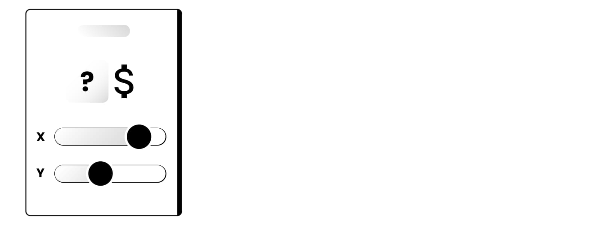
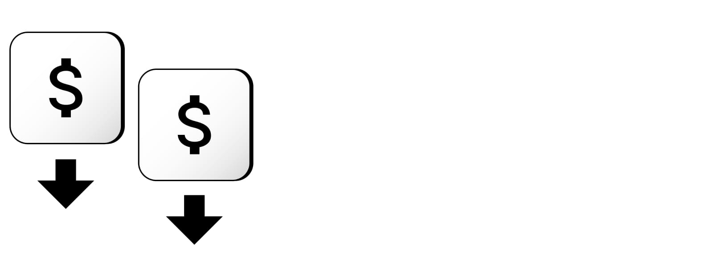
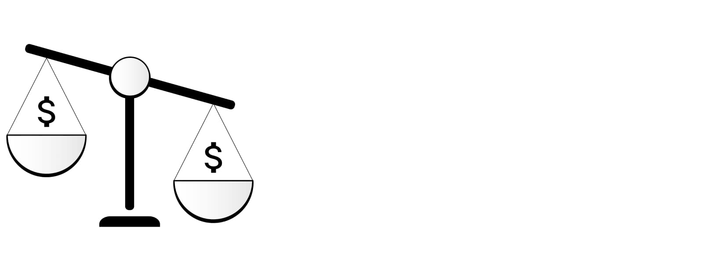

# Top 6 SaaS Pricing Models and 4 Major SaaS Pricing Strategies - with Examples

SaaS is a cloud-based software distribution model. Online-offered software is a great way to deliver products/services to a customer who can then use it to help grow their own business (B2B) or develop themselves (B2C).
In this article we will focus on the business side and highlight 6 SaaS Pricing Models that successful companies use, along with main Pros, Cons and Examples of each.
We'll also answer the  "How to Choose a SaaS Pricing Model?" question with the help of 4 Major SaaS Pricing Strategies. Let's start!

## Make or Break with Saas Pricing: An Example

It is one thing to have a great service on offer and another thing to make it an actual success. You cannot monetize that great product without a pricing model. A SaaS pricing model can make or break a business - and examples of both are plentiful.

For instance, [Snipcart](https://snipcart.com/) is a SaaS business with the simple promise of allowing you to add a shopping cart to any website. It takes mere minutes, supposedly, to be able to start accepting international payments.

### First Pricing Model

Originally, back in 2013, Snipcart's pricing philosophy was based around the tenet of "If you sell, we get paid. If you don't, we don't." Customers were not charged unless they themselves were making a sale. This pricing model grew out of an intuition, and despite the fact that support for the model within the company was not unanimous, they ran with it for two years. As they did, and as their customer numbers grew, they started compiling growing volumes of data that could now be analyzed to see what they were doing right and what they were doing wrong.

### Analyzing the Data

Following careful analysis, it turned out that Snipcart was being "asymmetric" in their support efforts: while 80% of the company's revenue came from 20% of the customers, they rest of the customers were contacting support just as frequently, thus generating costs for Snipcart, while not bringing them revenue.

The pricing model was also attracting many customers who were not serious about building an e-commerce business at all. At the same time, Snipcart was running what they called "a bootstrapped business," meaning their ROI had to be "on point" if they wanted to survive in their "highly competitive space."

### Pricing shift

They made the risky decision to introduce a minimum fee for their standard 2% commission at $10. This would have zero impact on those customers that sold over $500 a month, but breaking it to customers who had, up to that point, used Snipcart for free was not easy.

Following some negative feedback, however, the numbers spoke for themselves: Snipcart lost zero of their paying customers, around 50% of their total user base (the non-paying kind), and managed to triple their revenue in the following months.

### SaaS basics

As of 2021 SaaS is a major platform for servicing end users in a multi-billion dollar industry whose growth continues to impress. SaaS makes good on its promise to keep users' costs low, make deployments easy, and have upgrades be relatively painless for customers.

With every passing year the "Software as a Service" (SaaS) paradigm of delivering software to customers is becoming key to turning great services into great successes.

### Saas origins

Of course, SaaS did not appear out of thin air. SaaS is the fruit of long-standing developments in both IT and business. Before SaaS, customers had to buy software licenses, make sure they had specialists maintain and update the software they used, and ensure their own servers that ran the applications on their own premises were properly maintained. This was a pain that SaaS has helped relieve.

### SaaS benefits and pricing

SaaS has also helped businesses accelerate and achieve a competitive edge - which happened industry-wide, and so things have just accelerated overall, making SaaS a space of dynamic competition perhaps unseen before its rise. While SaaS has been gaining traction for years, the ongoing COVID-19 pandemic has accelerated this process, bringing the benefits of SaaS to light.

Again, though, a product or service is not worth much until and unless it is properly priced and thus made available to customers. In this article we will focus on what models of SaaS pricing are most commonly used by SaaS ventures and on how to approach choosing the correct pricing model for your business. Along the way, we will discuss the pros and cons of each model and offer some examples of how they have or have not worked for actual companies.

## SaaS Pricing Models

### SaaS Pricing Model #1: Flat-rate Pricing

This is simplicity itself. A single product with a single feature set and a single price. It is the opposite of tiered-pricing models (see below). The simplicity leads to some interesting advantages, but comes at a cost as well.

#### Pros:

-   Flat-rate pricing can make your offer clearly defined and your marketing forces' job easier. Because customers can easily understand your offer, flat-rate SaaS products are relatively simple to market, frame, and sell, especially compared to some of the other pricing models listed here.

-   Since more established providers usually sport elaborate pricing schemes, flat-rate pricing may help newcomers stand out easier.

#### Cons:

-   Customers will often be grateful for simplicity, but the flat-rate model can also backfire. Even if you have a single product, you still want to reach a multitude of different users. Otherwise you miss out on attracting customers with varying opinions on what makes a SaaS pricing model desirable.

-   You may appeal to small businesses, but you probably don't want to do that at the expense of attracting the attention of an enterprise. It is hard to gauge the value.

-   such different entities with a single, uniformly priced product. Why would you make an established enterprise pay as little as a startup? This smells of missed upselling opportunities.

#### Example of Flat-rate Pricing:

Basecamp, a popular business management software platform (essentially a project management tool), has confidence in their flat-rate pricing model. Flat-rate pricing is all about clarity, and so they put a major "Basecamp Business: $99/month flat" front and center on their pricing page. They can now boast putting no barriers in front of users: You can start unlimited projects with unlimited users and no per-user fees, and full-on support. But...

Even Basecamp has introduced a tier beneath this flagship business program: You can now use a "Basecamp Personal" variant, a lightweight option for "personal projects, students, freelancers, families, light use." 3 projects, 20 users and 1gb storage space, as opposed to unlimited, and 500gb storage, respectively - those will be your limits. Basecamp's hope must be that later you will perhaps get upsold to the business tier. A tier, which means, it's not really flat-rate pricing. This case shows it is increasingly hard to maintain flat-rate pricing simplicity. More on this [here](https://basecamp.com/pricing).

### SaaS Pricing Model #2: Usage-based Pricing (aka Pay as You Go Pricing)

This model, popularly known as "pay as you go" suggests charging customers based on the usage of the product.

Usage-based pricing is predominantly used in the field of infrastructure- and platform-related services offered by companies such as Amazon (with AWS). Customers may be charged based on the number of transactions made, amount of data stored and retrieved, or the volume of their API requests.

Pay as you go is, however, is gradually spreading beyond infrastructure and into spaces like social media, where specialist scheduling, invoicing, analytics, and other tools may be employed as part of this particular SaaS pricing model.

#### Pros:

-   New customers can enjoy a relatively low barrier to entry. They know they won't be paying as much as the big players until they start using the service to the extent that they do, so they feel like they are getting their money's worth from the get-go. You can then raise the price for customers who come to make more frequent use of the service.

-   It's likely that the advertised prices will consistently be lower than the actual, usage-based prices charged.

#### Cons:

-   The ultimate cost may prove to be perceived as too high for major users. Users are discouraged to use more of your service, which is an effective disincentive. They may then migrate to a provider who offers pricing as part of a more sophisticated SaaS pricing model.

-   Since it's hard to predict how much of your service will be used, and the revenue depends precisely on that, the revenue itself becomes relatively less predictable compared to some other models.

-   From the opposite perspective, customers may be discouraged in committing to your service since it may be hard for them to predict how much of the resource they might end up using.

#### Example of Usage-based (Pay as you go) Pricing:

Zapier is one company that firmly believe in the usage-based SaaS pricing model. They offer automation workflow they call zaps, which customers can create with the promise of major time savings.

Zapier offers pricing tiers depending on the number of zaps and number of tasks within a zap created by a customer. Most of this is customizable, making this a hybrid pricing model. They also throw in extra functionalities for higher tiers, such as "custom logic paths," "auto replay," and "connection via Webhooks." Essentially, though, the more of the zap functionality you use, the more you are charged. See more [here](https://zapier.com/pricing).

### SaaS Pricing Model #3: Per-user Pricing (aka Per-seat Pricing)

This is the de facto choice of many SaaS companies out there. As simple as it sounds, per-user pricing means that a fixed rate is charged monthly for every user of the SaaS product.

#### Pros:

-   Linear scaling in the per-user model guarantees a level of simplicity seldom matched by other SaaS pricing models. This helps make revenue generation predictable: You know how many users you need to bring in how much revenue. Thus, the calculations and forecasts of per-month revenue is easier to carry out.

-   From the customers' perspective, per-seat pricing is attractive in that it allows them to have a clear estimate of how their needs will translate into costs. Per=seat pricing scales relatively easily across the customer's businesses, allowing for a gradual adoption to correspond with increased and clearly defined financial burden.

#### Cons:

-   The pros of the per-user model come at a cost. By making it clear that more users means more cost to the customer, you provide an incentive to limit adoption of your SaaS product among your users, and even to cheat when using it, such as when sharing credentials across team members.

-   There is a sense of penalization for adoption that comes with the per-user pricing model. It is as if you were inviting your customers to drop out of your services as soon as possible, since fewer users equals lower cost for them.

-   Finally, the model does not reflect the real value of your product to your customers - which is seldom strictly tied to whether it is used by 4, 5 or however many of them. You want that value to be reflected in the price and pricing model. To have that happen, it might be best to avoid the per-user/per-seat model as a long-term solution.

#### Example of Per-user Pricing:

Upscope is a company that offers co-browsing - no download instant screen sharing to its customers. The company went through a series of unsuccessful variants and still experiments with their pricing model, but settling on the per=seat model seems to have been their turning point. It also seems like they flirted with the per-active-user model but now are more settled on the standard per=seat variant, but with the all-too-common added complexity of feature-based pricing. More on this on their [blog](https://blog.upscope.io/upscopes-b2b-saas-pricing-model-and-all-the-dumb-failures/). And [here's](https://upscope.com/pricing/) the current SaaS pricing model they employ.

### SaaS Pricing Model #4: Per-active User Pricing

In the per-active user pricing model of SaaS, your customers are charged solely depending on how active they are. All of your customers' employees may sign up for the service without worry that they will be charged for something they don't use. No money will be spent on users who are not actual users. When they do use the service, though, they will be billed for it. This pricing model is essentially a development of the per-seat model.

#### Pros:

-   Enterprises can commit to a service and increase that commitment across its organization without fear of being overcharged. This potentially encourages widespread organizational adoption.

-   The model is simple, but not so simple as to be devoid of flexibility in the eyes of customers.

#### Cons:

-   It is not uncommon to see abuse of the model's relative flexibility in regards to the standard per-seat model. Users and teams may share logins and other credentials to keep the company's cost low, especially with small, relatively non-bureaucratized customers.

-   Apart from above, the model suffers from disadvantages similar to the standard per-seat SaaS pricing model.

#### Example of Per-active User Pricing:

The cloud-based instant messaging platform [Slack](https://slack.com/intl/en-pl/pricing) is often quoted as an example of this SaaS pricing model. As Slack's website reads, "Most enterprise software pricing is designed to charge you per user regardless of how many people on your team are actively using the software. At Slack, you only get billed for what you use, so you don't pay for the members who aren't using Slack."

At the same time, the plan you purchase still applies to your entire workspace. The changes in billing will reflect the real changes in the number of active users of the service. Interestingly, if no members use Slack, the billing will show at least one member using Slack unless a downgrade to a free plan is made. This all comes under the company's "Fair Billing Policy."

### SaaS Pricing Model #5: Feature-based Pricing

This Saas pricing model often comes as a mix-in to other solutions, or a hybrid variant, making it a popular element of complex real-world pricing solutions. Because of the tendency to combine features in various ways within the feature-based pricing, it is sometimes called an add-on or modular model. If your software is not simple, but instead offers complex features that you are nonetheless able to configure in a tiered layout, then feature-based may be the way to go. Functionality may be spread wide across different - usually 3 to 4 - tiers, and the tiers themselves may be addressed to differently defined buyer personas. Some of those personas will not interact with some features of the application at a particular time, so not making them pay for those will be received well.

#### Pros:

-   Feature-based SaaS pricing makes the incentive to upsell clear through defining the next tier for the customer.

-   Complex functionality that will only be of use to a particular buyer persona can be priced adequately.

-   Even demanding customers may trial and evaluate your software at a less feature-rich option if they are not sure that they want to commit.

-   If the feature-based model is implemented well, the customers can understand the pricing well and see upgrading as a natural progression.

#### Cons:

-   The feature-based model is complex enough to give SaaS companies trouble as to defining the suitability of a feature set to different buyer personas, especially if the feature sets are rigidly tiered and not pick-and-choose (as is the case in a typical feature-based solution). It may not be suitable for newcomers to the SaaS space, since customer identification requires data they might not yet have.

-   For some users it will be disappointing to be charged for a set of features without getting the full package, leading not to upselling, but to dropping out in favor of a competitor who offers a similar feature set without implying that it is not complete or in some way lacking.

#### Example of Feature-based Pricing:

The countless hybrid pricing model implementations out there commonly include feature-based variation. [Unbounce](https://unbounce.com/pricing/) is a company that offers customers custom landing pages for their websites out of the gate. Customers can design and edit them without needing to code or hire a developer.

Unbounce sports a feature-based pricing model with 4 plans of feature-based service, the top one being further customizable as far as limits go. Unlike in freemium (see below), there is no free tier, but all the available tiers come with a 14-day free trial period.

Crucially, on closer inspection, you can see the plans differ not only in terms of how much of the service you can use, but also in regards to the many, many features included or excluded based on which plan you choose.

The differences include things like accelerated mobile pages, advanced targeting and scheduling, A/B testing or dynamic text replacement.

### SaaS Pricing Model #6: Freemium Pricing

A freemium pricing model for SaaS involves offering a free-to-use product with paid packages added on top. As the paid options are accompanied by an entry-level tier, limitations are introduced to the latter, encouraging its users to upgrade to one of those paid options.

The limitations may consist of disabling certain features (available only in a premium package), limiting the capacity of a resource for a user (e.g. in terms of a limited number of free API calls allowed per day), or constraining the context in which the user can access a feature.

#### Pros:

-   The freemium model employs the socio-psychological "foot-in-the-door" tactic, facilitating initial adoption among customers. It does not get cheaper than free.

-   Another plus is that the freemium model has been known to facilitate rapid adoption, yielding results akin to going viral. Users who like free software will tell their peers about it.

#### Cons:

-   Users may not come to highly value a service once they get it for free, regardless of the real benefit it provides them. This may lead your service or product to likely be abandoned once something more "valuable" comes along.

-   Needless to say, the freemium model can really drag your revenue down. In practical terms, the paying users need to generate enough revenue for you to compensate for whatever free-tier users are getting. A partial way around this is the ads-supported variant of the freemium pricing model where companies offer a service for free but still want to monetize the free users. Ads can even be added to encourage free users to upgrade to a paid package. Intrusive ads, however, can impair user experience and thus damage your brand itself.

-   Additionally, if you accustom your customers to getting the service for free and then expect them to pay for it, then even if the problem it solves for them is real and important, they may come to resent you for being charged.

-   Some statistics have purportedly shown that only 10% of the free-tier customers become paying customers. These are not exactly the results you want, and they indicate an undesirable burden created by the model on your costs, which the freemium customers generate but don't help you recuperate.

#### Example of Freemium Pricing:

Riddle is an app that lets you create quizzes, polls, surveys, personality tests and the like. They have given up on the freemium model, quoting overbearing server costs as a reason and adding that "freemium quiz pricing is not ideal for a healthy Riddle." The details are described in a blog post titled ["Free no Longer"](https://www.riddle.com/blog/riddle-freemium-quiz-pricing/), but overall it is clear that Riddle had come up against the limitations of the freemium SaaS pricing model: most users will use your product for free and never upgrade.

Having abandoned freemium in favor of a basic paid plan, they have vowed to keep the free users from before the change free. Riddle now also offers bigger discounts on longer-term commitments for users, building customer loyalty through pricing incentives.

## How to Choose a SaaS Pricing Model?

### Basics of SaaS Pricing Strategies

Following this rundown of major SaaS pricing models, the question arises: How do you choose the right pricing model for your SaaS business? This is answered with the help of SaaS pricing strategies. Whereas SaaS pricing models are schemes that define the structure of pricing, SaaS pricing strategies help your company decide which model to adopt at a given time and how to implement it. The strategies are a way for you to get from your pricing problem to a definite SaaS pricing model solution and get your profit margin to rise and your product's value to be realized.

### SaaS Pricing Strategy #1: Penetration

The penetration pricing strategy consists in reducing prices to often unsustainable levels in the interest of gaining rapid adoption among the customer base. The point is to compensate for this short-to-mid-term hit by recuperating the cost in the long run. Penetration is about getting to the customer first, even at the cost of incurring temporary losses. Slack and New Relic are among companies that have used this strategy to great effect.

### SaaS Pricing Strategy #2: Cost Plus Pricing

Based primarily on the cost as the primary driver of pricing, this strategy is about adding a desired profit margin to the sum of costs expended towards developing, marketing, and delivering the product. This comes at the expense of ignoring the prices set by your competition and the perceived/intended value of the product you are offering. While simplistic, the cost plus pricing strategy is seen as a useful starting point for establishing a pricing framework for your business.

### SaaS Pricing Strategy #3: Competitor-based Pricing

Under the competitor-based SaaS pricing strategy, your competition's already-set prices are used as a benchmark from which to establish your own. This makes your decision dependent on how well your competitors have set their own prices, and so it makes the strategy a risky approach. It is, however, often suitable for companies new to the market, uncertain of how much their product is worth, and unable to produce empirical data to back up any such notion. In the long run, our advice would be to steer clear of this approach as well - if the goal is to stand out and innovate, you don't necessarily want to mimic your competition's moves.

### SaaS Pricing Strategy #4: Value-based Pricing

Value-based pricing is often considered the optimal strategy for setting a SaaS pricing model for your service. Instead of looking at the competition or at your own costs exclusively - both of those approaches being reactive propositions - you set the trend yourself in conjunction with your prospective customer base. It's not solely about what you think your services are worth, obviously, and requires extensive research to establish what the actual and potential value of your product is. You then gain some distinct advantages, as follows.

#### Pros and Cons of Value-based Pricing Strategy

Since this strategy is quite complex, it deserves its own list of pros and cons before we wrap up this short piece:

#### Pros:

-   The major pros of value-based pricing for SaaS include pinpointing the match between what you provide in terms of value and the perception of it in the experience of your users.

-   If your users are willing to pay a price higher than that charged by your competition, you don't need to obsess about cutting costs. Instead, you may reap the benefits without the added constraints of following in the competitors' footsteps. Value-based pricing is outward-looking, founded upon understanding what your customers require and how to provide them with that value.

-   If you have a firm understanding of your customers' needs and expectations, and are able to maintain it in a dynamic environment, you can afford to experiment with both the product and the pricing to see if you can match the expectations of the varied segments of your user base.

#### Cons:

-  
The downside here is that it is resource-intensive to gain that understanding and get a firm hold on the value you are providing, as seen from different perspectives - both yours and your customers'. And on top of that, because the situation is dynamic, so must the empirical, data-based effort be maintained and renewed. It is worth it in the end, though.

#### Example of Value-driven SaaS Pricing Strategy:

Check out [this article](http://www.josephfung.ca/blog/2012-04-28/engineering-enterprise-saas-pricing/) on how TribeHR took an engineering and analytical, data-driven approach to establishing a firm pricing plan.

On the issue, they said "I’m an advocate of data-driven decision-making, and so with TribeHR we spend a lot of time digging into our numbers, both from a business metrics perspective as well as from a product analytics perspective. When the question of product editions came up, we took a data-driven approach to the problem."

The importance of adopting an empirical-oriented, data-focused approach cannot be overstated. If you need support to make this happen, read on because you are in the right place.

## What SaaS May Mean for You

We hope you have found this rundown of SaaS pricing models and strategies intriguing enough as to want to look more deeply into the ever-growing world of Software as a Service. It is the place to be for your company - now and in the future.

But navigating the sea of choices while avoiding the countless mistakes other companies have made while pricing their products is no small feat. It is hard to take it on alone.

We are here to help. If you would like to know more about SaaS and dive right into what it can do for your business, contact us today and let's get straight to figuring out what SaaS pricing model is right for you.
