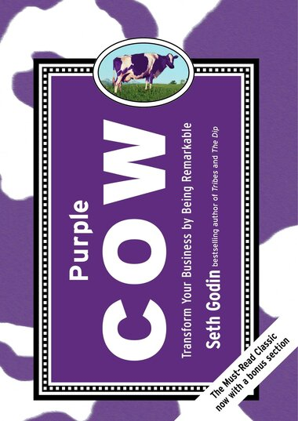

At MasterBorn, we are obsessed with improving the process of software development. For most companies and teams, this begins with creating and defining an MVP. We have built a lot of MVPs and I wanted to share some insights and best practices we have learned thus far, sometimes the hard way.

 

## 1. Ego-driven scope: building a product that’s for you more than from you

I know for a fact that software projects tend to be very personal – especially for founders and owners. It is only natural. Building a product MVP often comes from a deeper intellectual or emotional need. Some people want to make the world a better place, for others it’s a chance to start a new career or make it big in the digital age.

While individual goals are very important, because they drive us forward, any product must be built predominantly with users (clients) in mind. It is them who adapt or reject the application. Failing to validate your product with your actual target audience will probably kill it within months. This is one of the main reasons why [90% of startups fail](https://www.forbes.com/sites/neilpatel/2015/01/16/90-of-startups-will-fail-heres-what-you-need-to-know-about-the-10/).

There are two ways to tackle this problem. One is to go through a research phase before the first lines of code are written. A good understanding of your potential market will also help when looking for investors, who often prefer to understand the business model than to see a prototype.

The second approach is to invest in the UX phase, which is often misunderstood as simply drawing sketches of the application. In fact a well-executed user experience design process helps you understand the users, their real needs and potential problems. At MasterBorn, we require a clickable prototype before we will start writing code for a project. We have found that spending this extra 50-200 hours with our design team leads to far better outcomes.

**Core lesson: take a deep breath, do your homework and ask your users what they really want before investing in the MVP.**

FunFact: the term MVP (or Minimum Viable Product) first appeared around 2001 in the context of Apple Maps. [This article](https://ianbell.com/2012/10/01/apple-shouldnt-build-minimum-viable-products/), first published in 2001, is one of the early examples.

## 2. Misunderstanding of what "minimum" and "viable" really means

Perfectionism in software development is becoming a thing of a past. One of the main reasons for ditching the hairsplitting mindset is the pace at which the world evolves. What was an original idea yesterday, may be boring tomorrow and the first mover advantage is undeniable. So “viable” does not mean final, ideal or exceptional. It simply means optimal at a given stage.

I believe rejecting perfectionism and finding the right balance between richness of functionality and reasonable cost is the most straightforward way to success.

That is why at MasterBorn we advise our clients to first define the problem, find the value proposition, build a prototype and share the minimum with the world. And only when the world approves, invest more money into cleaner code, stunning design and unparalleled performance.

But “minimum” does not mean overly simplistic, coarse or clunky. If the MVP does not live up to basic standards it can be rejected by your target audience not on the basis of its potential, but because of the feeling of being mistreated or underserved.

**Core lesson: take a gradual approach and find balance between initial value for users and simplicity.**

FunFact: [45% of startups](https://websitebuilder.org/blog/startup-statistics/) fail because they run out of money, 42% because they haven’t identified the market properly.

## 3. Choosing the wrong tech stack

Technology is a wave and you need to learn how to ride it. I’m saying this from the eye of the hurricane.

While most modern programming languages allow building virtually any functionalities (especially in the early stages of the MVP), the careful choice of the stack is a technological choice as well as a psychological and sociological one.

There are technologies that are favored by the development community, are relatively easy to learn and a lot of investment is made into them (e.g. JavaScript). Others, while still in use, are shunned by engineers and their future is not as bright (in my opinion - e.g. PHP). Choosing a wrong stack may mean that within years the availability of qualified people to scale and maintain your application will be restricted and talent will be expensive.

Of course not all technologies are equal: for example a web app that is accompanied by a mobile app can be built in JavaScript. This language allows one team of JavaScript developers to build the backend (in Node framework), frontend (in Vue or React) and native apps (in React Native).

**Core lesson: while you need results here and now, think how the technology choice will impact the future.**

FunFact: the three most popular technologies among developers in 2020 are [JavaScript, HTML/CSS and SQL](https://insights.stackoverflow.com/survey/2020#technology-programming-scripting-and-markup-languages-professional-developers).

## 4. Misunderstanding of your product’s key differentiators

One of the key success factors of an MVP, and a mature product, is a well-explored Unique Sales Proposition. For any product a USP is a combination of three factors: what your clients want, what you can give them and what your competition doesn’t offer. Thus to find a good USP at least three exploration exercises have to be made to see if there is a market potential.

When I talk with some startup founders I often realize they ignore the fact that it’s not enough to have an awesome product. It has to make a real difference for the users and do it better than existing solutions. What is the point of inventing a new cola drink if Coke and Pepsi have the majority of the market?

Well, there might be a point if you do it right. As Seth Godin observed in his [great book "Purple Cow"](https://www.goodreads.com/book/show/641604.Purple_Cow) some companies can reinvent the old business model, transform it and become market leaders in the process. Starbucks, Apple and KripsyKreme have thrived in established niches, but they turned around. Similarly Uber reinvented taxis, AirBnB hotels and Revolut banking.

**Core lesson: find a USP that includes clients and competition, but do not be afraid to revolutionize an existing market.**

**FunFact: [the highest valued Unicorn](https://www.statista.com/statistics/407888/ranking-of-highest-valued-startup-companies-worldwide/) as of 2020 is a chinese company ANT Financial, Alibaba’s FinTech spin-off.**

## 5. Hiring the wrong team to build it

I see three main reasons why project teams fail in the MVP stage.

If the team you hire is too big it will cause a lot of problems. First and foremost it will burn your money like a V8 engine. Before you see any results of their work, you will already have depleted your precious financial resources that were also supposed to pay for sales and marketing… A disproportionately large team will also cause either boredom of the team members or cause them to spend their time on experimenting with technology, which is usually not a primary focus of a startup founder.

A team that is too small will feel under a lot of strain and cut a lot of corners to make the deadline. While I mentioned before that perfectionism is not the right way to go, under-resourced projects tend to end up in blood, sweat and tears. While this kind of pressure is motivating for some software development specialists, the vast majority need space to focus to deliver best results.

An under qualified group of developers, product owners and scrum masters will face not only technological challenges, but also communication problems leading to a frustration of the founders and the tech team alike.
It is also tempting to have a close-knit in-house team from day 1. It’s great for knowledge retention, you can reward developers with stock and build a strong identity. But this comes at a cost – hiring is slow and expensive, team-members come and go at a whim and it’s hard to be result oriented. By outsourcing the work in the MVP stage you shorten the time-to-market, reduce recruitment costs and have more certainty that potential substitutions will be available in a short time.

**Core lesson: make sure your team is fit for purpose and understand their biggest strengths and weaknesses to adapt to the problems that may arise in the future.**

**Fun fact: [according to some studies](https://www.qsm.com/process_improvement_01.html), team efficiency drops significantly if there are 9 or more team members.**

## 6. Product-centred approach

Products are tangible. They come with unique designs, cool features, technological quirks and database awesomeness. That’s why a lot of startups concentrate on products and risk a tunnel vision, where anything else is out of sight.

But in fact, a product is not complete without marketing, lead generation and sales. From a business perspective an application is just a part of the puzzle. Think about it: some founders find investors way before their apps get initial designs, not to mention code. It’s because they can convincingly speak about sales, marketing and monetization models.

**Core lesson: think of a software product as a means to an end, not an end goal itself.**

**Fun fact: [less than 57% of startups](https://www.forbes.com/sites/johnkoetsier/2020/04/30/74-of-startups-have-trimmed-staff-65-have-less-than-6-months-of-cash/) have a dedicated marketing team.**

## Summary

At MasterBorn, we are fanatical about improving the process of software development. We hope that you have found something valuable in our observations. [Let me know](https://www.linkedin.com/in/grayskinner/) what you think. We are always learning and improving our processes, so look for a revision sometime next year!
