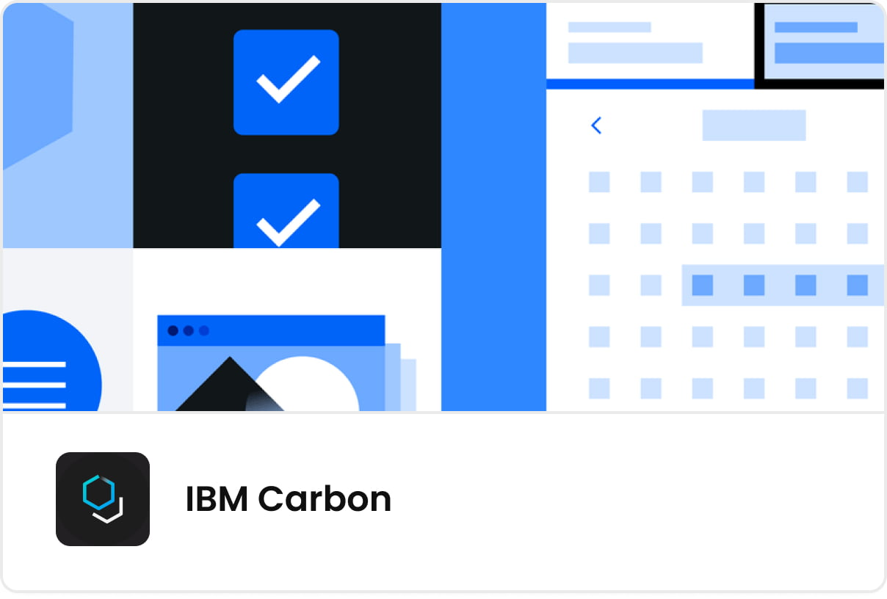
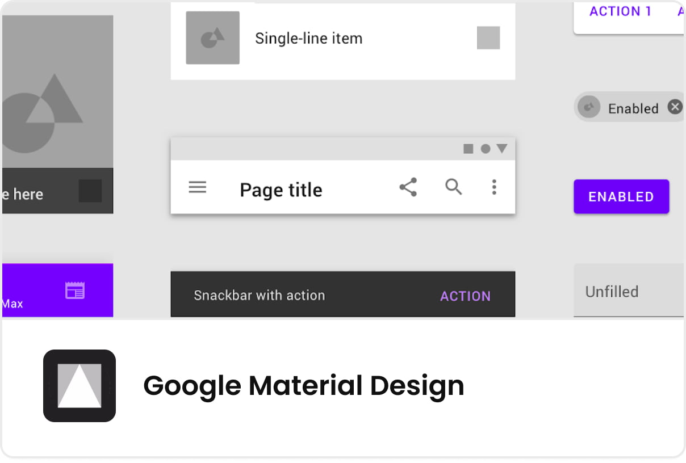
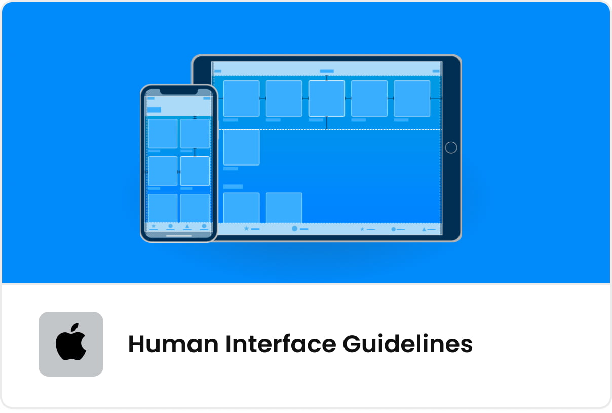
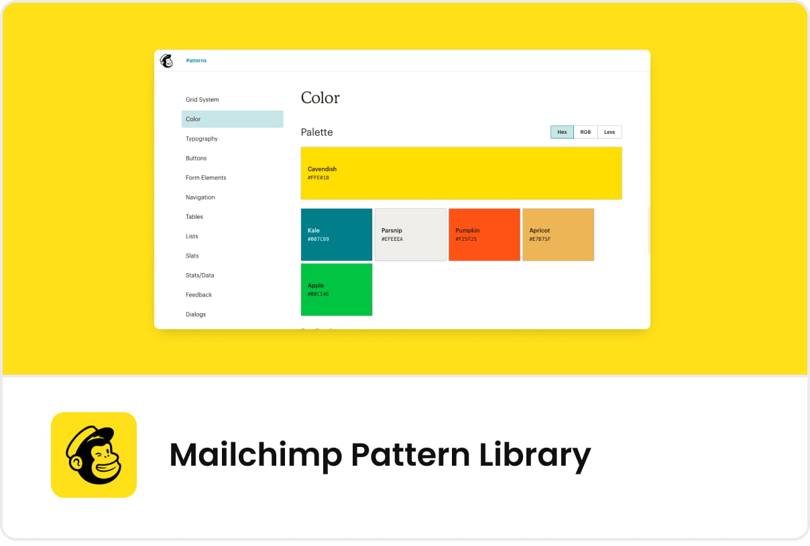
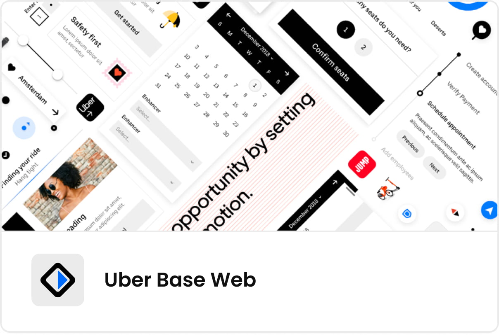
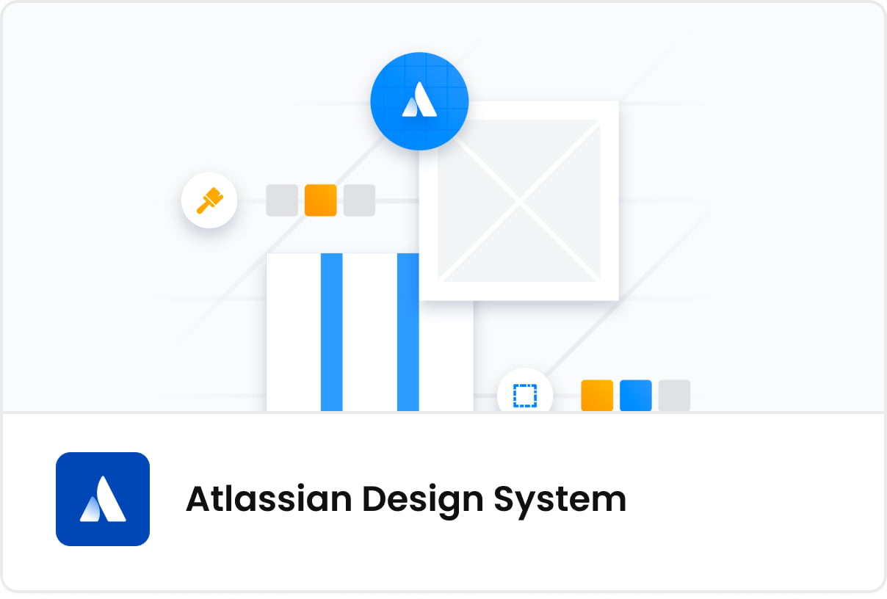

# Design systems: the benefits for start-ups and product teams

Design systems are tools that help speed up product development, achieve better time-to-market, and improve consistency across applications. They are a single source of truth for all team members that is shared and coherently organized.

Yet, despite their usefulness, the awareness of what design systems are is relatively low, especially among Founders, CEOs, CTOs, and developers, who generally have no background in UX and UI.

This is not a surprise - the concept itself is a relatively new one. According to material.io, [only 21% of design systems have been in place for 3 or more years](https://material.io/blog/research-state-of-design-systems-2020), while the rest of them are much younger. It is safe to say we are experiencing a design systems boom right now.

In this post, I will explain the concept of design systems, their impact on scalability, consistency, the efficiency of product teams, the most popular tools that help build design systems, and show you some examples of design systems from around the world.

Let’s go!

## Design systems and MVPs

A design system is a complete collection of information about the project. It encompasses both the visual part and the code that makes the front-end work. The creation of a design system is a complex process that does consume some time at the beginning of any project, and it’s impossible to say how much time it will take to complete it... because it is never complete. It grows along with the application.

This is sometimes problematic for early-stage start-ups, which have budgetary restrictions. But it is worthwhile to start with even a basic design system, as this will pay off in the future.

When we start with a Minimum Viable Product, we never suggest a full-blown design system at the very beginning. We start with a simpler style guide which evolves into a beautiful, complex design system.

## What is a design system?

Essentially a design system is a collection of visual assets (components) that are used across an application. Every time a new button, a drop-down list, a table, or a box is added to the app, it is saved and kept for future use. Anytime a team wants to reuse it, they don’t have to search for it or design it from scratch, they just use the component that is already there.

Apart from designs, there are code snippets that are attached to a specific component. For example, it’s not only important that drop-down lists look the same everywhere in the app, they also have to behave in the same way (think of hover, click, scroll, etc.). By using a uniform code, we standardize the behavior as well.

A design system can be very basic. It can define the color and size of fonts, shapes of buttons and vertical spaces between components. It can also be extremely complex, encompassing virtually all components, and their use cases and behaviors.

We can also think of two types of design systems: off-the-shelf and custom ones. Off-the-shelf ones include collections from Google, Apple, or Microsoft. They are publically available and ready to be used by anyone. The custom ones are designed from scratch for a particular app and allow for much more originality, branding, and purposeful visual language.

95% of design systems contain a color system, while 53% include JavaScript code - according to [Sparkbox](https://designsystemssurvey.seesparkbox.com/2020/)

## Design systems and scalability

Products that use a design system can scale much faster. In simple terms, a design system allows us to build new functionalities from an already existing set of components. Imagine how much faster it is to release a new screen or page without a lengthy design and coding process. While it’s not as easy as building a tower from LEGO blocks, it for sure does not require creating each of the blocks from scratch, from melting plastic to pouring it into forms.

So if we think of the long-term growth of applications, catering to new users, and staying ahead of the competition, design systems are among the key factors of success.

## Design systems and consistency

**Consistency in design is extremely important and is a vital part of user experience. It’s far better to have not just a simple design, but a coherent one.**

As your application grows, so does the number of designers and developers. Sometimes the team expands to different locations and even multiple continents. In the long run, some team members leave the project and others join it.

This can all easily lead to massive inconsistencies, as lack of communication and creativity creates an environment where there is no control over how the different parts of an app look and behave. Design systems are a great solution to this problem as they become the final authority.

## Design systems and efficiency

The usefulness of a design system is visible when a new designer or front-end developer joins the team. Thanks to clear guidelines, onboarding is much faster and works much more transparently. They also reduce the bad kind of creativity that leads to messy and unrefined solutions.

It’s clear that design systems have multiple advantages and are beneficial in many ways, but at MasterBorn we carefully assess each project before we start building a complex library.

In smaller, especially proof of concept projects, we weigh the benefits and costs involved. Sometimes, verifying a simple idea or market fit does not require a lot of effort. Then, a simple style guide or a publicly available design system works just fine.

On the other hand, when we know that the scale of the product will grow and multiple team members will contribute to the visual language and code - we build a design system coordinating this work with the client.

## ‘Accidental’ design systems

Some designers, and even whole teams, build design systems without even calling it that. For many IT specialists, consistency, coherence, and reusability are very important. They don’t want users to be confused or lost as much as they don’t want to do the same thing over and over again.

So even if they don’t consciously and deliberately build a proper design system, they still reuse existing elements, components or whole functionalities present elsewhere in the product.

## Design systems Tools to consider

Figma and Sketch are two primary tools that help build both complex and simple design systems. We discussed both solutions and their functionalities in detail in [my previous article](http://link).

The main difference between these two applications is that Figma is a cloud-first, platform-independent tool, while Sketch is a desktop app for Mac only.

This has implications where building design systems are concerned. As I discussed above, advanced design systems are usually the result of the work of multiple designers or even whole teams. That's why Figma is a much more intuitive choice in this case.

Sketch is also a great, well-established tool, but works far better in less advanced design systems (such as style guides) because it requires third-party applications to share files and collaborate on them.

## Examples of leading design systems

Let’s have a quick look at the leading design systems.

### IBM Carbon

Carbon is an open-source design system created by IBM. It consists of IBM design language, working code, design tools, and guidelines. With a bustling community of users, it’s one of the prominent public design systems.

### Google Material Design

Material Design attempts to imitate the physical world. That’s why it’s full of textures, reflections, and shadows. Material design is created for Android, iOS, Flutter, and the web.

### Apple Human Interface Guidelines

Apple’s design system was created with macOS and iOS in mind. It helps achieve the unique look & feel embraced by Mac and iPhone users.

### Mailchimp Pattern Library

An interesting and renowned design system created by the mailing automation company. It’s simple, clean, and powerful.

### Uber Base Web

Uber, one of the trendsetters in modern design, is behind Base Web - a rich, complex suite of components. It’s closely integrated with Figma, a cloud design tool, whose community hosts Uber’s design system.

### Microsoft Fluent

As an open-source, cross-platform design system Fluent designers and engineers a visual and coding framework that promotes accessibility, internationalization, and performance.

### Atlassian Design System

Atlassian Design system encompasses the brand guidelines, visual components but also a language style guide that is an integral part of user experience.

## Design systems - summary

Design systems are gaining traction in the product development world, but they are still a novelty for many teams. One of the reasons why the adoption is so slow is because many people think of a design process as drawing shapes and converting them into code.

As I hopefully was able to demonstrate, design systems are much more than that. They offer a single source of truth by hosting a library of components and code snippets. As the collection grows, it helps to navigate through the complexity of any product.

As a start-up owner or product manager, you should be aware of the advantages, even if you will not build design systems consciously early in the product life-cycle.
