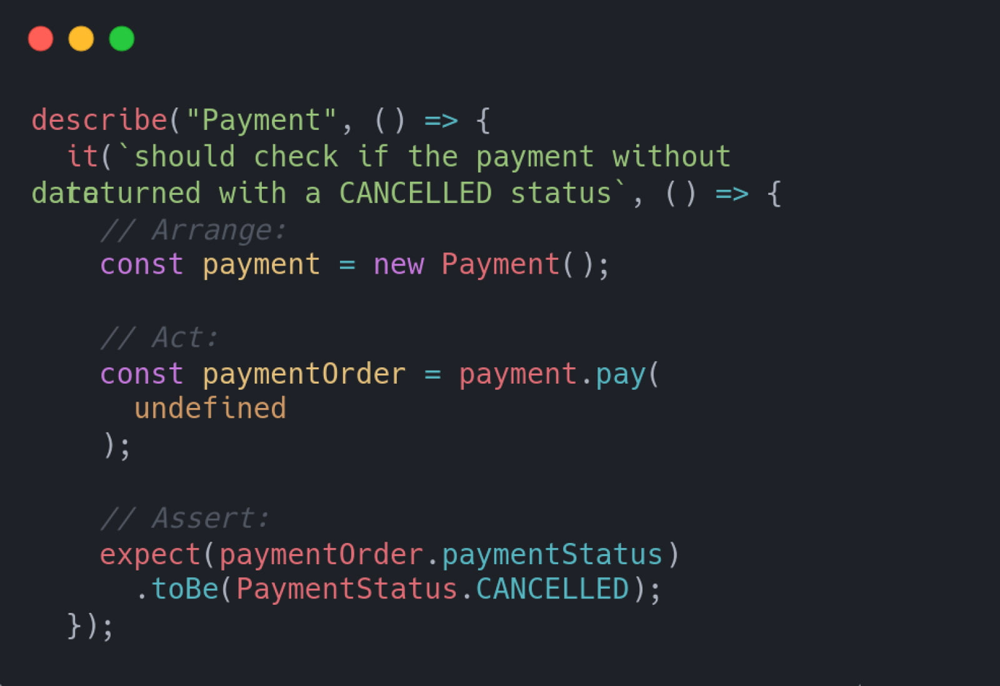
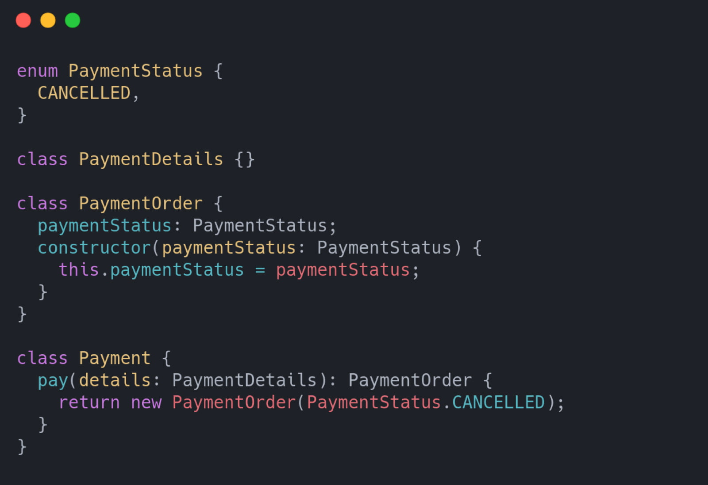
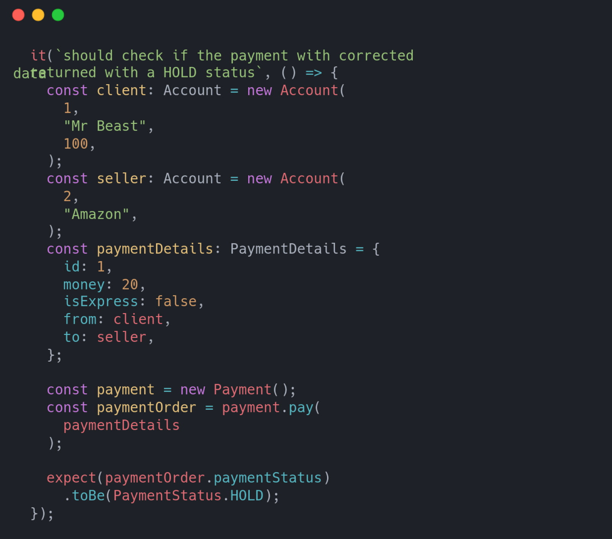
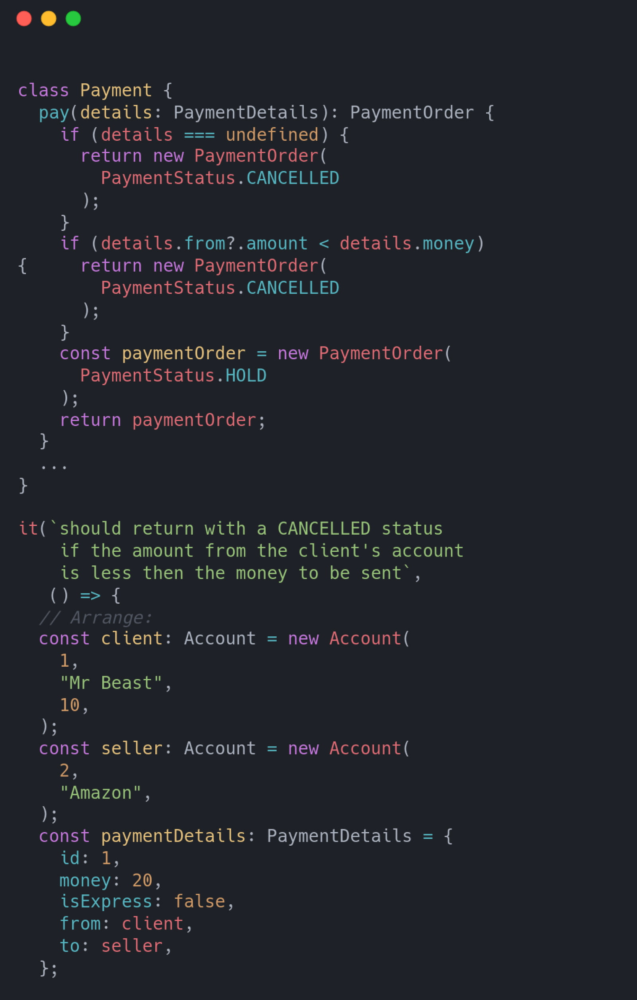
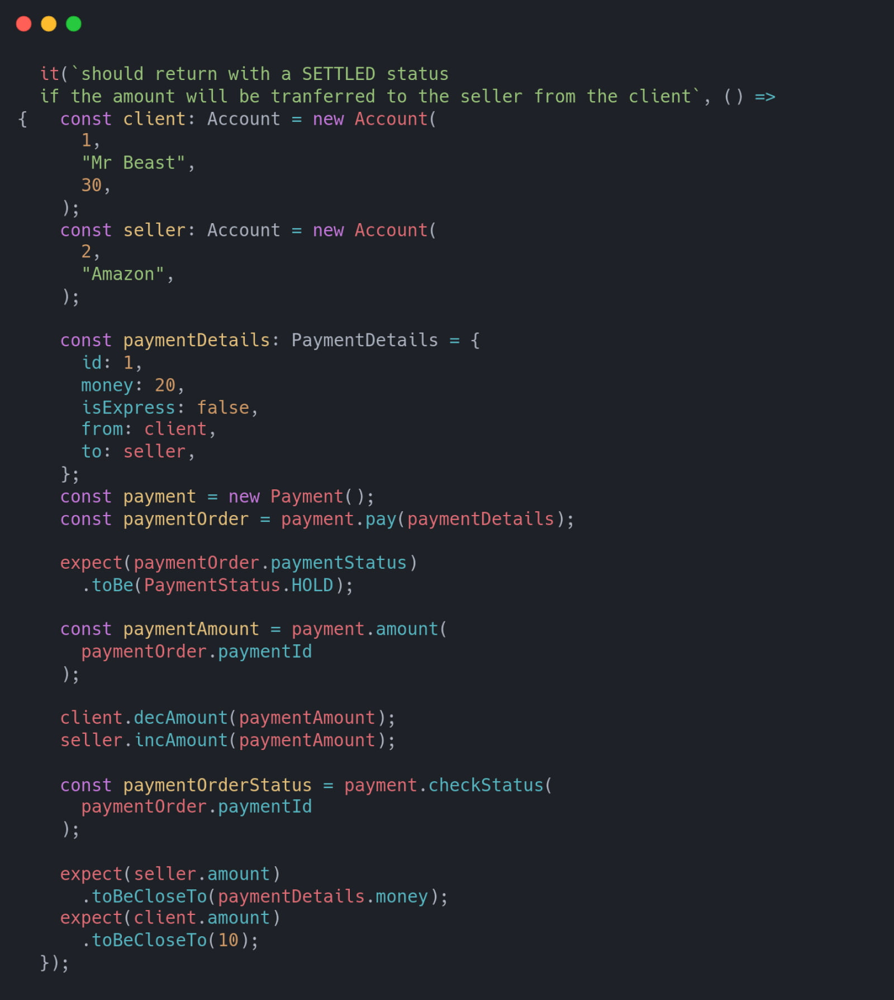
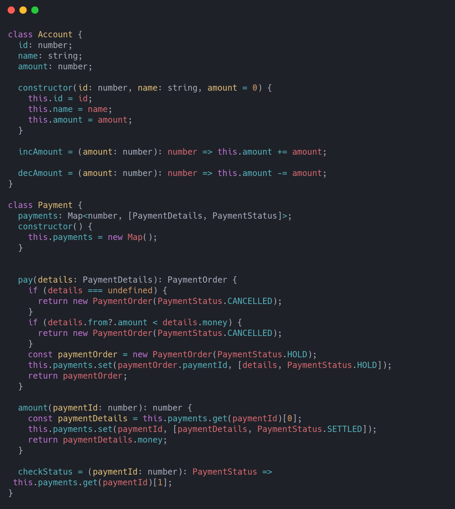
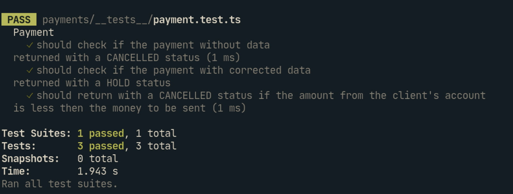

In this article, I would love to share with you some of my knowledge of TDD. If you are up to learning about using it, I’m here to show you a practical example with a bit of theory. I will skip some tests, and I will treat code as something abstract to show the approach.

## What is TDD?

But what do I mean by TDD? What do these characters stand for?

TDD is the abbreviation for Test Driven Development. The main idea is to start the development process by writing tests covering your functionality. With that done, write source code that will work for every test case that you create. As you begin working on each new feature, first — add missing tests related to the required functionalities and only then implement it. And again, and again, and again… The main advantage of this approach is to start by discussing “how code should work” with the other team members to agree on a common methodology or concept. In my opinion, it makes the development process clear and simple. I do hope that you, as a developer, will use it while working on your products.

This article includes some business logic, which focuses on the Payment process. As everybody knows more or less how it works, such an example should be easy to visualize.

Before we start coding, I would like to mention that I’m using TypeScript as my language and Jest as the testing framework.

## How to start a project with Test-Driven Development (TDD)

The first test created will cover the entry point of our payment service. My idea is to create a method called `pay` containing the most crucial logic. The resulting statement should be an order of payment.

I assume that such a statement should contain statuses like:

And the initial status should be `CANCELLED`. We want to be sure that in every case we don’t cover the, the process is canceled.

As we can observe, we should also be able to handle the case without any input data. I’d like to implement it in the simplest possible way.

After this simple warm-up, we can move to something that can handle data.

In this test, I add data classes initialized with values that I use in my method. In this test case, we pass the correct data. Now it only requires refactoring the code from the previous test case. The resulting status should be equal to `HOLD`.

The previous test was very naive considering we don't know there is enough money in the sender's account. The only value that we change here is the amount to pay. We can see big red text informing us that our test failed. Now — I will add such one condition to handle this case:

Now it works perfectly. Let’s run the test: the big green text tells us that we are on the right path.

Finally, we are able to finish our payment process. In this step, I want to transfer the money to the seller and of course, subtract that money from the client’s account. Here I check the current status of the transaction, and if it is correct, I will add some ‘expects’ asserting that the amount on both accounts change.

This fresh piece of code is the last version to implement.

Now I can move to our logic. We know exactly what we need to implement due to having all the cases covered by tests.

Running all the test cases right now, we can see that all the tests are marked green, which means that the tests are passing. We did it!

## Test-Driven Development (TDD) - summary

If you have the possibility of using TDD in some of your projects, it could be a breakthrough. There are a lot of advantages of working with the TDD approach. From being able to plan your development process to just ensuring that your code works as you want it.

Link to git repository containing the discussed code: [https://github.com/mkubasz/blog/tree/master/intro-tdd](https://github.com/mkubasz/blog/tree/master/intro-tdd)
