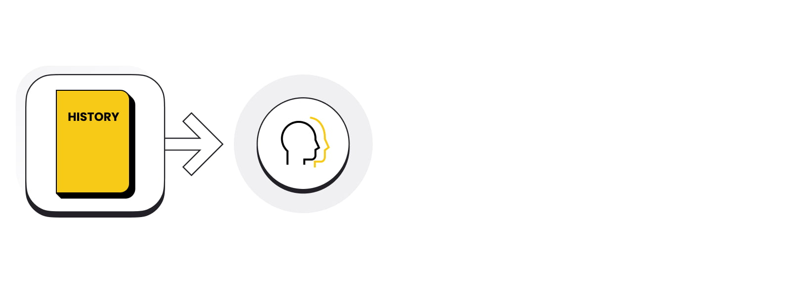
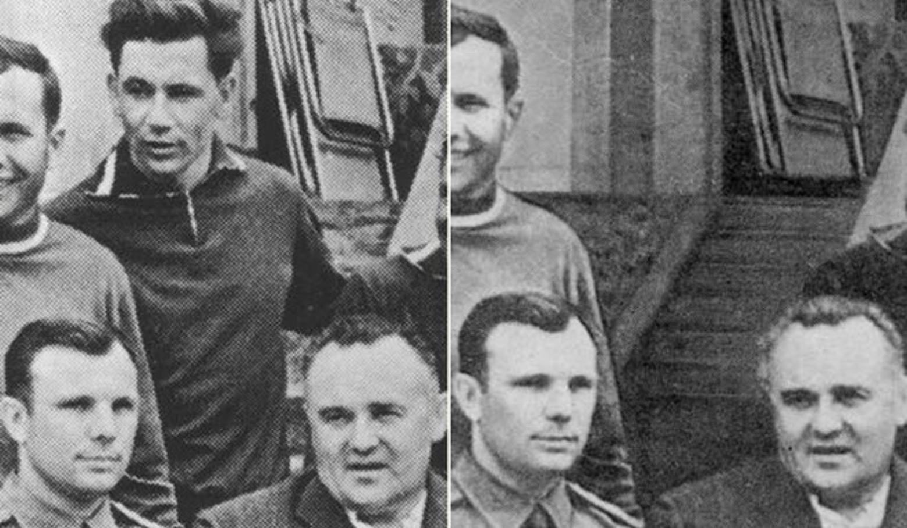
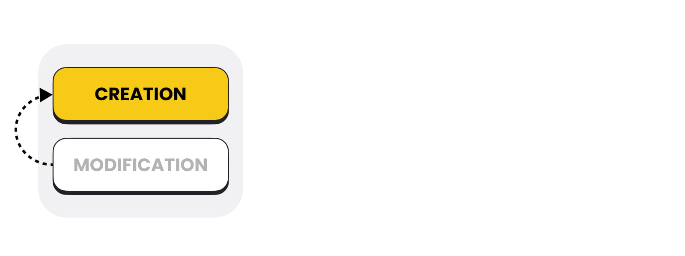
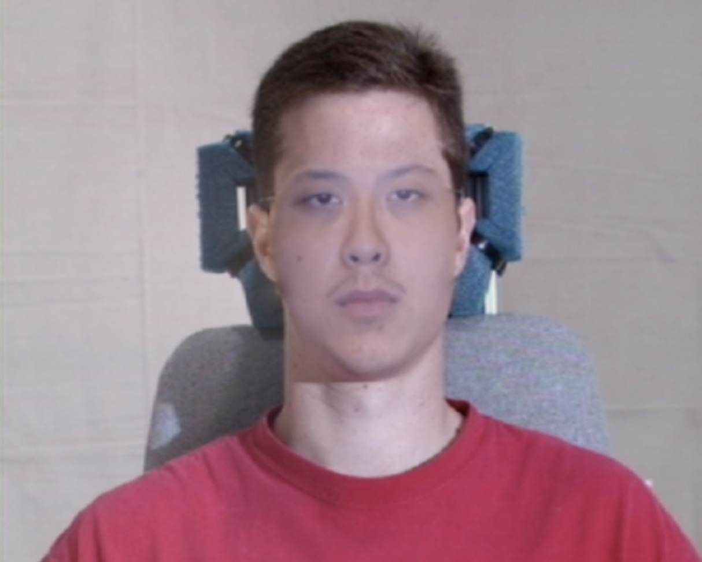

I am a professional that tries to spread the belief that automation is good for humankind. I am aware of the fear it may bring of non-skilled labor no longer being needed, and that hundreds of workers could possibly be laid off. That is true, but that also comes with a promise that fewer people would need to perform drudgery. Yes, that requires upskilling. I believe it is a reason to rejoice, not to fear. Truly speaking, there is little choice.

## History of DeepFakes

A short glance back. The first pictures were taken in the 19th century. Photography quickly gained momentum and while cameras started out quite scarce, we now live in the time where almost everyone has at least a couple of cameras, whether it be a smartphone, laptop, tablet, car, or anywhere else. Portable cameras have become widespread. Pictures were taken to document and show others what the photographer wanted to convey, pictures made newspapers much more vivid and attracted attention more effectively. Pictures allowed families to stay closer when separated by long distances or to admire the distant parts of the world without having to travel there.

The value of showing reality was clear. However, there is rarely any good in the world that does not come without possible evil. It quickly became apparent that pictures could be altered in order to manipulate the public. Take a look at these Soviet time pictures.

## First fakes, not deep yet

Was there a man in the picture? At some point yes, there was a man, but after he was disposed of, he was no longer wanted in any picture. As is well known, the Soviets experienced high turnover in their ranks, hence the need for invention.

Having discussed pictures, let's consider voice for a moment – if there is a recording, it can serve to pass the information, but also to manipulate. It is enough to skillfully cut fragments of speech to have an individual say things he never said or omit relevant context. At least that could bear the appearance of a reliable message, however it remains doubtful whether the intonation of one’s voice could be easily faked.

Both of these examples have something in common. For a long time, it was possible to only deal with existing information and it was possible to eliminate the content that was not needed nor wanted anymore. In the era of Photoshop, the use of different filters and picture enhancement came to light.

At that time it was much easier to manipulate the picture, but the work was done on an existing picture and there was not a reliable way to make a convincing animation of somebody doing something they didn’t do. Regardless, we could have talked about fakes at that time.

## A new paradigm – creation, instead of modification

The true breakthrough however, is Deepfake – a technology that allows users to create something that does not exist, and equip it with a realistic image and voice. Notice the prefix “deep”? That deserves an explanation. In 2012, during the competition “Alexnet”, the winning solution was a “deep” neural network that somewhat surprisingly, beat all the competition. That neural network was trained with the use of a backpropagation algorithm and it was effective in classifying objects into different classes. That year started a boom in the development and popularity of deep learning technology. In 2014, a paper came out that described GANs [2] while another described the encoder-decoder architecture [3]. Lets dive deeper, but before that let’s ground our historical perspective.

It was labor intensive to manually erase somebody from a picture, though clearly it was possible. It was also possible to switch the face of a person in a picture, however the accuracy of the results were not ideal, and seldom realistic. Before deep learning, there were techniques available for face swapping. Those techniques consisted of several stages:

1) facial landmark detection

2) face warping using triangulation

3) face warping using thin plate spline

4) face replacement

5) blending

6) Kalman filtering

How effective are those techniques?

It does bear some resemblance to a real person, but if a second glance is allowed, it would be tough to mislead a viewer of the picture's authenticity. Before deep learning, there was no technology ideal for the task. However, the game changing techniques were developed with an application of deep learning fake images.

## Modern Techniques and their broader applications

### Gans

There would be no deepfakes without GAN. Let’s dissect this buzzword and see what it is about. Generative adversarial networks (GAN) are networks that proved themselves to be very effective in generating realistically looking images. GAN is a neural network architecture (it is common in machine learning jargon to call the variations of compositions of different layers “architectures”) which consists of two parts. One is a discriminative model that models conditional probability, and the other part is a generative model that models joint probability. One network is learning a distribution that best reflects the observed data and with the addition of some noise (which is the perturbation of an input image, another piece of jargon), it comes up with artificial examples that are supposed to mimic the observed data points the best. The other network is tasked with telling apart the artificial images from the original ones. For more information consult the original paper [2].

### Image inpainting

Another application of GANs, which is at the heart of deepfakes, is image inpainting. It could realistically fix a missing part in an image based on neighboring pixels. The same applies to image quality upsampling or painting colorless pictures.

### Deepnudes

Probably the first audience deepfakes received was via deepnude, an application that was able to swap the face of a celebrity or politician with the face of a sexwworker performing in pornographic movies.

That demeaning technology could be used to reduce election chances or ruin somebody’s career as an actor regardless of an immediate insistence that it is a deepfake.

How effective is GAN at generating realistically looking pictures of people that do not exist?

Very effective. Judge for yourself:

Those are not real people.

### Encoder Decoder Architectures

First described in 2014 for the task of learning sequence to sequence representation, this architecture has been applied in deepfakes too. It consists of two neural networks, one compressing the input to a fixed size encoding and then the other network that tries to recreate the original input from this encoding. Since that blog post is less about the technical how, I will not delve into too many details here.

## Types of Deepfakes

Today’s deepfake may refer to [4]:

1.  An Entire Face Synthesis in which some version of GAN is used to create a nonexisting face. Current technology is breathtakingly accurate and is capable of generating faces that are not discernible to the human eye. Check www.thispersondoesnotexist.com for more.

2.  The Identity Swap technique of replacing a face of one person with the face of another person in a video. Identity swap can be achieved using classical methods or deeplearning based methods.

3.  Attribute manipulation is a technique to modify existing faces (hair color, skin color etc). It could be used by customers to try on a variety of products (glasses, cosmetics etc.).

4.  Expression Swap in which one person is filmed doing something, and then another person’s face is inserted into the face of an original actor. See Tom Cruise DeepFake, Queen DeepFake etc. The technology at the current moment does not allow someone to tell the original from a copy.

## Voice Deepfakes

What would a human be without a voice? A mute. But deepfake people are not mutes. They are more real than that. There is a technology for that as well. There are already solutions capable of synthesizing very realistic human voices. Think about how much damage potential malicious use could result in with only a recording of a couple seconds long... Millions of voice messages are sent on whatsapp daily. With the know-how of stealing that data, it has become very feasible to create a realistically looking person that speaks with its own voice? Is the technology so perfect that there is no one able to tell the difference between a combination of 3D and voice deepfake?

There are very realistic examples and evidence indicates that we are already living in the era in which we should not trust anything we see nor hear. However these examples, with their real life capabilities on a phone app, might be used for good in games and fun activities.

## Applications and threats

All of that technology could seriously impact life. Imagine how easy it is to manipulate public opinion about the moves of Central Banks raising or decreasing interest rates, with potential implications of drastic changes of prices on the stock exchange or bonds. A reader could come up with his / her own examples.

The covid pandemic has created a mindshift when it comes to remote contact. Courts, doctors, employers have all gotten used to remote contact with witnesses, patients, and employees. But how do they know if they are really contacting those they think? The point is, that a skilled and (possibly) state sponsored group of specialists could be able to fake every bit of information possible. So what? Well, picture the cold war era. With a very realistic Deep Fake of President Kennedy saying that he just ordered a nuclear attack on the Soviet Union. Now decision makers in the Soviet Union could have had only minutes to decide whether the message is real and could have made a rash and potentially dire decision.

## A vicious circle

It also should be mentioned that there is intensive research being conducted about detecting fakes, which is encouraging. What is discouraging however is the knowledge that discovering forgeries is always bound to be one step behind counterfeiters because having more and more efficient systems to discover deepfakes makes it more likely to construct more and more efficient GANs for the creation of deepfakes. Hence that race mostly resembles a vicious circle in which both parties try to catch themselves, but in reality could not exist without themselves.

## Realistic Deepfake Examples

Bear in mind a couple of examples of very successfully made deepfakes.

### Zuckerberg Deepfake

Where authors of deepfake made a very realistic [representation of Mark Zuckerberg](https://www.youtube.com/watch?v=cnUd0TpuoXI) saying that the true goal of Facebook is to own all data about its users. Users, he continues, are encouraged to post everything they do and add to their network everybody they know, so that the company might sell the customers and their interests to third parties. This is in start contrast to a far more common statement of facebook’s mission which is connecting people.

### Dancing Queen

Speaking about deepfakes, let’s join a tea party where you can see [Queen Elisabeth mocking Borish Johnson, Canadians, Royal Family and dancing on a table](https://www.youtube.com/watch?v=IvY-Abd2FfM&t=163s). It is easy to quote many more examples. However, the point is simple and I feel there is little need to engage in repeating oneself.

## Impact and business applications

Both of the examples described above were made in order to present to the public the possibilities of technology, not to fool it. Hence the content was far off from what the expected content would be, and “detection” was easy. That being said, it did not have to be this way. I think that the vast majority of society is not aware of the possibilities of technology nor is able to critically judge the content they engage with. That imposes a responsibility on internal safety agencies to create tools to monitor virtually every channel that the public uses, and that is costly. Sadly, there is little choice.

At the moment, it’s not known how many commercial applications of this technology there could be, but one natural industry that could benefit from it is the film industry. The cost of movie production is very high because actor’s salaries are counted in the millions of dollars, and the grimace or frown being filmed needs to be just what a director imagines. Some scenes that last only seconds are carefully choreographed for weeks, some scenes require stuntmen to perform in life threatening situations.

Imagine having to pay for only a couple of Data Scientists and their equipment. I think that the cost could be significantly reduced. Imagine that you need to redo a scene with Princess Leia, as in Star Wars – you just employ your GAN and without too much pain and boom, the scene is ready. But perhaps, there wouldn’t be a need for actors at all. What about creating non-existent males or females that are fully owned by directors, who will never get sick, or drunk or overdose on drugs. If there is a need for their older versions – not a problem, technology could help there too. It could solve a potential problem up front – because even if a real actor did not perform in a new movie at all, he or she could still somehow own the right to their profile. If technology is widely adopted, and I see no reason why it would not be, then quite apparently a deep change in some industry and legal frames should follow. When will that happen?

## Summary

The generation entering the labor market in the 21th century is likely to be forced to reformulate their professional career as a result of the changes in automation. It’s inevitable. Every danger, however, brings with it seeds of opportunity, because there will be a need for qualified individuals, allowing them to ask for high salaries. I propose to perceive every change through the lenses of opportunity it is bound to create, not through the danger it brings.

It simply pays off. Good luck!

### References:

[1] Tolosana, Ruben, et al. "Deepfakes and beyond: A survey of face manipulation and fake detection." Information Fusion 64 (2020): 131-148.
[2] Goodfellow, Ian, et al. "Generative adversarial nets." Advances in neural information processing systems 27 (2014).
[3] Cho, Kyunghyun, et al. "Learning phrase representations using RNN encoder-decoder for statistical machine translation." arXiv preprint arXiv:1406.1078 (2014).
[4] Tolosana, Ruben, et al. "Deepfakes and beyond: A survey of face manipulation and fake detection." Information Fusion 64 (2020): 131-148.

