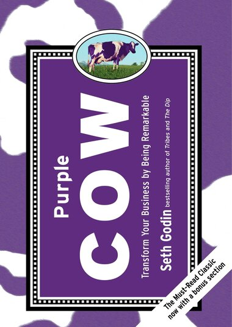

W MasterBorn ulepszanie procesu tworzenia oprogramowania stało się naszą firmową “obsesją”. W przypadku większości firm i zespołów proces ten zaczyna się od utworzenia i zdefiniowania MVP. W tym artykule chciałbym się podzielić spostrzeżeniami i najlepszymi praktykami, których nauczyliśmy się tworząc MVP dla naszych amerykańskich Klientów.

 

## 1. Zakres oparty na ego: tworzenie produktu, który jest bardziej dla Ciebie niż dla klientów

To naturalne, że projekty software’owe są zwykle bardzo osobiste - szczególnie dla founderów i właścicieli. Tworzenie MVP produktu często wynika z głębszej potrzeby intelektualnej lub emocjonalnej. Niektórzy chcą, aby świat stał się lepszym miejscem, dla innych jest to szansa na rozpoczęcie nowej kariery lub osiągnięcie sukcesu w erze cyfrowej.

Podczas gdy indywidualne cele są bardzo ważne, ponieważ napędzają nas do działania, każdy produkt musi być tworzony głównie z myślą o użytkownikach (czyli odbiorcach). To oni akceptują lub odrzucają aplikację. Brak weryfikacji produktu z rzeczywistą grupą docelową prawdopodobnie doprowadzi do jego porażki w ciągu kilku miesięcy (co stanowi jeden z głównych powodów [niepowodzenia 90% startupów](<(https://www.forbes.com/sites/neilpatel/2015/01/16/90-of-startups-will-fail-heres-what-you-need-to-know-about-the-10/).>)

Istnieją dwa sposoby rozwiązania tego problemu. Jednym z nich jest przejście przez fazę badawczą (research), zanim zostaną napisane pierwsze linie kodu. Tu pomocne okazują się warsztaty biznesowe i narzędzia takie jak choćby BMC (Business Model Canvas). Dobre zrozumienie Twojego potencjalnego rynku pomoże również w poszukiwaniu inwestorów, którym często bardziej zależy na tym, by zrozumieć model biznesowy niż na tym, by zobaczyć prototyp aplikacji.

Drugie podejście polega na zainwestowaniu w fazę UX, która często jest mylnie rozumiana jako zwykłe rysowanie wireframe’ów aplikacji. W rzeczywistości dobrze przeprowadzony proces projektowania doświadczeń użytkownika pomaga zrozumieć odbiorców, ich rzeczywiste potrzeby i potencjalne problemy. W MasterBorn zawsze dążymy do zaprojektowania klikalnego prototypu, zanim zaczniemy pisać jakikolwiek kod. Odkryliśmy, że spędzenie tych dodatkowych 50-200 godzin z naszym zespołem projektowym prowadzi do znacznie lepszych wyników w ujęciu długofalowym.

**Główna lekcja: weź głęboki oddech, odrób pracę domową i zapytaj użytkowników, czego naprawdę chcą, zanim zainwestujesz w MVP.**

Ciekawostka: termin MVP (lub Minimum Viable Product) pojawił się po raz pierwszy około 2001 roku w kontekście Apple Maps. [Ten artykuł](<(https://ianbell.com/2012/10/01/apple-shouldnt-build-minimum-viable-products/)>) , opublikowany po raz pierwszy w 2001 roku, jest jednym z wczesnych przykładów MVP.

## 2. Niezrozumienie, co tak naprawdę oznacza "minimum" i "viable"

Perfekcjonizm w tworzeniu oprogramowania odchodzi do przeszłości. Jednym z głównych powodów, dla których warto porzucić podejście polegające na dzieleniu włosa na czworo, jest tempo, w jakim zmienia się świat. To, co wczoraj było oryginalnym pomysłem, jutro może być nudne - przewaga pierwszego gracza (first mover advantage) jest niezaprzeczalna. Zatem „viable” (wykonalny, działający) nie oznacza ostatecznego, idealnego czy wyjątkowego. To po prostu optymalna wersja produktu na danym etapie.

Uważam, że odrzucenie perfekcjonizmu i znalezienie właściwej równowagi między bogactwem funkcjonalności, a rozsądnymi kosztami to najprostsza droga do sukcesu.

Dlatego w MasterBorn radzimy naszym klientom, aby najpierw zdefiniowali problem, znaleźli realną wartość produktu, zbudowali prototyp i podzielili się tym „minimum” ze światem. I tylko wtedy, gdy świat poklepie nas po ramieniu, można inwestować więcej pieniędzy w czystszy kod, oszałamiający design i niezrównaną wydajność. Nigdy odwrotnie!

Ale „minimum” nie oznacza nadmiernie uproszczonego, szorstkiego lub niezgrabnego produktu. Jeśli MVP nie spełnia podstawowych standardów, może zostać odrzucony przez grupę docelową nie ze względu na jego potencjał, ale z powodu poczucia użytkowników, że są źle traktowani lub niedoceniani.
MVP ma być Optymalne.

**Główna lekcja: znajdź równowagę między wartością dla użytkowników, a niezbędnym, optymalnym zakresem funkcjonalnościowym.**

Ciekawostka: [45% startupów upada](https://websitebuilder.org/blog/startup-statistics/) z powodu braku funduszy, 42% z powodu braku zapotrzebowania rynkowego na produkt

## 3. Wybór niewłaściwego stosu technologicznego

Większość nowoczesnych języków programowania pozwala na budowanie praktycznie dowolnych funkcjonalności (szczególnie we wczesnych etapach MVP), jednak trzeba mieć na uwadze, że staranny dobór stosu jest wyborem technologicznym, biznesowym ale także psychologiczno-socjologicznym.

Istnieją technologie, które są preferowane przez społeczność programistów, są stosunkowo łatwe do nauczenia i ciągle się rozwijają (np. JavaScript). Inne, choć nadal są w użyciu, bywają odrzucane przez inżynierów i ich przyszłość nie jest tak świetlana (w moim odczuciu np. PHP). Doświadczenie podpowiada mi, że wybór niewłaściwego stosu może oznaczać, że w ciągu kilku lat dostępność wykwalifikowanych osób do skalowania i utrzymywania aplikacji będzie ograniczona, a pozyskiwanie najlepszych ludzi będzie kosztowne.

Oczywiście nie wszystkie technologie są sobie równe: na przykład aplikacja webowa, której towarzyszy aplikacja mobilna, może zostać zbudowana w JavaScript. Ten język pozwala jednemu zespołowi programistów JavaScript budować backend (w środowisku Node), frontend (w Vue lub React) i aplikacje natywne (w React Native).

Główna lekcja: chociaż potrzebujesz wyników tu i teraz, zastanów się, w jaki sposób wybór technologii wpłynie na przyszłość produktu i Twojej firmy.

Ciekawostka: trzy najpopularniejsze technologie wśród programistów w 2020 roku to [JavaScript, HTML / CSS i SQL](<(https://insights.stackoverflow.com/survey/2020#technology-programming-scripting-and-markup-languages-professional-developers)>) .

## 4. Niezrozumienie kluczowych wyróżników Twojego produktu

Jednym z kluczowych czynników sukcesu MVP i dojrzałego produktu jest dobrze zbadana Unikalna Propozycja Sprzedaży (Unique Sales Proposition, USP). W przypadku każdego produktu, USP to połączenie trzech czynników: tego, czego chcą Twoi klienci, co możesz im dać i czego nie oferuje Twoja konkurencja. Tak więc, aby znaleźć dobry USP, należy przeprowadzić co najmniej trzy ćwiczenia eksploracyjne, aby sprawdzić, czy istnieje potencjał rynkowy.

Wielu założycieli startupów, z którymi rozmawiam, ignoruje fakt, że nie wystarczy mieć “super” produktu. Wyjaśniam im, że ich propozycja musi mieć realne znaczenie dla użytkowników i oferować odczuwalnie wyższą wartość niż istniejące rozwiązania.

Czy znaczy to, że zupełnie nie ma sensu wchodzić w nisze, które są już zajęte? Nie do końca. Jak zauważył Seth Godin w swojej fioletowej [książce „Purple Cow”](<(https://www.goodreads.com/book/show/641604.Purple_Cow)>), niektóre firmy mogą na nowo opracować stary model biznesowy, przekształcić go i stać się liderami rynkowymi. Starbucks, Apple i Krispy Kreme prosperowały w ugruntowanych niszach, ale je zrewolucjonizowały. Podobnie Uber wymyślił na nowo taksówki, AirBnB hotele, a bankowość Revolut.

**Główna lekcja: znajdź USP, które obejmuje klientów i konkurencję, ale nie bój się zrewolucjonizować istniejącego rynku.**

**Ciekawostka: [najwyżej wycenianym jednorożcem](<(https://www.statista.com/statistics/407888/ranking-of-highest-valued-startup-companies-worldwide/)>) w 2020 roku jest chińska firma ANT Financial, fintechowy spin-off Alibaby.**

## 5. Zatrudnienie niewłaściwego zespołu do jego budowy

Istnieją trzy główne przyczyny niepowodzeń zespołów projektowych na etapie MVP. Widzę je następująco.

Jeśli zatrudniony zespół jest zbyt duży, spowoduje to wiele problemów. Przede wszystkim spali twoje pieniądze jak silnik V8 benzynę i zanim zobaczysz jakiekolwiek efekty ich pracy, wyczerpiesz już swoje cenne zasoby finansowe, które miały również starczyć na sprzedaż i marketing… Nieproporcjonalnie duży zespół spowoduje też nudę członków teamu i sprawi, że prawdopodobnie będą oni spędzać czas na eksperymentowaniu z technologią, co zwykle nie jest głównym celem założyciela startupu.

Zespół, który jest zbyt mały, będzie czuć się bardzo obciążony i będzie chodził na skróty, aby dotrzymać terminu. Chociaż wspomniałem wcześniej, że perfekcjonizm nie jest właściwą drogą, projekty, na które brakuje środków, zwykle kończą się frustracją i odejściem kluczowych osób. Chociaż tego rodzaju presja motywuje niektórych specjalistów od tworzenia oprogramowania, zdecydowana większość potrzebuje przestrzeni, aby się skupić i osiągnąć najlepsze wyniki.

Kuszące jest również posiadanie zgranego zespołu wewnątrz firmy od pierwszego dnia projektu. Dzielenie się wiedzą i budowanie firmowej tożsamości brzmią świetnie jednak ten kierunek jest wbrew pozorom bardzo trudny. Zatrudnianie jest powolne i kosztowne, członkowie zespołu przychodzą i odchodzą i trudno jest utrzymać twardą koncentrację na wynikach (które na etapie MVP są kluczowe dla przetrwania projektu).
Zlecając prace na zewnątrz skracasz czas wejścia MVP na rynek, redukujesz koszty rekrutacji i masz większą pewność, że potencjalne zastępstwa będą dostępne w krótkim czasie.

**Główna lekcja: upewnij się, że Twój zespół jest dobrze dobrany do zakładanych celów i zrozum jego mocne i słabe strony, aby zapobiegać problemom, które mogą pojawić się w przyszłości.**

**Ciekawostka: [według niektórych badań](<(https://www.qsm.com/process_improvement_01.html)>) wydajność zespołu znacznie spada, jeśli jest 9 lub więcej członków.**

## 6. Koncentracja na produkcie

Produkty są namacalne - mają unikalne designy, przydatne funkcje, kolorowe guziki i bazują na ciekawych technologiach. To coś “prawdziwego”, coś w co można “poklikać”.
Niestety z tego względu wiele startupów koncentruje się na produkcie wchodząc w tzw. “widzenie tunelowe”, gdzie wszystko inne jest poza zasięgiem ich wzroku.

W rzeczywistości produkt to coś więcej niż sam kod i layout. Żaden produkt nie będzie kompletny bez marketingu, jasnego planu generowania leadów i pomysłu na komunikację rynkową. Z biznesowego punktu widzenia aplikacja to tylko część dużo większej układanki.

Warto zwrócić uwagę, że niektórzy założyciele znajdują inwestorów i fundusze na długo przed fazą projektowania i developmentu produktu. Aby tak się stało - trzeba mieć jasną wizję komunikacji marketingowej i konkretny pomysł na monetyzację przyszłej aplikacji.

**Lekcja główna: myśl o oprogramowaniu jako o środku do celu, a nie o celu samym w sobie.**

**Ciekawostka: [mniej niż 57% startupów](<(https://www.forbes.com/sites/johnkoetsier/2020/04/30/74-of-startups-have-trimmed-staff-65-have-less-than-6-months-of-cash/)>) ma dedykowany zespół marketingowy.**

## Summary

Mam nadzieję, że ten krótki artykuł wniesie do Twojej pracy realną wartość i nową, świeżą jakość. Jestem bardzo ciekaw Twojego zdania i przemyśleń także zachęcam do kontaktu (np. na [LinkedIn](https://www.linkedin.com/in/grayskinner/)). W MasterBorn stale się rozwijamy, a jedną z najlepszych form nauki jest dzielenie się nasza wiedzą z innymi dlatego spodziewaj się kolejnych podobnych artykułów już niebawem!
