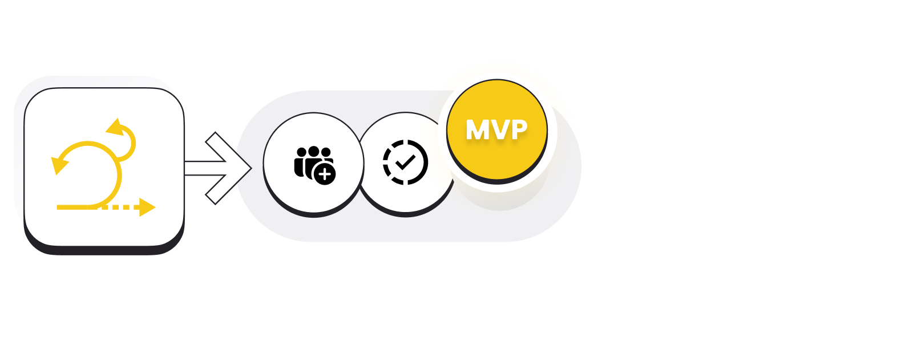
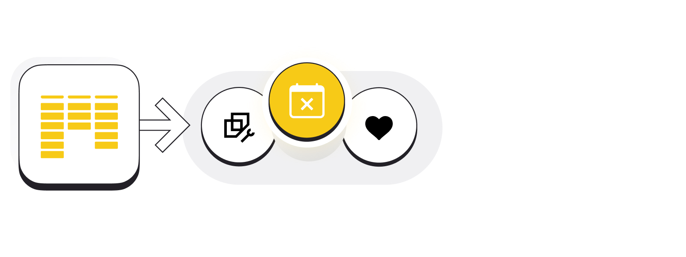

Let's start with the foundation and a short reminder of what Agile is.

The world is becoming increasingly complex, and everything changes constantly. Traditional project management methods are less and less able to cope with such a rapidly changing environment. Currently, no products can be developed for years or months without applying some changes during development. This is where Agile comes in. It’s an iterative approach to project management in many different industries, but it found the greatest popularity in software development. Instead of betting everything on a "big bang" launch as it used to be in Waterfall projects, Agile teams deliver work in small but consumable increments. Requirements, plans, and results are evaluated continuously, so teams have a natural mechanism for responding to change quickly.

Remember that Agile is an approach - a way of thinking, attitude, and mode of reacting to changes. It’s a set of traits supporting an agile working environment that is based on respect, constant improvement and learning cycles, cooperation, strong ownership, a value-centered approach, and the ability to adapt to change quickly.

## Scrum, Kanban, Scrumban

Scrum, Kanban, Scrumban - you've probably heard about them already. They are frameworks that help optimize the product, project, or service development and empower teams to generate the best possible value. These frameworks are slightly different from each other. Scrum is a specific one described in the [Scrum Guide](https://scrumguides.org/index.html). Kanban is rather a conceptual framework, more of a set of principles. Scrumban, on the other hand, can be called a "pathway" because it’s a combination of some of Scrum's strict principles with Kanban's conceptual approach.

These terms are often confused and used interchangeably. In this article, we will answer the question: What is the difference between them, and when is it worth applying each?

## What is Scrum?

Founders: Jeff Sutherland and Ken Schwaber

Date: 1993

Scrum is an Agile development framework. It was created in the early 90s, but it’s constantly evolving as teams introduce functional changes. It helps individuals, teams, and organizations to create value through adaptive solutions to complex problems.

Scrum is successfully used in IT, but also in marketing, financial services, manufacturing, engineering, data analytics, and even in [education](https://www.eduscrum.nl/).

Scrum has been adopted by software development companies, marketing agencies, design agencies, startups, enterprises, and manufacturers all around the world - all to manage the creation and delivery of products and services.

Scrum helps to arrange management, the environment, and work techniques to enable teams to deliver improvements in a rapidly changing world. It uses an iterative (repeatable over short periods of time) and incremental approach that allows for the introduction of changes to cyclically deliver value to the customer.

It’s most often used by software development teams, but it can be implemented in all kinds of teamwork. The framework is a set of meetings, tools, and roles that empower teams to structure and manage their work.

Fun Fact: The name "Scrum" was taken from rugby. It describes the ways in which the team cooperates to move the ball across the field: careful alignment, a clear goal, and a unified pursuit of that objective. The framework’s creators decided that this is a perfect metaphor for how teams should work.

## Scrum events

Sprints are at the core of the Scrum framework, transforming ideas into value. All the work required to achieve a product goal happens within sprints. But what exactly is a sprint? It’s a short, time-boxed period (usually between 1 to 4 weeks) when a team works to complete a specific amount of work. At MasterBorn, sprints are usually 2-week-long.

In each sprint, there are the following meetings:

-   A sprint planning is a collaborative event focused on answering two basic questions: What work can be done during this sprint based on team velocity and capacity, and how will that chosen work be done?

-   A daily meeting is a short 15-minute meeting held every day. The goal of this meeting is to help the team verify how the work is progressing. The team brings to light any blocks and challenges that might impact its ability to deliver the goal.

-   A sprint review meeting is a meeting where the team gets together with the client to demonstrate what team members have been up to during the sprint and show the plans for the next sprint. It’s a perfect opportunity for asking questions and holding discussions between the team and client.

-   A retrospective meeting opens the doors to optimizing the teams’ performance and communication. The discussed lessons learned and feedback from team members lead to increasingly better results.

-   As the name says, during the refinement meeting, the team refines the product backlog items. This is the time to discuss and resolve any doubts about them.

## Scrum roles, artifacts, and values

Scrum comes with its specific roles. In the context of software development, the team consists of developers (front-end and back-end developers, design specialists, QA testers, business analysts, etc.), the Product Owner, and the Scrum Master.

Scrum artifacts are product backlog, sprint backlog, and increment - all representing work or value. The idea is to increase the transparency of important information so that everyone in the project has the same basis for adaptation.

Scrum teams base their work on the following values: commitment, focus, openness, respect, and courage.

## What is Kanban?

Founder: Taiichi Ohno

Date: 1940s

Kanban is a simple method developed in the late 1940s by an engineer at Toyota. Initially, it was used to improve production efficiency. Today you can see it used on a much larger scale - from production through software development to education.

Fun Fact: The name “Kanban” comes from the Japanese word 看板 which means "signboard" or "billboard.”

## Kanban board

As the name suggests - in order to implement Kanban, it’s enough to have space for a board. It can be physical - for example, created on a flipchart - or virtual using software such as Trello, Jira, or Asana. To create a Kanban board, it’s enough to create 3 basic columns "To do", "Work in Progress," and "Done" - and then fill it with work items, the so-called Kanban Cards. A Kanban Card should include a title, description, owner, and additional information (like a due date). It’s also worth setting a limit of tasks in individual columns, especially in "Work in Progress," and to measure lead time - the amount of time passing from the start of a process until its conclusion.

Kanban focuses on visualizing work, limiting work in progress and maximizing team efficiency (or flow). Thanks to Kanban, team members have access to updated information on the status of each task. This helps to understand what other team members are working on and show what we are working on so that everyone is on the same page. What lands on the Kanban board depends on the team and its way of working.

## Scrum vs. Kanban

Scrum and Kanban are two different strategies for implementing an agile project management system. While Kanban is more fluid and continuous, Scrum is based on short and well-structured sprints.

In my opinion, Kanban is much easier to implement than Scrum. Kanban starts with what the team is up to at the moment. It doesn’t prescribe roles or impose time restrictions for work in progress. It just helps to get work done on the basis of real-time communication.

Scrum, in turn, is a comprehensive framework based on values ​​and artifacts. It defines roles in the team precisely. In Scrum, tasks need to be performed during specific time intervals, the so-called sprints. In Kanban, tasks can be added and performed at any time - and priorities may change quickly.

Fun Fact: Scrum can use some Kanban elements - for example, the Kanban Board.

## When should you choose Scrum?

It’s worth choosing Scrum when you’re creating products from scratch (especially MVPs) and in projects that are developed in a highly variable environment.

These types of projects are challenging and can get out of hand if we don't lock them in a certain framework. Scrum helps to structure the work that might be quite chaotic at first due to the many unknowns and the need to string together many threads.

New and exploratory projects require many meetings with stakeholders and the implementation of new functionalities. They’re subject to a high level of uncertainty. Their requirements often change - including during the implementation phase. Thanks to Scrum, managing them is easier because clients can see how each sprint reflects a certain part of the system and can verify the requirements on an ongoing basis.

When starting a new project, you might work with a new team whose members don’t know each other well (or at all). Scrum enables regular meetings with stakeholders, brings opportunities for applying changes, and gives space for team members to integrate - and eliminate any obstacles on the way to the goal.

Scrum also brings a lot of value to clients who have constant access to information about the current state of project implementation. Team activities become transparent and predictable, and stakeholders know more about the project’s progress - and set a more realistic release date.

To sum up, choose Scrum if:

-   You’re creating an MVP or a product from scratch.

-   Market requirements and circumstances are variable, and the scope of work is difficult to predict.

-   Your team is new, and its members don’t know each other yet.

-   You want to actively participate in the production process and see progress in real time.

## When should you choose Kanban?

Kanban, on the other hand, is worth using in maintenance projects that don’t include many functional changes and where the backlog is a list of tasks and bugs without specific deadlines. It’s also a good pick for teams that are mature - where team members know each other very well, have professional experience under their belts, and have collaborated for a long time.

In this case, there’s no need to hold many meetings or constantly communicate with the client. It’s enough to organize a planning meeting and a summary every once in a while. The method is clearly the simplest and easiest to adopt. The KISS rule (Keep it simple stupid) fits Kanban perfectly.

So, Kanban will work for you if:

-   The project is carried out over a longer period of time; it’s a maintenance project.

-   The team working on the product is mature, and its members have cooperated with each other for a long time.

-   The project has no specific deadlines.

## What is Scrumban?

Scrumban combines a selection of rules and organization from Scrum with Kanban’s flexibility and visualization methods. Scrumban takes advantage of the iteration structure of Scrum and brings it together with the continual improvement process of Kanban (via the Scrumban board).

Scrumban allows teams to benefit from Scrum’s agility and Kanban’s simplicity. All the while, it doesn’t require updating any roles and is easy to adopt.

## When should you choose Scrumban?

Scrumban comes in handy to startups that need flexibility but also structure to keep it all together. It’s also a good fit for teams working on fast-paced projects. Teams willing to sacrifice strict rules and hierarchy for some efficiency and freedom are a good match for Scrumban.

If your team works in Kanban or Scrum, you don't need to stick to any of these methods. Consider this: if a team works in Scrum for a long time and at some point, its members realize that holding all these meetings or working in sprints isn’t necessary, they can use Scrumban. However, it’s worth paying attention to whether the team’s resignation from some Scrum meetings isn’t related to another problem.

The opposite can happen in teams that work in Kanban. Team members might notice that Kanban alone isn’t enough for them. Then drawing on some Scrum rules, roles, or meetings is a good solution.

Long story short - bet on Scrumban if:

-   You need to react to changes almost immediately in your project.

-   You don't want to stick to too many rules, but a simple Kanban board is not enough for you either.

## Scrum vs. Kanban vs. Scrumban

Wow, this comparison is becoming overwhelming! But no worries - let's try to make it all crystal clear!

There are no sprints in Scrumban, planning is done once in a while, usually in 1-year, 6-month, or 3-month buckets. Tasks are scheduled on an ongoing basis, and estimation is optional. There are no fixed meetings - team members meet as needed. There are no specific roles, so when implementing Scrumban, you don’t have to change the existing positions. Scrumban is quite easy to implement compared to Scrum, but it is more difficult to implement than Kanban.

Ok, it might sound crazy. So let’s take a look at the visual comparison below:

## Scrum vs. Kanban vs. Scrumban - summary

To sum up:

Scrum is an excellent choice if you’re working on a project where clients are involved in the development process, and deadlines are critical.

Choose Kanban if you operate mainly in a maintenance setting where activities are continuous and development isn't a major component of your output.

Scrumban is a great choice for individuals that have frequent priority changes, find Scrum too restricting, wish to add pull features, or fail to fulfill time restrictions due to a lack of resources.

It’s worth remembering that you shouldn’t choose one framework for all projects in the company, it’s important that the methods are adapted to the types of projects and increase their efficiency. Regardless of which method you choose, pick a person responsible for the scope of the project, communication with the client, and the entire business side of the project. It doesn’t matter whether we call them a Product Owner, Product Manager, Project Manager, or anything else - it’s important that they’re a decision-maker. And even when they can’t make a decision right away, they will collect all the necessary information and form a strong basis for decision-making. Thanks to such a person, teams won’t experience any unnecessary breaks or chaos.

I’m currently working on an MVP where Scrum works great. I definitely recommend this framework - not only for software development. I once heard a story of someone who used Scrum to carry out a general renovation of their apartment with a construction team! It was completed quickly, efficiently, and in line with the owner’s vision. And we all know how rarely that happens…

I hope this article will help you to become agile, effective, and simply make your everyday life (and renovations) easier! :)
