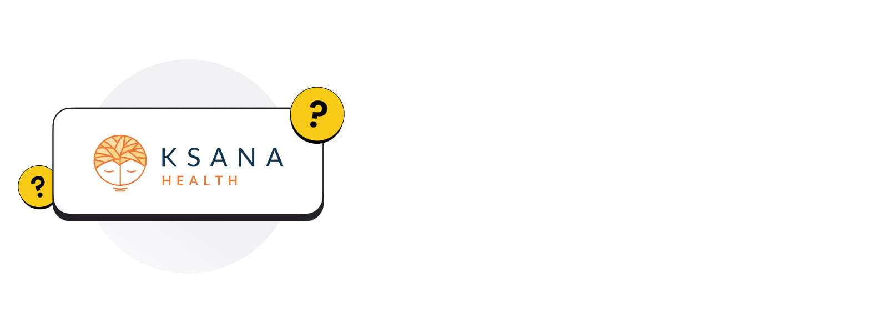
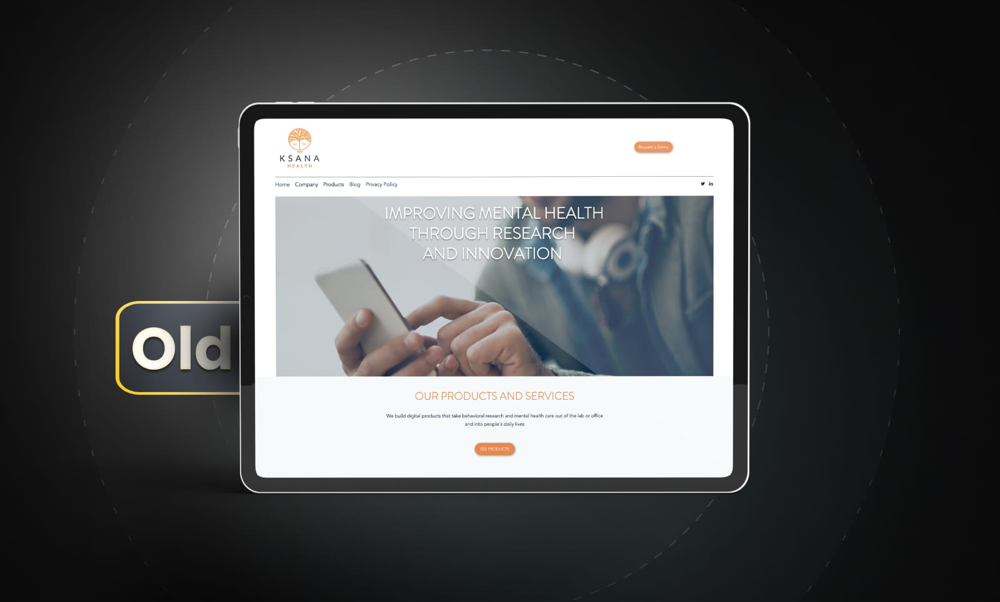
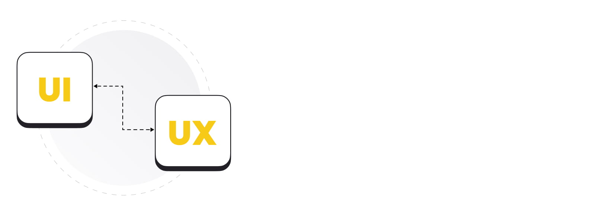
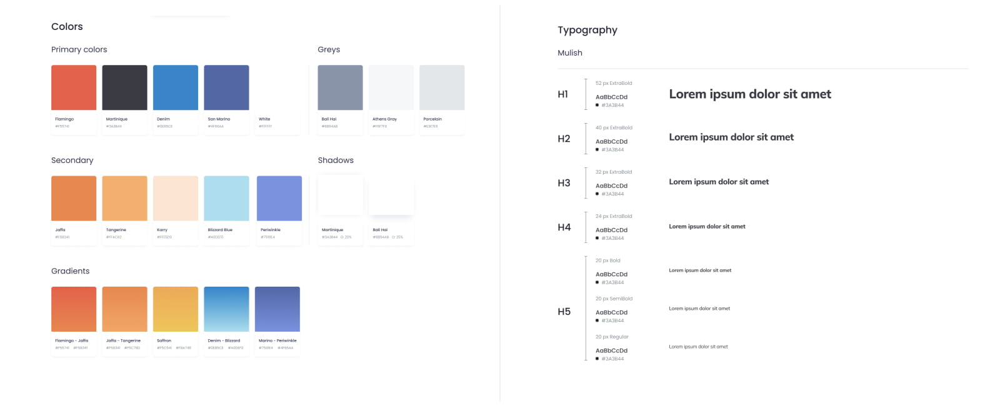
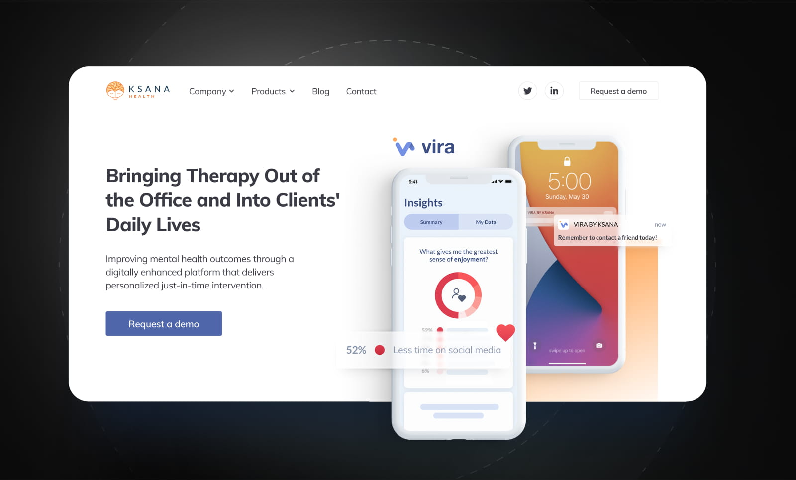
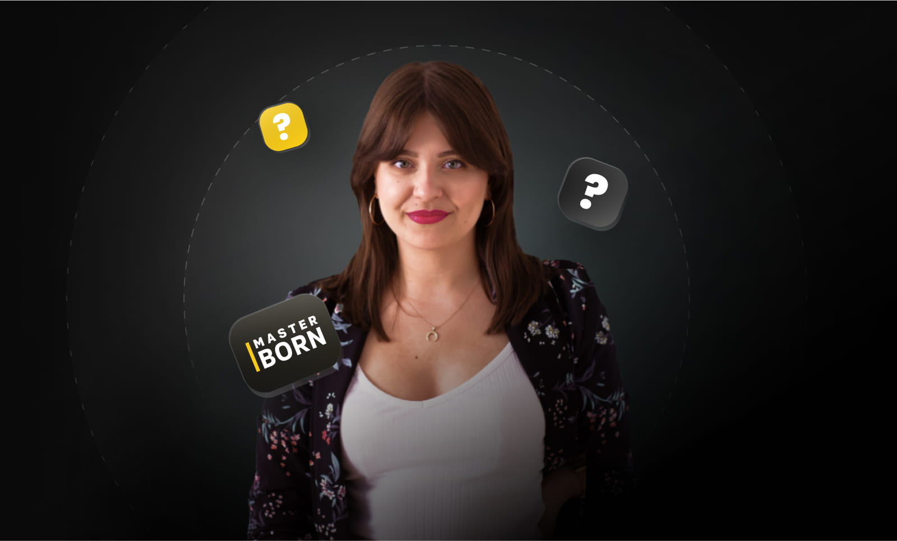

# Ksana Health Case Study: How I created designs that got featured in TechCrunch

It’s sometimes hard to define success, let alone allow it to sink in. It comes in many forms: social media likes, money, promotion... some people understand it as social recognition or simply being in touch with yourself.

As a product designer, I also often think about what success is in my line of work. Is it designing an app that is subjectively beautiful? Or something that is user-friendly and offers great UX?

For me, success came in an unexpected form: the designs I created [were featured in TechCrunch](https://techcrunch.com/2021/06/15/meet-the-mobile-therapy-startup-backed-by-christian-angermayers-remind-capital/?guccounter=1&guce_referrer=aHR0cHM6Ly93d3cuZ29vZ2xlLmNvbS8&guce_referrer_sig=AQAAABAV5aizPB3_RdpU_no9zcGEdJMfkQWNeVheGg0d0jCeZfRCYmNddinwqTOr__OR_2aumQH_-3MtQezCVbK_fTnh1SXh-YYT1p6HMVUIZhHGxRlQFz9RZyblhHC0sP0jy3Vb1kcxQIOyFzVYxjt2WmVxV_A9bW_w_AHNK95nPuDX). At the same time, I feel that my designs make a real difference by contributing to the mental health of its users. What’s even more gratifying is the fact that my accomplishment contributed to the success of the founder of Ksana, University of Oregon Professor [Nicholas Allen](https://psychology.uoregon.edu/profile/nallen3/), and his amazing team.

## Intro

The project for Ksana Health was my first serious assignment as a Product Designer at MasterBorn. I was tasked with designing a website presenting Ksana’s apps in a comprehensive and attractive way.

We are a team of developers and designers who work with US-based startups. We follow the four core values - clarity, efficiency, growth, and acceptance. Rather than being just a slogan, we actually follow these principles to deliver the highest quality of work in a nourishing workplace. Our values are also important for building trust with our clients.

Before joining MasterBorn, I worked as an in-house designer at a startup that had one product that everybody worked on polishing. With this, I gained lots of experience in what it meant to show a product in its best form.

So prior to the Ksana Health project, I already knew the importance of presenting the main purpose of the app within - literally - seconds. I also understood that attracting and retaining users requires content, but it should not be invasive or overbearing.

In essence, you have to inform future users why they need your solution and convince them that you’re honest, without overloading them with text. All these things should be shown in a user-friendly, compact, and intuitive way so that the application is self-explanatory and guides people through user journeys smoothly.

The Ksana Health project was really exciting for me because I wanted to show my skills but I also found out that mental health was a really interesting topic to dive deeper into.

## What is Ksana Health?

Ksana Health is a mental health startup from Oregon. Its in-house team consists of 12 people - I worked closely with 4 of them - and they have two products based on passive data collection.

Both of them address the burning issue of mental health disorders in teens and young adults (during the project I learned that [almost 50%](https://www.nimh.nih.gov/health/statistics/mental-illness) of U.S. adolescents have a mental disorder and this problem is global).

The team’s biggest achievement is EARS (Effortless Assessment Research System), an app for institutions conducting clinical research. Its users (participants in clinical trials) can download the app and share with the researchers data such as movement, location, and device usage.

Their new product, and the one I’ve been working with, is Vira. Patients can give their therapists access to data collected on their phones. Therapists can discuss users’ habits and program nudges on their phones to remind them to go and exercise, meet friends or go to sleep earlier.

It’s actually a very smart idea. Since young people today are literally glued to their smartphones, why not use the devices to improve mental health? In today’s life, where we have so much pressure from the world to be the best version of ourselves every day, it’s great to have such apps as a starting point to becoming healthier.

It was a challenge to show all of this potential on the Ksana Health website, especially because the old design needed changes and the content had to be updated or written from scratch.

## What was the product design goal?

The main goal of my project was to show what Ksana Health represents and what their products really are. It was especially important to feature Vira as a brand new app that will be available soon.

The client also wanted to introduce people to Ksana’s stories and show their credibility. This was important for building trust.

The app was not only expected to be shown as valuable for patients, doctors, and therapists, but also everybody else who is involved in contributing to improving one’s health. This is the reason that during the research and ideation phase of our project we worked on more than one persona.

### New vs old

In comparison, the old website had very minimal information for potential future users and neither the images nor the copy was able to capture all that Ksana Health had to offer. It also failed to present the cutting-edge research Ksana is carrying out.

When I first saw the website, I kind of understood it was a product, and that it connected somehow with mental health and... nothing more. There were only a few small screenshots of the EARS apps, but it wasn’t enough for me to know how it worked or what it looked like.

Taking all of this into consideration, my main goal at the very beginning was to learn about Ksana Health as much as I could, then group all of the information and build wireframes of the most important pages.

Thanks to this initial step I found myself on the same page with our client and able to better understand their vision for what they wanted to create. I would also learn what we should focus on and what other information and assets I would need to start designing.

### The biggest challenge

The biggest challenge in the beginning was to design without any new content and no existing screenshots of their applications. I had to trust my knowledge, the research I did on the internet, and my gut feeling. I did some analysis of competitors’ websites but to my surprise, what I saw was very similar to Ksana’s old website.

Although it needed improvements, it’s important to acknowledge that some of the features of the existing Ksana website I really liked and I wanted to stay true to. It was simple, clean, with lots of white space, and positive orange accents. I agreed with the client that the new Ksana Health site should maintain this look and feel.

We both understood that it was important from a patient’s point of view to be interacting with a website that gives them a professional and uplifting vibe. To find a point of reference, I started looking at product pages that were not connected to mental health, just to see what could be important for promoting and selling apps in the best possible way. I didn’t focus solely on content, but on design as well. Thanks to this research, I knew what information I wanted to show on the main page and individual product pages.

## The UX / UI Process

**Knowing all of this, how did I approach the design?**

I started with page-level “audits”. I went through all the pages of the existing site to see what needed to be changed or added. I made many notes using a Miro [board](http://miro.com). I made a few simple, side-by-side comparisons of what we have and what we need. I also added questions addressed to the client and a few requests for clarification.

Once I gathered all of the information that I needed and came up with a plan, I was ready to go. But before I started, I talked through my findings with the rest of the team. This is actually something we do very often at MasterBorn, as we believe individual decisions should be preceded by consultation within a larger group.

At this stage, we were ready to reach out to Ksana and show them how we envisioned their revamped pages.

After getting the green light from the client, I started designing with a specific focus on the homepage and the EARS product page. This helped us find the starting point for building the rest of the website.

The base we created in the beginning consisted of specific sections that acted as signposts indicating how the content should be changed to fit the new design. The two initially designed pages also helped us with agreeing on the visual language (illustrations, colors, fonts, etc.).

### The deliverables

The first deliverable included two design options and an accompanying explanation of the decisions I made.

The first drafts consisted of components suggested by the client’s team, and my own proposals. The latter included:

- logos of companies that are using their app - to offer social proof and show that they are already present

- separate sections on the homepage for their two apps from where users can navigate to product pages

- a testimonial section which would also build trust among future customers

- real quotes with photos and names, so everybody could find who recommended us and why

- a FAQ section where the most commonly asked questions would be answered

This helped to bring together mine and Ksana’s thoughts about the design and the message for their customers. The journey from drafts to final designs wasn’t too long, but like any project, sometimes the ride was bumpy due to changes in the content that had an impact on visuals.

The initial setup also helped me build the style guide, which made mine and the developers’ work easier. It wasn’t as complicated as a design system. It included the basics: typography, colors, and main buttons and I made them consistent across the project.

### Method and tools

My method was relatively simple: design everything at first as a draft with “lorem ipsum” and empty mockups, then go to the Ksana Health team and compare this with their needs, give them homework to prepare content for us, and give access to the tools where the designs were being created. Thanks to this process, both sides knew what they needed and what they could expect.

#### Figma

I designed Ksana’s website in Figma [as we do at MasterBorn](https://masterborn.com/blog/figma-vs-sketch/).

Personally, I think Figma is a great tool not only because it is so intuitive and user-friendly but also because it is easier for me to communicate with clients.

We met weekly to talk about any changes and our needs, but every day we could talk through comments in Figma. It was a great experience because we could get feedback relatively quickly and it was exciting for the client’s team to see how everything was progressing.

Another advantage of Figma is that I could create the style guide I mentioned earlier. It allowed me to design quicker and make the visuals consistent. Lastly, by using Figma, our developer was able to check and download everything on his own - without any middleman that would slow down the process. This meant that I wasn’t needed during the development phase unless there were any unanswered questions.

#### Miro

I also mentioned Miro before. While it's not a design tool, it helps a lot with the brainstorming phase of the work. Thanks to it I could get my thoughts in order so I knew what I wanted to do and what I should ask for. It is also nice that more than one person can work with it at the same time.

## My biggest challenge

My biggest challenge was having to combine two personas in this one project. We had to present every facet of the application in two ways - for individual users and for practitioners who would use the app with their patients or in their research.

Because of that, we made many changes in the content and in Vira’s product page where we wanted to show benefits for these two groups. We made separate sections about the advantages and a navigation at the top of the page. Users can now navigate to the part designed specifically for them.

We also emphasized these two types of users on the homepage. Every different part would lead you to the specific part of the product page.

Another aspect I struggled with a bit was the deadline that was set by the client. Because our client completed a funding round, we had to plan our work to fit a tight timeline. In the end, this made it difficult to make final changes. We had to make quick decisions if something was worth changing at that time, or decide if it was something we could do later after the deadline.

## Final result

**The final result was a set of ten pages that are the reflection of Ksana’s identity, value proposition, and mission.**

We followed psychological and cognitive mechanisms to emphasize trustworthiness, social and professional recognition, and popularity.

The narration was constructed around Ksana’s products, whose credibility was supported by the Evidence page, showcasing the sources of knowledge which the apps use.

In addition, we also fixed the blog, so more great content can now be created for their users and mental health professionals.

## Summary

Designing Ksana’s website for me was a great adventure, both professionally and personally. Apart from learning to deal with multiple personas I gained a lot of knowledge about mental health and how difficult it is to maintain it in our current times.

If I can offer some advice to the founders and CEOs of startups - please do not wait to design your pages professionally for too long. You can have a great product, but if you fail to adequately showcase it, your user acquisition and funding may be less than satisfactory.

Reach out to me or anybody from the MasterBorn team if you have any questions about your product or website redesign!
