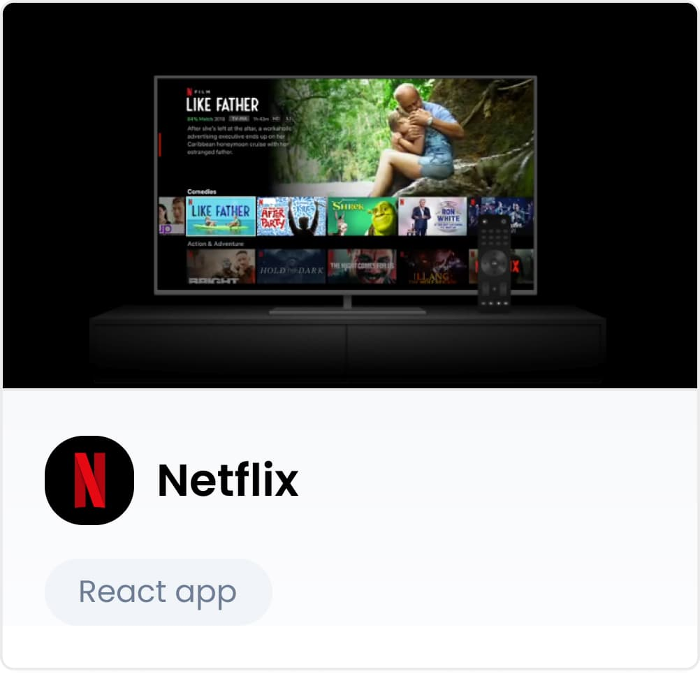
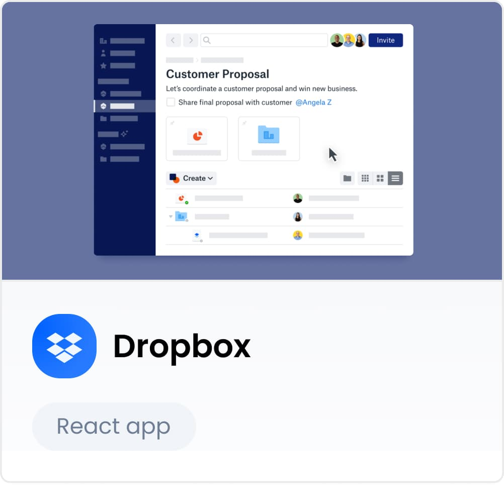
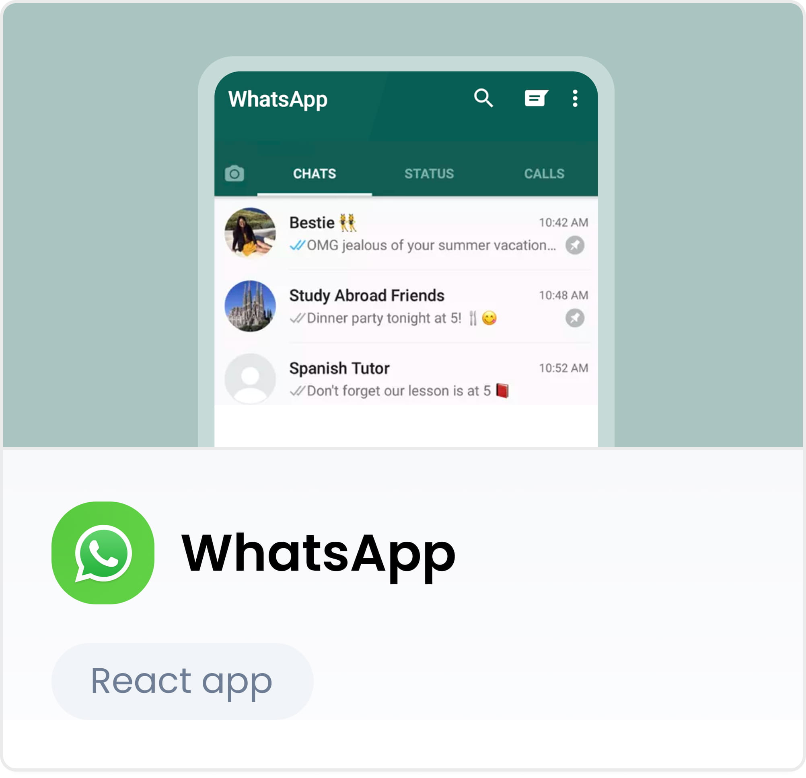
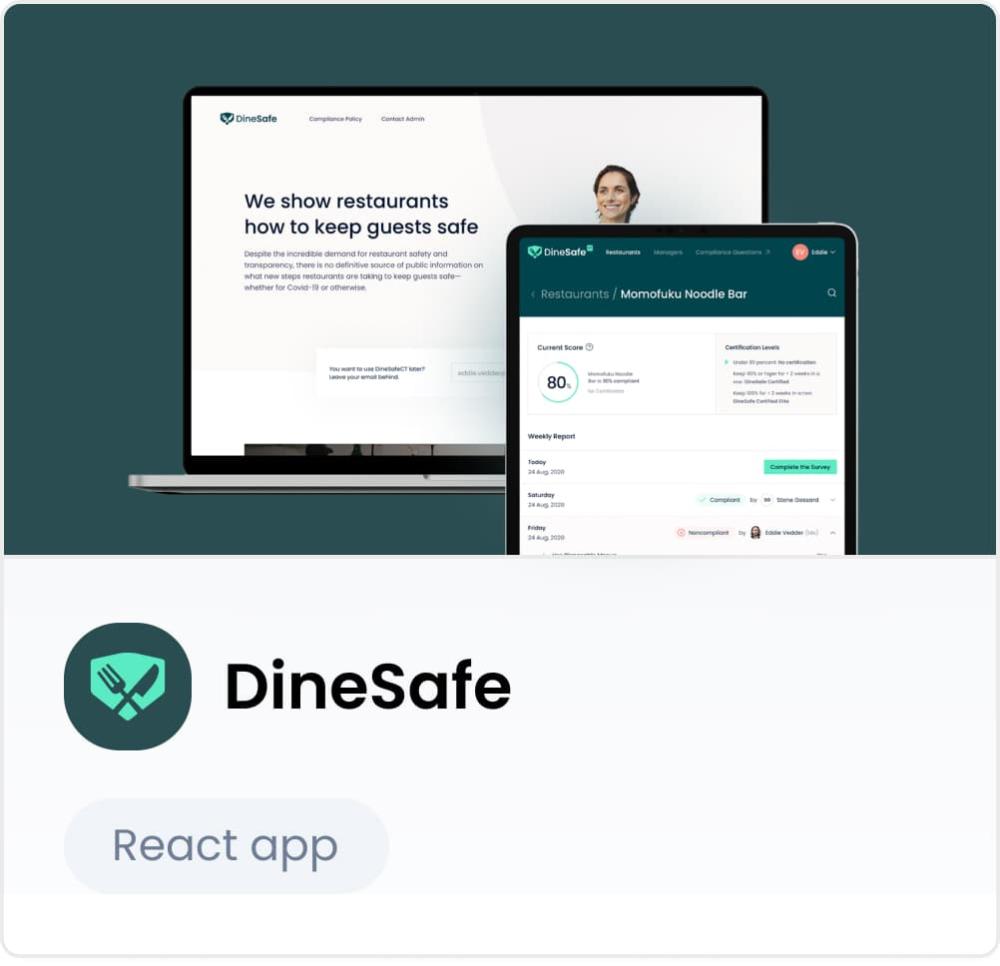
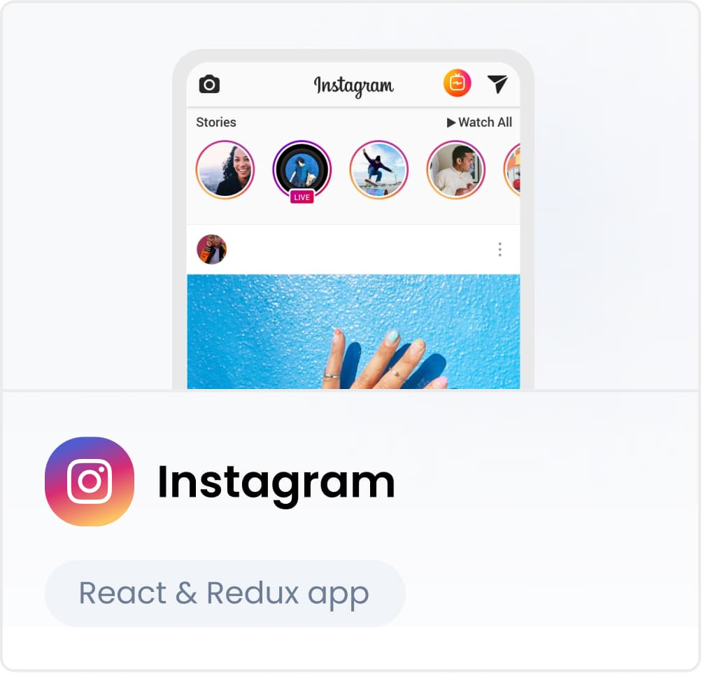
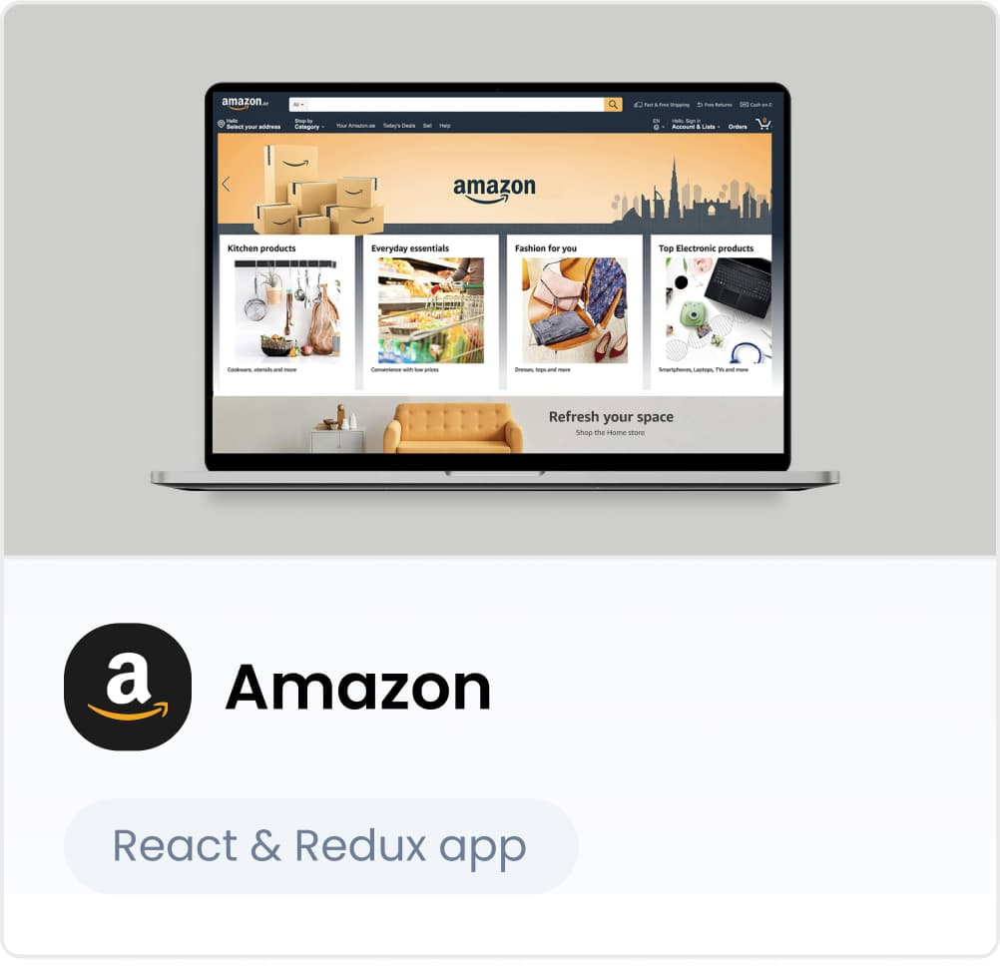
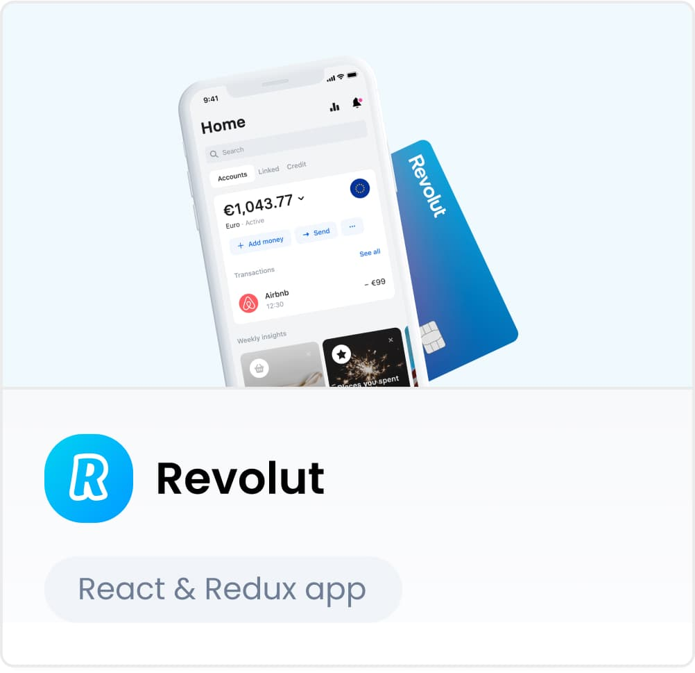
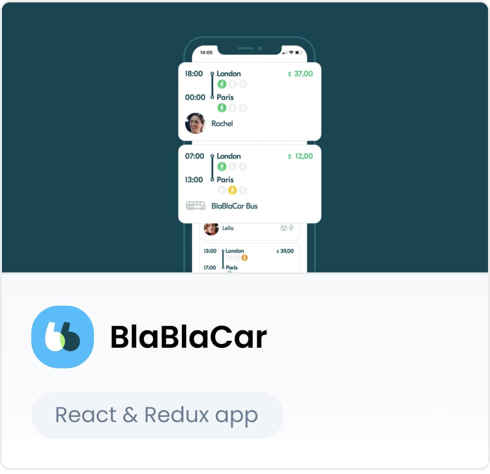
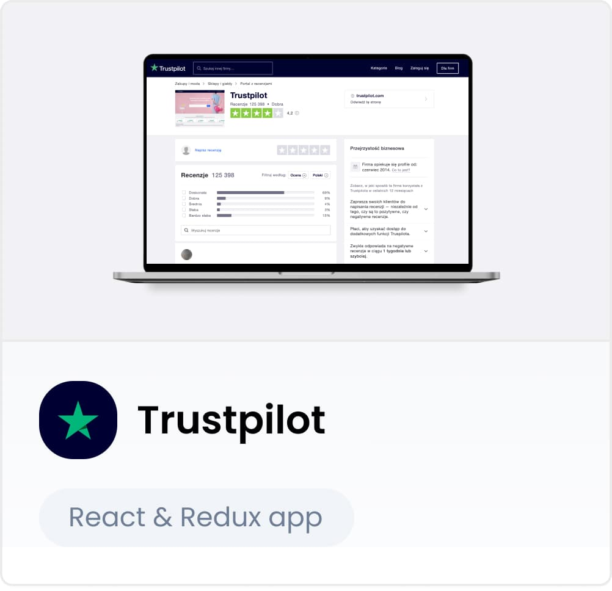

# React and Redux - 10 examples of successful Web App Development

At MasterBorn, we bet on quality, not quantity. The approach of “less is more” works well for us and we apply it to both the people we hire and the technologies we add to our stack.
Fun Fact: last year, we hired 0.70% of candidates who applied to us (3576 in total!).
And we approach our tech stack in a similar manner. Let’s take front-end development as an example. Today, our JavaScript tech stack looks like this:

## JavaScript Tech Stack: React & Node.js

Such a narrow specialization allows us to work at a global level, bringing together experienced senior developers who know their technology inside and out. We’re always busy expanding our knowledge to achieve JavaScript mastery. And we translate this expertise to the solutions we build for our clients, balancing and optimizing their cost and performance.

Node.js is a backend development technology. The backend of a web application is the place where its data is stored and served from.

React, on the other hand, is one of the most popular choices for front-end development. The front-end of a web application is the part that users see and interact with when they load it on a desktop, laptop, or mobile device. The front-end and backend communicate using an API or a library.
In this article, we focus on two front-end technologies - React and another Javascript library, Redux.

**Almost half of React applications use Redux today.** The question is - why is Redux gaining so much steam? And, is React becoming more popular thanks to Redux?
Keep on reading to understand these two front-end tools better and discover how tech giants and startups alike benefit from them in web development.

## What is React?

React is a JavaScript library that engineers use to build user interfaces and components for web applications. Today, React is a popular choice among companies looking to build complex web pages, as well as their layouts and content.

React was developed by Jordan Walke at Facebook and was initially used to build Facebook’s feed in 2011. Later on, Facebook developers used it to develop Instagram in 2012. In 2013, React became an open-source library, and today it’s maintained by its community with the help of Facebook.

### React vs. React Native - what's the difference?

The name React might bring to mind another technology - React Native. Don’t confuse these two because they serve entirely different purposes.

While React is a library for web development, React Native is a React-based framework used to build cross-platform mobile applications. React Native was developed by Facebook as well, and today it’s used as one of the primary cross-platform tools for creating native iOS and Android mobile applications.

## What is Redux?

Redux is an open-source JavaScript library written in JavaScript itself. It was initially released in 2015 by Dan Abramov and Andrew Clark.

The key advantage of Redux lies in its compatibility with other JavaScript libraries such as React, Ember, and Angular. You can use Redux to enhance your complex JavaScript application. Engineers also love Redux for its time-traveling debugger that enables live code editing.

## React vs. Redux - what's the difference?

To explain the difference between React and Redux, we need to focus on one key detail - states. Every application needs a method for managing state.

React state is stored locally, within a component. When the state needs to be shared with other components, it’s simply passed down through props. What does this mean for your app? That its top-most component that requires access to a mutable value will hold that value in its state.

In Redux, on the other hand, the state is stored globally in the Redux store. Any component that needs access to a value can subscribe to the store and easily gain access to the value.

Redux helps to centralize all data while enabling components to get the state it needs - without other components knowing that. These two technologies are often used together - as you will see in the following examples of some pretty impressive applications.

## Why use React?

Why has React become so popular?

### React is declarative

This means that software engineers can create interactive UIs easily. It also makes the application’s code more predictable and easier to debug.

### Gentle learning curve

Compared to other popular JavaScript-based frameworks like Angular, React is simple to learn and use.

### React is component-based

Components are basically building blocks of React pages, and the good news is that they’re reusable. This accelerates the development process.

### Massive community

React is surrounded by a large community of developers who share their knowledge and are happy to help one another. This means that finding skilled coders for your project is easier.

### React supports mobile development

React Native is growing fast and becoming a key technology for developing native mobile applications.

## Why use React & Redux?

Let the successful examples of React and React & Redux apps become your answer.
Ready?
React, you’re up first. Show us what you’ve got!

## 5 Examples of Successful Web Apps Built with React

### React App #1: Netflix

Location: **Los Gatos, CA**  
Founded: **1997** 
Funding: **[$3.2B](https://www.crunchbase.com/search/funding_rounds/field/organizations/funding_total/netflix)** 
Revenue: **$24.99B (in 2020)** 
Users: **203.66 million** 

The Netflix team used React to develop the most popular video streaming web application on the internet. They even [published a blog post](http://techblog.netflix.com/2015/01/netflix-likes-react.html) that explains how React helps them to increase startup speed, optimize runtime performance, and improve many other things.

As the Netflix UI engineers say:

#### “Our decision to adopt React was influenced by a number of factors, most notably: 1) startup speed, 2) runtime performance, and 3) modularity.”

### React App #2: Dropbox

Location: **San Francisco, CA** 
Founded: **2007** 
Funding: **[$1.7B](https://www.crunchbase.com/search/funding_rounds/field/organizations/funding_total/dropbox)**
Revenue: **$0.504B (Q4 2020)** 
Users: **600 million users (Q3 2019)** 

Dropbox [switched to React](https://dropbox.tech/frontend/the-great-coffeescript-to-typescript-migration-of-2017) from CoffeeScript some time ago, right when the technology was gaining steam among web developers. Dropbox uses React to handle the massive traffic and data flow the platform experiences. So, it’s fair to say that the library is a serious contributing factor to the success of the cloud-based storage service.

### React App #3: WhatsApp

Location: **Santa Clara, CA** 
Founded: **2009** 
Funding: **[$60.3M](https://www.crunchbase.com/search/funding_rounds/field/organizations/funding_total/whatsapp) (acquired by Facebook in 2014 [for $19B](https://www.forbes.com/sites/parmyolson/2014/10/06/facebook-closes-19-billion-whatsapp-deal/#57a7e715c66c))** 
Revenue: **Estimates range from [$5B to $15B](https://www.forbes.com/sites/greatspeculations/2017/11/10/how-much-revenue-can-whatsapp-generate/#9f1c652f2c97)** 
Users: **2 billion** 

Although we saw several beta versions of WhatsApp before its official launch, the new WhatsApp Web application uses React for building UIs in tandem with other JavaScript libraries and frameworks such as Underscore.js and Velocity.js.

### React App #4: Khan Academy

Location: **Palo Alto, CA** 
Founded: **2006** 
Funding: **[$16.2M](https://www.crunchbase.com/search/funding_rounds/field/organizations/funding_total/khan-academy)** 
Revenue: **$16,8M** 
Users: **6.54 million (subscribers on YoutTube channel)** 

Many parts of Khan Academy are based on React. One of the engineers [shared his personal experience](https://speakerdeck.com/joelburget/backbone-to-react) with the library and showed how it differentiates from the Backbone script they used before. Switching to React looks like a serious upgrade - take a look at his article to learn more about the most important features built with React and the benefits it brought to Khan Academy.

### React App #5: DineSafe

Location: **Hartford, CT** 
Founded: **2020** 
Users: **CT restaurants, [150+ CT-based eateries](https://www.hartfordbusiness.com/article/ct-tech-startup-dinesafe-helps-prove-restaurant-cleanliness-safety)** 

This Connecticut-based startup has built a web-based platform that offers users reassurance that the restaurant they’re eating follows proper health codes and protocols.
DineSafe recently got a huge boost when Google agreed to make DineSafe’s certification visible when someone searches for a restaurant.
The entire platform was developed using React, showing that the technology is a popular choice among budding startups.

Ok, it’s time to see what React can achieve together with Redux. Here are 5 solutions built with this master duo.

## 5 Examples of Successful Web Apps Built with React & Redux

### React & Redux App #1: Instagram

Location: **Menlo Park, CA** 
Founded: **2010** 
Funding: **[$57.5M](https://www.crunchbase.com/search/funding_rounds/field/organizations/funding_total/instagram) (acquired by Facebook in 2012 for $1B)** 
Revenue: **Estimated $20B in ad revenue in 2019 ([Bloomberg](https://www.bloomberg.com/news/articles/2020-02-04/instagram-generates-more-than-a-quarter-of-facebook-s-sales))** 
Users: **1 billion monthly active users** 

Instagram uses React in many parts of its application - from geolocation and Google Maps APIs to the incredible search engine accuracy and tags. It’s thanks to React that fans can access so many amazing features. And according to [Stackshare](https://webcache.googleusercontent.com/search?q=cache:vLhucVd2yd4J:https://stackshare.io/ins[%E2%80%A6]nstagram+&cd=1&hl=pl&ct=clnk&gl=pl&client=firefox-b-d), Instagram is using Redux as well.

### React & Redux App #2: Amazon

Location: **Seattle, Washington** 
Founded: **1994** 
Funding: **[$108M](https://www.crunchbase.com/search/funding_rounds/field/organizations/funding_total/amazon)** 
Revenue: **$125.555B (Q4 2020, a 43.59% increase YoY)** 

The global e-commerce mogul and cloud service provider [uses React](https://medium.com/@blairanderson/amazons-new-brand-stores-utilizing-react-framework-a22f56e9e206) for brand pages vendors can set up to create a unique experience on the Amazon site. In a recent hackathon called the 5 day React Challenge, participants created [The Amazon Clone](https://medium.com/cleverprogrammer/amazon-clone-using-react-the-ultimate-guide-fba2b36f3458) using - surprise, surprise - React.

### React & Redux App #3: Revolut

Location: **London, England** 
Founded: **2014** 
Funding: **[$905.5M](https://www.crunchbase.com/search/funding_rounds/field/organizations/funding_total/revolut)** 
Revenue: **£160M (2019)** 
Users: **12 million (June 2020)** 

Revolut is a financial services platform that specializes in mobile banking, card payments, and foreign exchange. Users can take advantage of many different products, from prepaid debit cards and currency exchange to peer-to-peer payments. To build its frictionless financial solutions, Revolut is using React with Redux.

### React & Redux App #4: BlaBlaCar

Location: **Paris, France** 
Founded: **2006** 
Funding: **[$448.5M](https://www.crunchbase.com/search/funding_rounds/field/organizations/funding_total/blablacar)** 
Users: **87 million** 

The French startup BlaBlaCar isn’t only occupying the ride-sharing space - it recently diversified its activity to bus rides and bus ticketing. Offering services in 400 cities in Europe, BlaBlaCar is definitely one of the most impressive tech startup stories in Europe. And according to [Stackshare](https://webcache.googleusercontent.com/search?q=cache:X-OcSbJKa-wJ:https://stackshare.io/bla[%E2%80%A6]lablacar+&cd=2&hl=pl&ct=clnk&gl=pl&client=firefox-b-d), one of the technologies behind its success is the combination of React with Redux.

### React & Redux App #5: Trustpilot

Location: **Copenhagen, Denmark** 
Founded: **2007** 
Funding: **[$199.7M](https://www.crunchbase.com/search/funding_rounds/field/organizations/funding_total/trustpilot)** 
Revenue: **[$100 million (Q3 2020)](https://press.trustpilot.com/news/2020/11/10/trustpilot-surpasses-100-million-in-annual-recurring-revenue)** 

Last year, users wrote over 38 million reviews on Trustpilot. This handy free-to-use web service allows any user to review a business's services under a real name or nickname. The idea was to enable users to get independent perspectives on a company's services without the risk of fake and fraudulent reviews. The company reported success in facing this challenge - and its impressive interface hides that complexity thanks to React and Redux.

## Applications Built with React & Redux - Final Thoughts

React has offered a revolutionary approach to building front-ends as well as mobile applications. It has quickly become the go-to tool for many JavaScript developers, and it doesn’t seem to be going anywhere. The combination of Redux and React adds extra strength to the mix and helps developers build applications faster.

We absolutely love using them when building products for our clients and will definitely continue doing so for years to come. If you’re still hesitating between React, React & Redux and other frameworks or libraries, just give us a shout at hello@masterborn.com, and we’ll make sure to React as fast as possible.
