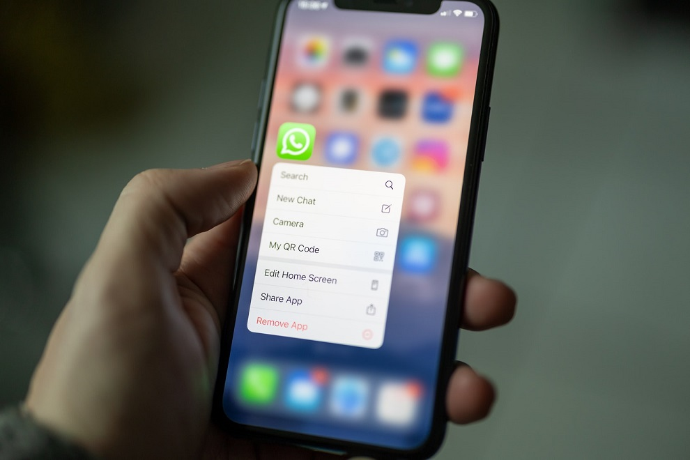
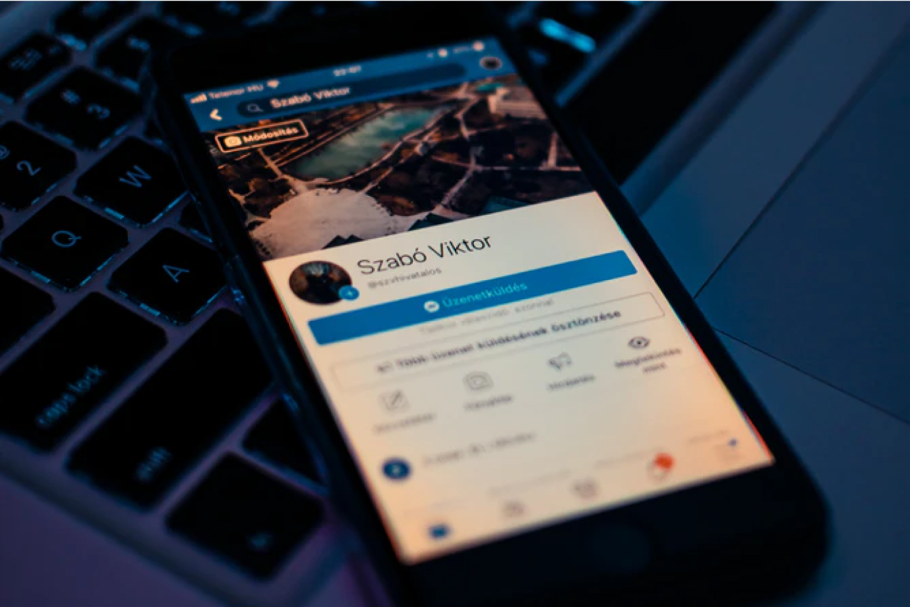
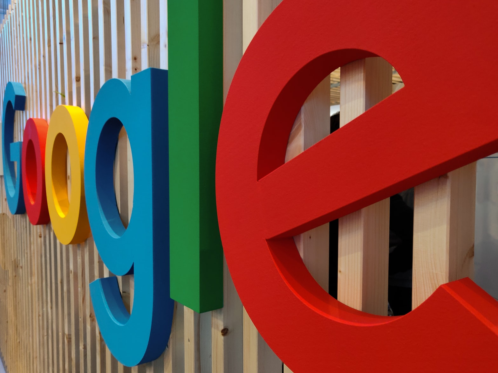
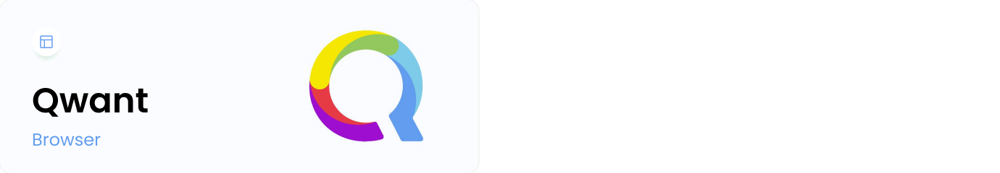

We all love to use tech products like messaging apps, email apps, and search engines. **But this comfort comes at a price.** Tech giants like Facebook and Google, which own the most popular communication tools in the world, are in the business of user data. Scandals like Cambridge Analytica made that painfully clear.

**WhatsApp recently asked users to agree to updated terms of service, triggering a massive exodus to alternative apps like Signal or Telegram.** Take a look at the Google Play and Apple App stores: Signal saw [7.5 million downloads](https://www.businessinsider.com/whatsapp-facebook-data-signal-download-telegram-encrypted-messaging-2021-1?r=DE&IR=T) that week - a 4,200% increase on the previous week - and Telegram got 9 million downloads, a 91% increase.

WhatsApp now pushed the deadline for accepting the new terms to May 15th as it further explains the changes. No wonder people are leaving - Facebook (WhatsApp’s owner) lost consumer trust in privacy back in 2017 when the EU [fined](https://ec.europa.eu/commission/presscorner/detail/en/IP_17_1369?utm_source=Benedict%27s%20Newsletter&utm_campaign=aa30e7ee8e-Benedict%27s%20newsletter_COPY_02&utm_medium=email&utm_term=0_4999ca107f-aa30e7ee8e-71235909) it for data sharing activities in WhatsApp.

This is why more and more people are getting interested in privacy apps that promise to protect their data, keep their conversations private, and never use their information to display ads or build new products.

Read this article to gain full clarity about the apps that dominate the market and learn more about alternative privacy apps for Android, iOS and desktop that promise to bring their users full privacy and security.

## What you need to know about WhatsApp, Facebook Messenger and Google

### Whatsapp - statistics and key facts

-   Founded in 2009 by Brian Acton and Jan Koum as an app to replace text messages
-   Acquired by Facebook in 2014 [for $19 billion](https://www.forbes.com/sites/parmyolson/2014/10/06/facebook-closes-19-billion-whatsapp-deal/#57a7e715c66c)
-   Number of users: [2 billion](https://www.whatsapp.com/about/)
-   Active users per month: [1.6 billion](https://www.statista.com/statistics/258749/most-popular-global-mobile-messenger-apps/)
-   Downloads: [96 million](https://sensortower.com/blog/top-apps-worldwide-february-2020-by-downloads) (in February 2020, a 42.4% YoY increase from February 2019)

Key facts:

-   WhatsApp is available in [over 180 countries](https://www.whatsapp.com/about/) around the world.
-   With [340 million users](https://www.emarketer.com/chart/230669/top-10-countries-ranked-by-whatsapp-users-2019-millions), India is the biggest market for this king among messaging apps.
-   WhatsApp now delivers around [100 billion messages](https://techcrunch.com/2020/10/29/whatsapp-is-now-delivering-roughly-100-billion-messages-a-day/?guccounter=1) a day.
-   Every day, users made [over two billion minutes](https://blog.whatsapp.com/10000646/Group-Calling-for-Voice-and-Video-Is-Here) of voice and video calls.
-   WhatsApp Business scored over [5 million](https://www.pymnts.com/mobile-applications/2019/whatsapp-business-messaging-app-users/) business users one year from launch.
-   Surprisingly, WhatsApp isn’t that popular in the U.S. - counting 68 million users, out of which [26 million](https://www.statista.com/statistics/350461/mobile-messenger-app-usage-usa/) are monthly active users.
-   Where is WhatsApp blocked? Aside from China, the app is completely or partially blocked in countries such as Cuba, Syria, Iran, the UAE, North Korea, and Qatar. Some of these bans apply to Voice Over Internet Protocol (VOIP) services, not the app itself (so messaging via WhatsApp is still possible).

Privacy issues:

 - The EU   [fined](https://ec.europa.eu/commission/presscorner/detail/en/IP_17_1369?utm_source=Benedict%27s%20Newsletter&utm_campaign=aa30e7ee8e-Benedict%27s%20newsletter_COPY_02&utm_medium=email&utm_term=0_4999ca107f-aa30e7ee8e-71235909) Facebook for data sharing activities on its most popular messaging app in 2017.
  - The new policy update potentially means that the app's users will be sharing their data with Facebook. In its [statement](https://www.theverge.com/2021/1/12/22226792/whatsapp-privacy-policy-response-signal-telegram-controversy-clarification), WhatsApp claims that this change would only affect business users:
   "To further increase transparency, we updated the privacy policy to describe that going forward businesses can choose to receive secure hosting services from our parent company Facebook to help manage their communications with their customers on WhatsApp. Though of course, it remains up to the user whether or not they want to message with a business on WhatsApp."

But I'd say - better stay on the safe side and choose an app that ensures no third parties gain access to your data.

### Facebook Messenger - statistics and key facts

-   Launched in 2011 by Facebook
-   Active users per month: [1.3 billion](https://www.statista.com/topics/2018/whatsapp/#:~:text=As%20of%202019%2C%20WhatsApp%20is,most%20popular%20social%20network%20worldwide)
-   Users of messaging apps in the U.S. prefer Facebook Messenger and Snapchat to WhatsApp - they have [106 million and 46 million](https://www.statista.com/statistics/350461/mobile-messenger-app-usage-usa/) monthly active users, respectively (vs. 26 million WhatsApp users)

Privacy issues:

-   Some of the terms and conditions accepted by Facebook Messenger users include recording audio at any time without their permission or calling phone numbers without intervention. In other words, the app may earn access to data you'd never give up voluntarily.
-   If you use Facebook’s mobile app, you’ll be forced to use Messenger for exchanging messages with friends.

### Google Search - statistics and key facts

-   Founded in 1997 by Larry Page and Sergey Brin as a small garage project
-   Market share: [88.14%](https://www.statista.com/statistics/216573/worldwide-market-share-of-search-engines/) (October 2020)
-   Main revenue source: [Advertising](https://www.statista.com/statistics/266471/distribution-of-googles-revenues-by-source/)
-   Daily number of searches in 2020: [6.9 billion](https://www.statista.com/statistics/216573/worldwide-market-share-of-search-engines/) (this means 2.5 trillion searches per year worldwide)

Key facts:

-   Google scored one of the [highest tech business revenues in 2019: around 160.74 billion U.S. dollars](https://www.statista.com/statistics/266206/googles-annual-global-revenue/).
-   A user spends [12:11 minutes](https://www.alexa.com/siteinfo/google.com) every day on Google.com on average.
-   According to estimates, Google holds 15 exabytes of data (the capacity of some 30 million personal computers).
-   Google is also the owner of the Google Play Store that provides apps to millions of Android-powered smartphone users.

Privacy issues:

-   Google’s [privacy policy](https://www.google.com/policies/privacy/) suggests broad and far-reaching data collection in the entire suite of products.
-   Google tracks your browsing path and links that information to your IP address and an associated Google account. This profile is rich with information - and that’s how Google makes so much money on advertising.
-   The content of Google’s email tool, Gmail, is tracked to improve relevance and targeted ads.
-   Google’s Chrome links all your activity within it to your Google account.

## Alternatives to WhatsApp, Messenger and Google you can try to protect your privacy.

### 1. Messaging apps

#### Signal

Founded in 2018 by Brian Acton and Moxie Marlinspike (note that Brian is also the guy behind WhatsApp - he left WhatsApp in 2017 after disagreements with Facebook regarding the app’s monetization).

Initial funding: $50 million

##### Growth of Signal:

-   After WhatsApp’s rollout of new terms, Signal got [9 million new](https://www.businessinsider.com/whatsapp-facebook-data-signal-download-telegram-encrypted-messaging-2021-1?r=DE&IR=T) users between January 6 and January 10. Now it’s second in both Google Play Store and Apple App Store, one of the key privacy apps for Android and iOS users.
-   The biggest growth market? [India](https://www.businessinsider.com/whatsapp-facebook-data-signal-download-telegram-encrypted-messaging-2021-1?r=DE&IR=T). This is where Signal got 2.3 million (over 30% of its total new installs). The second-biggest market is the U.S., where users installed it 1 million times.

##### Why choose Signal?

-   Once you register your phone number, the messaging app knows little to nothing about your account.
-   The data isn’t transmitted or stored on Signal's servers - “Your message history is stored on your own devices" says [the app's privacy policy](https://signal.org/legal/#privacy-policy).
-   The app offers Screen Security - you can block other apps on your phone or users from taking screenshots of your chats on Signal. You can ensure that no app on your phone can capture what’s happening inside Signal.
-   Signal got a lot of publicity when public figures like Elon Musk and Edward Snowden endorsed it as a WhatsApp alternative.

**Fun fact:**
When [Elon Musk tweeted](https://twitter.com/elonmusk/status/1347165127036977153?ref_src=twsrc%5Etfw%7Ctwcamp%5Etweetembed%7Ctwterm%5E1347165127036977153%7Ctwgr%5E%7Ctwcon%5Es1_&ref_url=https%3A%2F%2Fd-25292612552822264012.ampproject.net%2F2101230412003%2Fframe.html) "use Signal," it had an unexpected side effect - the stock of an unrelated company, Signal Advance, [soared by 11,700%](https://markets.businessinsider.com/news/stocks/signal-advance-stock-price-surge-elon-musk-tweet-privacy-app-2021-1-1029956384).

#### Telegram

Founded in 2013 by Nikolai and Pavel Durov (the guys behind the Russian social media platform [VK](https://vk.com/), which is the largest one in its domestic market).

Active monthly users: [500 million](https://mashable.com/article/telegram-500-million/?europe=true)

New daily users: [1.5 million](https://telegram.org/blog/400-million) (in April 2020)

Number of messages sent daily: [15 billion](https://telegram.org/blog/15-billion) (in February 2016, the last time Telegram made this stat public)

##### Growth of Telegram:

-   After WhatsApp’s policy update, 25 million of users joined Telegram within 72 hours.
-   It was in the [top-10 most downloaded apps worldwide](https://go.sensortower.com/q3-2020-data-digest-report-ty.html?aliId=eyJpIjoiOEx2b0Q2M1BEVlRoU2NIVyIsInQiOiJSSFRcL2NUYzV3M1BwVTlrdnp2U3RZQT09In0%253D) in Q2 and Q3 2020, scoring around 80 million downloads in both quarters.
-   It’s the most-downloaded social media app [in 20 countries](https://telegram.org/blog/400-million).
-   In July 2019, Telegram got [a 323% YoY increase](https://sensortower.com/blog/hong-kong-protests-app-downloads) in first-time installs in Hong Kong during the pro-democracy protests where people would use the app to communicate.

##### Why use Telegram?

-   Telegram offers a wide range of privacy features. You can have ‘secret chats’ where messages are stored on devices, not the cloud. Messages can be set to self-destruct after a set amount of time. This ensures full privacy and security.
-   You don’t have to link Telegram to a phone number after registration.
-   The app doesn’t store or process your personal data, but random sequences of symbols that have no meaning without the keys that Telegram doesn’t even have. This is what the app's end-to-end encryption looks like. Naturally, we have no idea what happens to your data exactly because Telegram's tech isn't open-source.
-   In 2021, Telegram will be adding a number of new paid features for business teams or the so-called “power users.” Among them, there will be Telegram’s own ad platform.

**Fun fact:**
You can add up to 100k participants to a group.

### 2. Search engines - here’s what to use instead of Google Search

#### DuckDuckGo

Founded in 2008 by Gabriel Weinberg

Funding: [$13 million](https://99firms.com/blog/duckduckgo-statistics/)

Annual revenue: [$25 million](https://99firms.com/blog/duckduckgo-statistics/)

Estimated net worth: [$901 million](https://99firms.com/blog/duckduckgo-statistics/)

Daily number of searches in the U.S.: [30 million](https://99firms.com/blog/duckduckgo-statistics/)

##### Why use DuckDuckGo?

-   A great choice among browser apps, DuckDuckGo doesn’t track your search activity. It also doesn’t target you with ads using the data collected from you.
-   It includes Tor. You can enable DuckDuckGo to protect your privacy and prevent websites from identifying your locations - to name just a few of its wide range of privacy features.

**Fun fact:**
In December 2018, Google [transferred ownership](https://www.theverge.com/2018/12/12/18137369/duckduckgo-duck-com-google-acquisition) of the domain name Duck.com to DuckDuckGo. We still don’t know how much DuckDuckGo paid for it.

#### Qwant

Launched in 2013 in Paris by Qwant SAS

One of the few EU-based search engines that have its own indexing engine

Available in 26 languages

Daily search requests: [over 10 million](https://www.similarweb.com/fr/website/qwant.com)

Number of active monthly users: [50 million](https://www.similarweb.com/fr/website/qwant.com)

In March 2019, Google added Qwant to the Chrome default search list for its French users

##### Funding:

Qwant acquired total funding of €3.5 million from 2011 to 2014 (part of it as a loan).

In 2014, it got additional funding - among others, a €6 million investment from Axel Springer Digital Ventures in return for a 20% stake in the company.

In 2016, the European Investment Bank invested [€25 million](http://www.eib.org/infocentre/press/releases/all/2015/2015-243-eib-provides-eur-25-million-for-start-up-qwant.htm) in Qwant.

##### Why use Qwant?

-   The app claims that it doesn’t use user tracking or personalize search results. It does so to avoid trapping users in a filter bubble.
-   When using Qwant, you can make sure that your internet activity reaps the benefits of digital freedom: neutrality and privacy.
-   The app offers a great user experience with well-organized trending topics and news stories organized very well.

### 3. Browsers - try them instead of Chrome

#### Brave

Founded in 2015 by [Brendan Eich](https://en.wikipedia.org/wiki/Brendan_Eich) (the creator of JavaScript and former CEO of Mozilla Corporation) and [Brian Bondy](https://twitter.com/brianbondy?lang=en)

First stable release: November 13th, 2019

Monthly active users: [8.7 million](https://brave.com/brave-launches-next-generation-browser/)

In November 2019, Brave launched an ad network that returns a [70% revenue share](https://www.cnet.com/news/brave-browser-fix-for-online-advertising-pays-you-to-view-ads-that-respect-privacy/) to users

##### Why use Brave?

-   It blocks ads and website trackers, so you don't need to worry about your IP address and other data being sold to advertisers.
-   The app offers support for Tor (anonymity network) in the desktop version. This is something you can find in other search engine apps too.
-   A research report published by the School of Computer Science and Statistics at Trinity College Dublin tested a number of browsers and found Brave to be [the most private of them](https://www.zdnet.com/article/brave-deemed-most-private-browser-in-terms-of-phoning-home/) in terms of phoning home (network communications a browser initiates to its backend infrastructure).

So... Are you brave enough to try it?

#### Firefox Focus

Released in 2015 by Mozilla Foundation and Mozilla Corporation

A free and open-source privacy-focused browser

Available in 27 languages

Initially a tracker-blocking app for mobile iOS devices, Firefox Focus was developed into a minimalistic web browser shortly afterward

When the first release for Android went public in June 2017, users downloaded Firefox Focus over [1 million times](https://www.heise.de/newsticker/meldung/Firefox-Klar-Eine-Million-Downloads-drei-neue-Funktionen-3779778.html) in the first month

##### Why use Firefox Focus?

-   It blocks ads and various web trackers by default.
-   It’s fast and reliable - it also isn't blocked by any site.
-   You can add the Firefox Focus extension to the Safari browser on your iPhone, iPad, and Mac.

## Final thoughts

Switching to an alternative browser or search engine is much easier than doing the same with your messaging app. But the recent example of WhatsApp showed us that users are becoming increasingly aware of their privacy and willing to switch to other apps to protect it. Privacy apps for Android and iOS are becoming more and more popular in app stores - their number of downloads speaks for itself.

**Since the tech industry is developing faster than regulations and laws, we must ensure full protection of our data. We simply can’t count on tech giants to do that for us.**

This is why I encourage you to get informed about tools like a virtual private network, explore the privacy apps further, and learn how your data is collected and used. Only then can you make a conscious and well-informed choice on the apps you use in everyday life.
