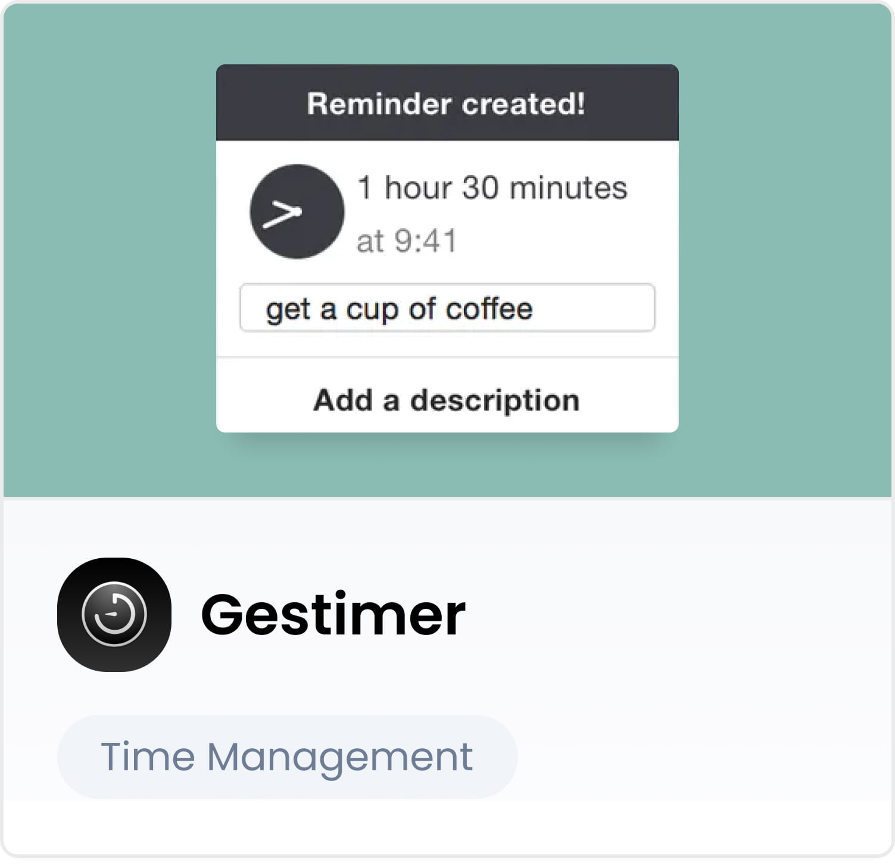

# Best Productivity Apps for Mac

Did you know that office workers spend [1.700 hours per year](https://www.independent.co.uk/news/uk/home-news/office-workers-screen-headaches-a8459896.html) in front of a computer screen? That's crazy, right?
I usually spend around 6-8 hours with my eyes glued to my Mac every day. This doesn’t include my free time when I often end up using my computer as well.

I think that being productive means doing things more efficiently and smarter. And in the context of using a Mac computer, productivity isn’t only about work but a broadly understood way of performing tasks on our device.

Being productive isn't just the result of your ability to stay focused, managing your tasks well, or having specific skills. Sometimes you just need some well-chosen productivity apps for Mac that optimize your work in a project and shorten its time to completion.

## What Are the Best Productivity Mac Apps?

In terms of tooling, the choices are endless. But the quantity often doesn’t match the quality. To help cut through the noise, I prepared my personal cherry-picked collection of the 17 best productivity apps for Mac.

The following apps come in handy for project management, development, non-IT work, or other everyday activities such as attending online meetings, listening to music, or using social media.
I have divided the top and absolute best productivity apps into 5 categories.

### 5 categories of my favorite Mac apps that increase productivity

1.  #### Agility apps

2.  #### Time Management apps

3.  #### Meeting apps

4.  #### Browser apps

5.  #### Task Management apps

Ok, let’s take a look at those Mac goodies!

## 17 Best Productivity Apps for Mac

## Agility apps

### 1. [BetterTouchTool](https://folivora.ai/) - for creating your own shortcuts

-   Price: $8.50
-   For the price of three coffees, you get a tool that makes your life easier every day.
-   A wonder among Mac apps, BetterTouchTool is so versatile that it might not be so obvious how to use it and what you can get out of it. Also, it's easy to fall into the trap of defining 100 different keyboard shortcuts that are hard to remember, so you end up not using them at all.

-   Make your keyboard shortcuts universal and intuitive. They should work across your entire operating system and be natural enough for you to remember them.

-   WHAT you optimize is equally important - create shortcuts only for things that you do at least 30 times a day. Don’t forget that small improvements add up over time!

-   Most of BTT shortcuts work as Trigger  →  Action combinations. Trigger is what you do, action is what it does when that happens.

### A good place to start your BTT journey is your trackpad

Here are my recommendations for trackpad shortcuts that work across MacOS applications.

It’s good to switch to four finger swipe gestures in your MacOS trackpad settings so it doesn't conflict with the triggers below.

-   Trigger:  3 Finger Click

-   Action:  Middle Click

-   Tip: Middle-click any link to open it in a new tab

-   Tip: Middle click a tab to close it

-   Trigger: 3 Finger Swipe Up

-   Action:  Send Keyboard Shortcut: ⌘R

-   What it does: Refresh current page

-   Trigger: 3 Finger Swipe Left

-   Action: Send Keyboard Shortcut: ⌘⇧[

-   What it does: Switch one tab to the left

-   Trigger: 3 Finger Swipe Right

-   Action: Send Keyboard Shortcut: ⌘⇧]

-   What it does: Switch one tab to the right

-   Trigger: 3 Finger Swipe Down

-   Action: Send Keyboard Shortcut: ⌘W

-   What it does: Close current tab (or window if there are no tabs)

### 2. [Contexts](https://contexts.co/) - switching windows lightening-fast

-   Price: $9.99

-   As a developer, you're probably familiar with the quick file open - you only have to type a few letters to open a file in your project. What if you could do that with your open windows?

-   Press down the Fn key and type 'chr'. Boom, Chrome is in focus now! Type 'spo' - Spotify, 'sl' - Slack. You get the picture.

-   This is my favorite feature of Contexts - but the tool offers much more. For example, it can replace Mac's default app switcher (⌘+TAB) and windows switcher (⌘+`) or place an additional dock on every display with only the windows on that display.

### 3. [Droplr](https://droplr.com/) - for capturing screenshots like a pro

-   Price: $7 per month for individual users

-   This handy screen capture tool is exceptional because it focuses on teamwork - which isn't something you see in other Mac apps.

-   It’s simple - showing something on your screen is often the fastest way to get your idea across.

-   Did you know that before we became MasterBorn, we were actually a product company developing Droplr for our US partners? If you're toying with the idea of creating an app, feel free to drop(lr) us a line at [hello@masterborn.com](mailto:hello@masterborn.com) ;-)

### 4. [Numi Calculator](https://numi.app/) - for an optimal cal/spreadsheet combo

-   Price: $23.79 (free version available)

-   What happens when you cross a notepad with a spreadsheet? You get an innovative calculator that is super easy to use. Once you try it, you'll never come back to a standard calculator.

-   It features unit conversion, time zone conversion, currencies, and many types of operations - everything you need in one place.

-   One of the best productivity apps for Mac that might change how you work with numbers.

## Time Management apps

### 5. [RescueTime](http://rescuetime.com/) - for learning how you spend screen time

-   Price: $6.50 per month (in annual billing)

-   Review how you actually spend your time when in front of your computer.

-   The tool tracks your time automatically, so there’s no turning timers on/off or manual time entry.

-   It tracks the time you spend on apps, websites, but also documents.

-   Learn the truth about your habits, identify time wasters, and set targets to track your success as you become more focused.

### 6. [Toggl](http://toggl.com/) - for tracking time in projects

-   Price: Free to $18 per user per month in Premium plan

-   One of the best tools to track your time in projects.

-   Works well for freelancers and large teams that need to track time spent on many moving parts.

-   Both project and customer data are compiled into a single dashboard that makes understanding where your time is going super easy.

### 7. [Gestimer](http://maddin.io/gestimer/) - a simple timer that adds value

-   Price: $3.99

-   A simple timer with a very satisfying way of setting the timer up. Just drag it down from your top menu bar, and you’re good to go!

-   It’s a perfect example of productivity apps for Mac for those who practice the Pomodoro Technique.

### 8. [Mindful Mynah](https://apps.apple.com/us/app/mindful-mynah/id503981565?mt=12) - for setting smart reminders

-   Price: Free

-   This small free tool can regularly remind you with a sound to build a habit like:

-   Get up and stretch

-   Breathe deeply

-   Keep your posture

-   Drink water

-   Find something to be grateful for

## Meeting apps

### 9. [Meeter](https://trymeeter.com/) - for joining meetings faster

-   Price: Free

-   Meeter connects to your calendar and allows you to quickly join the meetings, regardless of where they’re happening - on Hangouts, Zoom, or Skype.

-   It will also show you reminders about meetings and display your next meeting title in the menu bar.

### 10. [SoundSource](https://rogueamoeba.com/soundsource/) - for automatic volume regulation

-   Price: $48

-   Tired of adjusting your volume during meetings because of different mic levels? Here’s a solution.

-   One of the best SoundSource features is the dynamic volume boost - it will increase the volume when it’s too low.

-   It also allows you to add audio effects on all sounds or on specific applications.

-   And if you want to play around, check how your colleagues sound when their voices are pitched up or down 2x by adding AUPitch effect into your meeting application and muting your mic. You can add some reverb to make it even more dramatic. :)

-   You can add an Equalizer on Spotify or the entire audio output to tweak the sound of your headphones or speakers.

-   It's quite expensive but it's one of the best and most reliable tools of this kind.

-   Be warned about the trial version - it’s a case study of “How to make your potential customers hate you in 20 minutes”... :)

-   Tip: If you need more control over dynamic volume adjustment, use AUDynamicsProcessor effect.

## Browser apps

### 11. [Tab Wrangler](https://chrome.google.com/webstore/detail/better-onetab/eookhngofldnbnidjlbkeecljkfpmfpg) - for keeping a tab on your tabs

-   Price: Free

-   Having 200 tabs opened slows down your browser and productivity, so clean up your multi-tab madness without the fear of losing any valuable information.

-   Tab Wrangler will automatically close tabs that are inactive for a given number of minutes and save them on a list so you can get back to them later.

-   It's satisfying to look at the closed tabs list once in a while and realize that you never really needed to revisit them. It saves you time and cleans up your mental space.

### 12. [Nudge](https://chrome.google.com/webstore/detail/nudge/dmhgdnbkjkejeddddlklojinngaideac) - for avoiding distractions

-   Price: Free

-   Nothing is worse than realizing that you've been browsing Facebook for 10 minutes and you can’t even remember why you opened it in the first place.

-   One of the best features of Nudge is its ability to hide addictive parts of popular websites behind buttons. You can still access them, but you now actively CHOOSE to see them or not.

-   A must-have among the best productivity apps for Mac - especially for those looking to regain their focus.

### 13. [I don't care about cookies](https://chrome.google.com/webstore/detail/i-dont-care-about-cookies/fihnjjcciajhdojfnbdddfaoknhalnja) - for getting rid of cookie pop-ups

-   Price: Free

-   This handy tool speeds up your browsing experience by removing all the annoying cookie pop-ups on the websites you visit.

### 14. [Nativefier](https://github.com/nativefier/nativefier)

-   Price: Free

-   Do you use GitHub or Gmail 50 times a day? Why not make it a separate app in your dock? This is what Nativefier does.

-   Other web apps that work well as a separate app are Google Calendar and Jira.

-   Tip: Chrome now lets you do that out of the box for some websites - look at the right side of the address bar.

## Task Management apps

### 15. [Simplenote](https://simplenote.com/) - for exporting notes everywhere

-   Price: Free

-   This is a valuable cross-platform alternative to Apple Notes.

-   Apple Notes doesn’t allow exporting all of your notes, so if you want to change the platform, you can’t - you're locked in.

-   The tool supports Mac, Windows, iOS, Android, and Web.

### 16. [Workflowy](https://workflowy.com/) - for making outlines fast

-   Price: Free ($4.99/month if you write a lot)

-   Outlines are awesome. They let you focus on the main points first and then dive into the details as deep as you want.

-   I tried many mind mapping tools and note-taking apps. They're often either too limited or too bloated with features. Workflowy offers a perfect balance.

-   Fun Fact: This article was outlined in Workflowy!

### 17. [Thoughtback](https://thoughtback.com/) - for jotting down random ideas

-   Price: Free

-   Do you often come up with random ideas that you’d like to revisit later? Do you write them down but then never have time to actually read it?

-   Try Thoughtback - you can add your thoughts there, and the tool will email you one thought per day.

-   You'll be surprised at how a 2-year-old idea can suddenly change your perspective on the problem you’re facing at the moment.

## The Best Productivity Apps for Mac - Final Thoughts

As a Product Owner and Node.js developer, I strongly encourage you to explore the available tools and improve your workflow. For me, productivity is a mindset and a sort of habit. I like discovering hacks that help me to save time and become more efficient.

### As they say: work smarter, not harder!

I hope that this collection of the absolute best productivity apps for Mac I shared above will also help you become smarter about your work habits and inspire you to do your own research in the universe of productivity tools.
