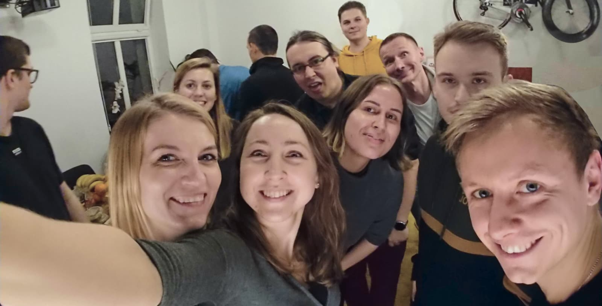

# Why Your Company Values (might) Stink

A company’s values are not always what is written on the website. A team’s values are the behaviors modeled and communicated regularly (for better or worse) by the leaders of a company. I have worked in teams with vague or generic values as well as those without any. I often notice a gap between public facing values and how team members experience the culture within the organization. At MasterBorn, our goal is to eliminate this gap.

## How to identify company values?

To find the actual company values, one must look at the daily decisions of its members.

Over the last year, we have undertaken an extensive and intentional process of creating and defining our company values. We believe having real and authentic values is critically important to executing our mission at MasterBorn.

## Why are company values important?

Without clear core values, leaders and members of a team are left to assume and decide for themselves what is best for the company. While this might seem at first glance empowering to the members of a team, the end result is dozens of individuals pulling in different directions. A loss of cohesiveness ensues, leading to a breakdown in company culture, feelings of uncertainty by your team, and ultimately a degradation of your work.

I see the role of core values as serving to align all of the decisions made by the team so everyone is pulling in a single direction.

Finding the best words was the hardest part. Even when we knew what we wanted to communicate, even if we felt the values in our guts - we often still couldn’t find the ONE word to sum it all up. Ultimately, at MasterBorn we chose as our core values: Clarity, Efficiency, Growth and Acceptance.

## How to use your company values to drive success

We know very well that this is not the final step. Publishing them on the website or writing them on the wall at the office is not the end of the process. We invest time every month with the entire company and with key leaders to reinforce and check ourselves against the standard we have set for our team.

Our core values are also living in the sense that we use them when recruiting and evaluating new team members.

Finally our core values help us set clear expectations and honest, long-term relationships with our clients.

This article is the beginning of a 4-part series in which I’d like to explain each value.  
I’ll start with Clarity because only with clarity of purpose can people, teams, and organizations fully mobilize and achieve something truly excellent.

In this article I will focus on a communication side and issues that might occur while working online, especially on my beloved&hated Slack.
