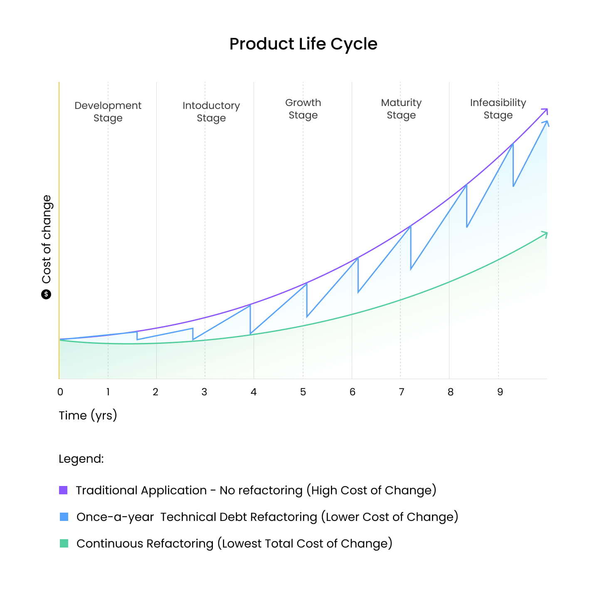

# Technical debt - 6 things business should know about it

Just like financial debt, technical debt is not totally bad by definition. In fact, you could argue that technical debt is absolutely essential for business growth.

However, just like financial debt, technical debt becomes more expensive the longer you have it. The key to avoiding pitfalls here is addressing technical debt from the first stages of any IT project.

This means identifying where and why compromises may be necessary, establishing a detailed timeline for correcting those issues, and paying down your debt. By managing technical debt, business owners and team leads can be sure that their projects are successful and productive.

## What is technical debt?

The term "technical debt" was coined by Ward Cunningham, a programmer who is also known for developing the first wiki. Technical debt is a metaphor that equates software development to the world of financial services.

Imagine that you have a project in front of you and you can develop it in two potential ways. One is quick and easy but will require modification in the future. The other comes with a better design but will take more time to implement.

In software development, releasing code in the former quick and easy approach is like incurring debt - it comes with the obligation of interest while technical debt comes in the form of extra work and money spent on it in the future. Taking the time to refactor is equivalent to paying down the principal. While this takes time in the short run, it also decreases future interest payments.

### Ward Cunningham and the concept of technical debt

Ward Cunningham describes this concept in 1992 as follows:

"Shipping first-time code is like going into debt. A little debt speeds development so long as it is paid back promptly with a rewrite. The danger occurs when the debt is not repaid. Every minute spent on not-quite-right code counts as interest on that debt. Entire engineering organizations can be brought to a stand-still under the debt load of an unconsolidated implementation, object-oriented or otherwise."

I think a good, slightly more technical definition of technical debt would be something similar to this:

**“Technical debt is the refactoring effort needed to add a feature non-invasively.”**

## Technical debt as a metaphor

The term "technical debt" is a financial analogy. It helps people understand the intention behind the problem. If it makes sense to you, we can go even further. If we think about debt, it’s usually connected with some kind of loan to which there is always interest.

And debt interest can take on different forms based on many factors, starting from the lending company, time of lending, interest rates, etc.

If the conditions of the loan are good and you're sure that you'll be able to pay it off, you're good to go. But here's the thing: in the IT world, it's hard to identify the total real interest on that loan.

## Bad code is NOT technical debt

Let’s get started by defining how technical debt differs from badly written code (also called cruft).

It’s important to understand the difference between cruft vs. technical debt. If you find the analogy I mentioned above helpful, I think it’s safe to say that cruft is similar to a loan shark. You just don’t want to do this.

Cruft refers to badly designed, unnecessarily complicated, or unwanted code. That's definitely something that you want to avoid in your team.

Ok, so by now we narrowed our definition of tech debt down by saying what technical debt is not. Understanding the real thing about technical debt should be easier now.

## The Technical Debt Quadrant

Take a look at the Technical Debt Quadrant. In the right part of the quadrant, you'll see two types of technical debt: Prudent-Accidental and Prudent-Deliberate.

There are two types of tech debt that you will probably have to deal with and manage in your software development team. The left side of the diagram represents the cruft.

### Prudent-Accidental

The first type - Prudent-Accidental -  refers to the situation when you're initially dealing with incomplete information/knowledge about the system or project scope, so you make design and implementation decisions based on your best knowledge at that time. It's only later that you realize how you should have done something.

### Prudent-Deliberate

The second type of technical debt - Prudent-Deliberate - refers to the conscious, strategic decision made by the development team. The idea is to ship a fast solution despite the technical debt it will incur because that speed is actually worth the cost of incurring debt. The team is fully aware of the consequences. But developers also have a plan in place to address them later on.

## Technical Debt: Another metaphor

I think it is time to add another metaphor for these last two "healthy" technical debt types.

Try to think about technical debt in terms of an airplane’s lifecycle in an aviation company. You have to carry out regular maintenance to ensure that the plane is safe and able to operate smoothly.

This is just what happens in software development. You might have to carry out repetitive code refactoring to keep it well-maintained. It’s a normal thing, you can’t escape it.

## Technical debt - 6 things business should know about it

Based on my experience as a software developer, I encourage you to look at the tips I share below and take them really seriously next time you launch a development project.

If you want your project to succeed, then the question of technical debt is an aspect to which you should pay extra attention.

## 1. Cruft vs. technical debt

### Avoid cruft to pay your technical debt back

Technical debt isn't just badly written code. It's a strategic decision made by developers who know that a faster time to market means earlier feedback and the opportunity to correct their assumptions. Cruft is just a bad decision.

Your ability to pay back tech debt depends on how you write the application code. This is where technical debt differs from cruft. The code needs to be clean enough to enable developers to refactor it later on, once you finally understand the problem at hand. You need to have a system that is clearly written and refactorable - it has tests around it. Clean code is a key prerequisite of technical debt.

### How to differentiate cruft from tech debt?

Ask yourself these questions:

-   Is the code clean and tested?

-   Do I have a learning objective or event?

-   Do I have a plan for payback?

-   Does the business know about this?

If you answered YES to these questions, you're looking at an example of technical debt (or just some messy code that needs to be straightened out).

## 2. Technical debt consequences

### Unhandled technical debt leads to serious problems

As I mentioned before, technical debt is something that just happens when you're trying to ship software as fast as possible to get feedback and come back with something even better.

But just like any other debt, technical debt must be paid in time. It should be a short-term thing in your project - otherwise, your organization is going to face mounting costs.

Procrastinating bugs and other problems that need to be fixed is risky. Unaddressed tech debt is bound to lead to several problems:

-   Reduced development speed - A team that spends a lot of time dealing with code smells and bugs isn't a team that ships software fast. Technical debt takes a lot of time and attention that developers could instead dedicate to expanding the application.

-   Feature problems - Buggy features aren't going to make anyone happy: end-users, business stakeholders, or the team that built the software. Technical debt spiraling out of control might seriously affect the system's functionality.

-   Reduced productivity - Technical debt will hold your team back from focusing on what matters most: shipping new features and finding better solutions to challenges.

## 3. The economics of technical debt

### Tech debt impacts your budget (even in normal circumstances)

Technical debt is going to happen when developing new software, especially if the time to market is important to you.

So, accept that it will happen and that your team will have to later spend some time on paying it back and fixing all the issues.

The best thing you can do at this point to prepare your business for payback is to allocate a budget for it and deal with your technical debt on time.

## 4. Technical debt always grows over time

Just like how financial debt grows over time, technical debt does as well. You need to give the development team the space it needs to make continuous refactoring effort a part of your process.

### Lehman law

Consider one of Lehman’s laws of software evolution here:

Increasing Complexity (1974): "As an E-type system evolves, its complexity increases unless work is done to maintain or reduce it.”

There you have it. The longer you wait to deal with technical debt, the worse it's going to get. As in financial debt, it will have serious consequences in both the short term and long term.

## 5. Technical debt measurement

### There's no straight way to quantify tech debt

Trying to measure tech debt with a high degree of precision is a task doomed to failure.

There is no single metric you can use here.

Everyone wants to measure it and there certainly exist some ways of calculating it - for example, by the number of warnings. But in practice, none of these solutions are going to answer your question accurately.

What's there left to do? You need to rely on the awareness and experience of CTOs and developers who are technology experts and have experience in dealing with technical debt.

## 6. The technical debt trap

There are few traps of technical debt that you should be aware of.

When preparing to build new software and considering the question of technical debt, it's good to know what's coming.

Here are a few common traps of technical debt that might lead your project astray over the long term:

-   The precedent for speed over quality and expectation of increased velocity - You embraced technical debt because of the business speed it offers you. But your team doesn't seem to be as fast as you expected it to be. Don't forget that taking a technical debt means writing code that is clean and refactorable. This isn't something a team can do fast. If you want fast results, you're more likely to get cruft.

-   The need to write more cruft to keep up - You're trying to fix so many issues at once and instead of getting to the bottom of the problem and solving it once and for all, you end up writing more bad code.

-   Asking for permission to do your job correctly - We should assume that the team knows what it’s doing. Developers should be the ones to estimate how much time it takes to deliver a new feature, not the business stakeholders. If developers ask you how much time they have to deliver this feature, it’s like asking if they have time to make it right.

## Technical debt - final thoughts

OK, I'll be honest now. At first, I wanted to write an article about the pros and cons of technical debt. Our Content Manager proposed such material according to the SEO analysis. But I said no.

Trust me, you don’t want to consider technical debt that way. Such an approach is dangerous and might harm your business. Even if you find millions of articles about that topic on the web.

### Here's my view on technical debt:

-   Tech debt was always part of building software. And it always will be.

-   That's why managing technical debt is a priority here.

-   Instead of focusing on eliminating technical debt entirely, focus on managing it effectively.

We might not offer financial consulting services, but we know quite a lot about debt. Technical debt, of course.

If you're looking for a reliable technology partner for your project, get in touch with us at hello@masterborn.com. We can help you finally gain control over your technical debt and make sure that your project is successful on a long-term basis.
