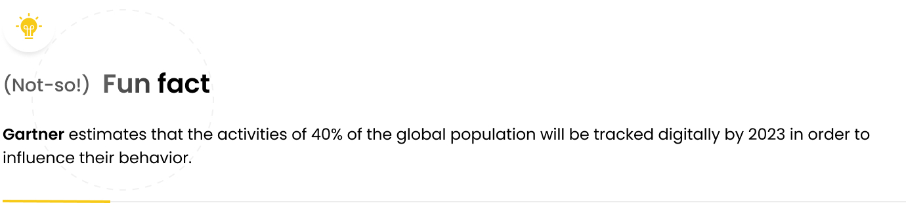
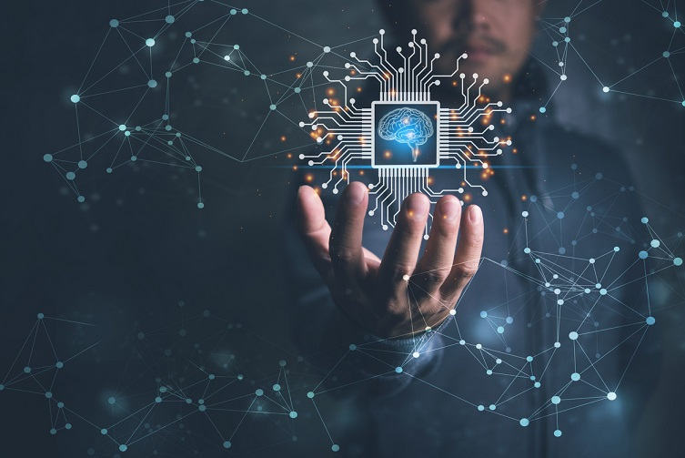

COVID-19 has redefined pretty much everything we took for granted before 2020, and prompted the emergence or advancement of certain phenomena, technologies or concepts. We know it’s hard to keep up with the technology trends at the pace at which they are morphing and evolving.

To help you stay on top of things in the new internet reality, you need to get familiar with some key phrases that were either coined or gained prominence only during the pandemic. Some of these technologies have been around for a while, while others are only emerging.

Without a further ado, we present to you a list of the hottest tech concepts and trends driving the digital transformation in 2020. Let's dive straight into the top technology trends 2021!

## 1. Technological unemployment

The impact of COVID-19 on the global economy, although still difficult to estimate and fully understand, is undeniable. Various lockdown restrictions have changed the ways we go about our lives, and led to closures of whole verticals like fitness, hospitality and wellness industries.

Health and wellness seems to [suffer the most](https://runrepeat.com/pandemics-impact-fitness-industry):

-   More than 38,000 US gyms and health clubs have been closed down because of the virus (as of May 2020)
-   23.9% of surveyed US gym members said their gym was still closed as of August 2020
-   Many US and sports stores filed for bankruptcy: Cyc Fitness, YogaWorks, Flywheel Sports, Town Sports International, 24 Hour Fitness, Gold's Gym, and Modell's Sporting Goods

As of early 2020, our lives have different dynamics, and our daily needs have morphed. We work, buy things, and spend our leisure time differently – precautionary savings and raging inflation slowed down the economy in many countries. The unprecedented and forced shift to remote working conditions has driven digital transformation and favored certain technology trends pushing business over the tipping point towards adoption. We’re seeing an increase in remote work (forced or otherwise), higher demand for online shopping, greater migration of assets to the cloud and increased spending on data security.

Advances in robotics, machine learning and automation have led to a situation where jobs are being taken over by machines. Advanced robotics impact physical jobs such as manufacturing, but intellectual jobs are not less threatened by AI. In the near future certain roles like translators, transcribers, proofreaders, bookkeeping clerks, financial advisors, accountants and security guards may be affected by technological unemployment.

Jobs that are the [least likely to be hit](http://www.oxfordmartin.ox.ac.uk/downloads/academic/The_Future_of_Employment.pdf) by technological unemployment include occupations which require building complex, deep relationships with people or clients, or jobs which are simply highly unpredictable and require making educated decisions based on many immeasurable and often abstract factors – think physicians and surgeons.

The jobs that are least at risk of automation include:

-   Mental health and substance abuse social workers (Chance of automation: 0.3%)
-   Occupational therapist (Chance of automation: 0.35%)
-   Dietitian and nutritionist (Chance of automation: 0.39%)
-   Physician and surgeon (Chance of automation: 0.42%)
-   Clergy (Chance of automation: 0.81%)

## 2. Universal Basic Income (UBI)

The looming threat of technological unemployment around the world has brought about the concept of universal basic income – the idea whereby all people are getting paid a basic income to cover their costs of living. While not necessarily a tech trend, universal basic income may soon be a part (and direct consequence) of the digital transformation.

Sounds like a pie in the sky? Hardly! Oakland, Ontario, Uganda and Finland are among the first countries (and cities) which have already run the first trials of universal basic income–to varying effects. There are many more countries experimenting with variations of universal basic income, but it's not hard to imagine that the idea is a bit controversial. Opponents bristle at the concept, claiming that giving money for doing nothing is the first step towards killing people's motivation, and can ultimately ruin the economy.

But one thing is certain – whether universal basic income is the right solution or not, we definitely need to start thinking up ways of tackling the consequences of living in the new economic reality – and the effects of automation and shifting workplace mechanics.

However, scary as it sounds, technological unemployment is nothing people can’t cope with. Employees rarely “become unemployed” and lose jobs day to day – they are more likely to change specialization and adapt to the new reality. In fact, over the last 60 years of automation only one job was completely eliminated: elevator operator.

## 3. Internet of Everything - IoE

You may have heard of the concept of the Internet of things. It did make a splash a couple of years ago promising a world where internet-enabled devices and appliances unlock a myriad of new possibilities like smart, connected appliances, smart home automation systems, wearable health monitors and inventory trackers.

Sounds exciting, doesn't it? It probably does, but it’s also kinda yesterday’s news – Internet of Everything (IoE) is the real deal now. The term Internet of Everything was first coined by Cisco around the year 2013 but since then has been used by other firms and become commonplace.

IoE builds upon the concept of IoT, but adds data, processes and people to the equation. It proposes a broader, more meaningful view of the Internet of Things. It’s about internet connectivity where not only machines communicate with machines (M2M) but also people communicate to machines (P2M) and people communicate to people (P2P) – through the means of technology. IoE emphasizes the other two types of communication and explores the possibilities they offer, such as:

-   Streamlined operations and increase profitability for businesses

-   Higher efficiency and productivity with automation of repetitive or time-consuming tasks

-   Better customer experience with chatbots and virtual fitting rooms or automated shop assistants

-   Mobility and agility, e.g. various technology enabling remote work and management

The Internet of Everything (IoE) brings together people, process, data, and things to make networked connections more relevant and valuable.

Real life examples of IoE could include:

-   A smart wristband that tracks your wellness data and automatically books a consultation with an appropriate healthcare specialist when suspected activity is spotted

-   A smart home device that intelligently turns up your thermostat before you come home from work so the house is warm by the time you arrive

-   Smart door locks which lock the doors automatically so you don’t even worry about locking the door when you leave home

As you can see, the sky's the limit. IoE opens up many business possibilities that were previously unheard of. It [enhances the concepts of IoT](https://www.sam-solutions.com/blog/what-is-internet-of-everything-ioe/) by enabling automated decisions based on data streamed from the cloud (edge).

## 4. Everything as a Service (XaaS)

Gone are the days when software was distributed primarily on physical media and provided only locally (or on-site) on client machines. Today’s software is made available from the cloud, offering the provider greater control over the scalability, updates, security and lower fees for the customers.

SaaS has pretty much become the norm by now, benefiting both the providers and end users. But the delivery mode has quickly extended beyond just software – to a wide array of products, tools, and technologies which are now delivered to users as a service over the internet: Office 365, Google Drive, Adobe Creative Suite products and so on.

XaaS aka “everything as a Service” is an umbrella term denoting the delivery of virtually anything as a service. Originating from terms such as Software as a Service (SaaS), Platform as a Service (PaaS) and Infrastructure as a Service (IaaS), XaaS extends the concept to everything, and pretty much reflects the current trend in software.

There's no doubt that public cloud services are a booming business. Gartner's latest forecast put the total worldwide revenue for 2017 at $260.2 billion, up from $219.6 billion in 2016, representing 18.5 percent growth.

## 5. MCommerce

While eCommerce (ecommerce, e-commerce, depending on your editor's taste) is nothing new in itself, the industry apparently needed a new term to describe the new trend in ecommerce – mCommerce. The term “mCommerce” was first used by Global Mobile Commerce Forum’s CEO Kevin Duffey, in November 1997.

Mobile commerce, just like the name suggests, refers to the process of completing transactions on mobile devices – smartphones, tablets. According to [recent research](https://www.salecycle.com/blog/stats/2019-ecommerce-year-in-review-infographic/), mobile accounts for 65% of all ecommerce traffic. However, mobile sales are still lagging, mainly due to poor UX/UI practices or performance issues on mobile devices.

Retailers need to take mCommerce seriously and embrace the ‘mobile-first’ approach to website design, ensuring that the user experience for smartphone visitors is as good as possible. This must include a stronger focus on key UX/UI factors like easy navigation on mobile, clear product images and copy, and simplified checkout helps to attract and convert mobile visitors.

Some eye-opening mCommerce statistics:

-   Mobile users are 5 times more likely to abandon a task if the website isn’t mobile-optimized

-   85% of adults think that a company’s mobile website should be as good or better than their desktop website

-   [75% of mobile users say](https://think.storage.googleapis.com/docs/au-what-mobile-users-want.pdf) they’re more likely to revisit mobile-friendly sites

-   Customers who have a negative brand experience on mobile are [62% less likely to purchase from this brand in the future](https://www.toptal.com/designers/ux/ux-statistics-insights-infographic)

By contrast, specific industries (e.g. travel sites) face a greater challenge on mobile. The fashion product selection and payment process is relatively simple compared to that of many travel sites, where people need to choose various options, from flight times to hotels, and enter plenty of detail.

For this reason, although 53% of traffic to travel sites comes from smartphones, just 29% of sales take place on mobile. This suggests that, for travel bookings, people still find it much easier to finalize the purchase on larger desktop screens.

Although more sales happen on desktops, mobile commerce cannot be underestimated. Mobile retail sales in the UK were up 30% compared to Q1 2020 and 25% stronger than the pre-COVID Q4 2019. This is literally like three years of growth in just a couple of months.

The statistics don’t tell the whole story, still. Even if not buying on the phone, many users use their mobile devices for product research – only to finalize the purchase on the desktop.

## 6. Internet of Behaviors (IoB)

The IoB is a network of interconnected physical objects that gather and exchange information and data over the internet. What the IoB does is make sense of this data and attach it to specific human behaviors such as purchasing, or following a specific brand online. Analytics, tracking A/B testing and all the things that companies have been using for the better part of this decade, have all been a part of the effort to win the holy grail: sell more. Internet of Behaviour brings IoT into the equation, offering a fuller view of the customer journey.

Examples?
There you go: imagine you share the data from your smart home’s IoT devices. With all the data pulled from your phone, your cooker and your fridge, the advertising network will know you haven’t done your shopping yet and can’t cook your lunch. Boom, a Pizza Hut ad with a discount code pops right in front of you when you open your home laptop. The ad link will automatically take you to the order page of the nearest Pizza Hut restaurant – based on your GPS location.

It may sound really, really scary when you think that a machine might know your needs better than you do – and try to sell you something before you even realize you need it. But the bottom line may not be that bad after all – it could help make ads that are better targeted to you, and thus possibly a little bit less annoying.

Business opportunities are endless. With ubiquitous technologies such as IoT sensors on automobiles used to analyze driving habits and help insurers optimize rates on automobile insurance – and offer cautious drivers lower insurance premiums.

While a bit scary when taken at face value, the benefits of the Internet of Behaviors reach beyond just selling you more stuff. Through more granular data about people’s behaviors and reactions, medical companies can test the effectiveness of their products, health providers can measure the activation and engagement efforts of patients. At the same time, policymakers can even personalize content, affecting laws and current programs.

As companies learn more about us (through the IoT), they can affect our behaviors (the IoB). Consider a health app on your smartphone that tracks your diet, sleep patterns, heart rate, or blood sugar levels. The app can alert you to adverse situations and suggest behavior modifications towards a more positive or desired outcome.

The ethical concerns associated with IoB certainly pile up the more you think about it, but there is not much we can do to stop it. The incursion of the internet in our lives is real, and happening as we speak. Just sit back and watch the future unfold in front of your eyes. Chances are IoB will one day be superseded by a more fitting acronym like IoL (Internet of Life)?
Who knows...

## 7. Brain-computer interfaces (BCI)

Electroencephalography-based endogenous brain–computer interfaces, aka brain-computer interfaces (BCIs) are still in the early prototyping phase, but the potential advancements such products can offer are incredible, from marketing, through education to entertainment. Sky’s the limit.

Brain-computer interfaces will once enable what once was purely the domain of science fiction. In fact, some companies have already made impressive progress in this area!

See the video below for some real-life examples:
[Mysteries of the Brain: Brain-Computer Interface - YouTube](https://www.youtube.com/watch?v=p1XQ4uxqxZI)

Functional brain-computer interfaces giving people a way to control their prostheses (i.e. bend fingers and move prosthetic arms and legs) will make the things you’ve seen in Cyberpunk 2077 a reality. The breakthrough in this domain may be just around the corner.

Brain–computer interfaces allow direct communication between human brains and external devices. BCIs are often directed at researching, mapping, assisting, augmenting, or repairing human cognitive or sensory-motor functions. BCIs will definitely find applications in the domain of rehabilitation, allowing disabled patients better control of prosthetics, and in neuro-feedback. Among the few existing clinical applications is the treatment of drug-resistant epilepsy.

There are many startups working really hard to leverage brain-computer interfaces and connect our brains to machines. This can allow to better understand what we feel (e.g. through mood detection) or reinvent the ways in which we input data and control machines:

-   Neurable (“everyday” brain-computer interfaces)
-   MindX
-   NextMind (non-invasive neural interface that sits on the back of one’s head and translates brain waves into data that can be used to control compatible software)
-   Neurosity
-   Kernel
-   Nectome
-   CTRL-Labs
-   Neuralink
-   Paradromix

It’s still too early to call it a BCI revolution, but a breakthrough is round the corner.

## 8. Extended Reality (XR)

The reality that COVID-19 brought upon us prompted the adoption of the technology, or at least increased the interest in it in areas such as: retail, real estate, training, remote work, marketing and therapy.

The concept of virtual reality has been around for a while but somehow never really caught on. It’s been hailed as the next big thing for years, but instead of experiencing a glittering VR future, we are still struggling with heavy, uncomfortable headsets, shortage of good VR content, and – most importantly – lack of consumer interest in VR.

Entertainment in VR is a tough game:
-   Having invested tens of millions in VR in 2016 and 2017, IMAX announced in 2019 it would no longer be investing in Virtual Reality tech.

-   In spite of constant advancement of the VR technology, there aren’t many games built today for VR platforms like Oculus and Playstation, and those that exist lack the depth or consumer interest that other Xbox and PlayStation games get.

According to [a 2019 report](https://www.statista.com/statistics/1096765/global-market-spend-on-xr-technologies-by-industry/), the business uses of extended reality (XR) technologies worldwide will continue growing across all industries between the years 2019 to 2023. It is also estimated that in 2023, the manufacturing and construction industry alone will spend 35 billion U.S. dollars on XR technologies.

While the entertainment industry may not have fully embraced VR, the sister technologies Augmented Reality (AR), and Mixed Reality (MR) find various applications in non-entertainment industries. Extended Reality (XR) is an emerging trend now.

It’s blanket term which covers all the immersive technologies and concepts (VR, AR, 360 and MR), has numerous practical applications, such as:

-   Safer and cheaper training for employees, especially for dangerous jobs (construction, engineering) or in jobs where potential mistakes may entail serious consequences or costs (surgeons, pilots, etc.) XR makes it possible to do the training but takes away all the associated risks.

-   Design and engineering to make prototyping easier. Virtual reality provides the opportunity to visualise 3D-models without the need to build physical mockups or prototypes. Engineers can now test the operation of certain machines in virtual conditions, analyse the results, and optimise.

-   Real estate. Developers and estate agents can implement XR to show the interiors to potential buyers before the construction of the building even begins.

-   Remote work. XR eliminates many barriers connected with remote work, allowing remote people to seamlessly access data from anywhere in the world.

The leading XR companies today include: Unity Technologies, Within, LiveLike, Subvrsive, Virtuix, Matterport, Oculus, Limbix and Survios.

## 9. Voice-as-User Interface (VUI)

Pioneered and brought to the public by software giants such as Google, Amazon and Apple virtual voice assistants are hardly new technology today, but we know that with accelerated advancement of artificial intelligence the technology will be getting increasingly reliable.

By buying the hardware and starting to use the assistant, the user enters the specific ecosystem, i.e. [walled garden](https://en.wikipedia.org/wiki/Closed_platform), which makes it very difficult to ensure compatibility with other devices.

Voice-as-user interface, voice-user-interface, or simply VUI is a trend which has been gaining popularity over recent years. It focuses on the use of speech recognition technology and advanced AI to enable users to interact with technology using just their voices, imitating human-to-human interaction.

## 10. Hyperautomation

Hyperautomation was identified as the top trend on Gartner’s [Top 10 Strategic Technology Trends](https://www.gartner.com/smarterwithgartner/gartner-top-10-strategic-technology-trends-for-2020/) 2020.

The term hyperautomation emerged because there was a need for a word that would draw a line between the traditional, old-school automation and modern day’s automation leveraging technologies like artificial intelligence (AI), machine learning (ML), and robotic process automation (RPA). The result is automation of the tasks that once could only be performed by skilled humans.

The key benefits of Hyperautomation:

-   Optimized performance. Automation can work many times faster than workers, and what's more, never get tired and rarely make mistakes when working on monotonous, repetitive tasks. According to Gartner application integrations delivered with robotic process automation (RPA) will grow by 40% yearly by 2022. 50% of all RPA scripts will be dynamically generated by 2023. Organizations will lower their operational costs by 30% through a combination of hyperautomation and redesigned technologies by 2024.

-   High-quality customer service. Optimized processes and their changes based on accurate data adapted to customer expectations can be made possible by automation.

-   Higher ROI. Automation of processes can reduce inefficiencies and increase ROI.

-   Innovation. Because employees spend less time on monotonous work, they can be assigned to more “ambitious” and creative tasks, which can lead to innovation and further optimization.

With hyperautomation in place, certain low-value tasks can be automated with little to no human intervention. Consider the below example process as an illustration of hyperautomation of loan underwriting before a customer’s credit purchase is approved:

-   The customer's credit history data is collected using external and internal sources

-   The collected data is used to identify unusual patterns through ML algorithms for fraud detection

-   ML models are applied for risk assessment

-   Historical transactions of customers and provide interest options

Although hyperautomation can lead, in part, to exacerbation of technological unemployment, it also allows humans to attend to other, more demanding tasks and push the envelope in certain industries. Hyperautomation is about the production line as much as it is about business processes. Among other things, hyperautomation makes it possible to leverage technology and allow people to make decisions and draw insights faster, streamlining the decision-making processes in companies.

## 11 Quantum Computing

As traditional computers are approaching the limits of their computational power, quantum computing is the next step. It promises next-level computational power through leveraging quantum mechanics – hence the name.

Quantum computing emerged as a novel way to solve today’s complex challenges. Quantum computers leverage the quantum mechanical phenomena of superposition and entanglement, creating states that scale exponentially with the number of qubits (quantum computers use qubits instead of bits).

Ok, I know you're waiting for the human language version of it. Read on.

"Normal" computers use bits, 1s and 0s as the smallest units of information. Quantum computers use qubits, which can be set to 0 or 1, but can in fact take any proportion of both states at once. This is what makes quantum computing so much more powerful, but also explains why they require so much more computing power.

Governments and investors around the world are literally pouring billions into quantum computing research and development. In 2020 the US White House announced plans to invest $1 billion in quantum computing and artificial intelligence research.

Here are some industries which will benefit from the advancement of quantum computing the most:

-   Finance – it would be hard to imagine a more fitting application of quantum computing than in finance – helping companies manage investments, improve fraud detection and design advanced simulations

-   Healthcare – This sector would benefit from the development of new drugs and genetically customised treatments, as well as DNA research

-   Cybersecurity – Quantum programming involves risks, but also advances in data encryption, such as the new Quantum Key Distribution (QKD) system. This is a new technique for sending sensitive information that uses light signals to detect intruders in the system

-   Mobility and transport – quantum computing enables significant progress in traffic planning systems and routing

So… what’s the actual impact of quantum computing on the life of the average Joe? Well… minimal. It is very unlikely people will directly benefit from quantum computers in the foreseeable future – not to mention own a quantum computer. And the cryogenic infrastructure is [just one obstacle here](https://www.ibm.com/blogs/research/2020/09/ibm-quantum-roadmap/). Quantum computers will be expensive and very specialized tools for researchers and engineers, allowing them to do insanely complex calculations more effectively. But it is unlikely that we’ll ever use quantum computers in the way we use today’s computers (e.g. to play video games or surf the net).

## Last thoughts

There are dozens upon dozens of existing and emerging strategic technology trends and it would be silly to try to cram them all into a single article. It's also hard to make predictions reaching further than just 1-2 years in the future (if you're a fan of that, you should definitely check Gartner's Hype Cycle for Emerging Technologies, see below).

But one thing is certain – the future will definitely be shaped by these technologies, morphing, complementing and augmenting one another in various configurations.

*****

Are you an innovator looking to leverage disruptive technologies? At MasterBorn, we love ambitious, challenging projects and are fascinated by the emerging possibilities of AI and ML. If you have a technology project you’d like to discuss, drop me a line at malgorzata.g@masterborn.com. Our engineers will be more than happy to get back to you and discuss how we can help.
